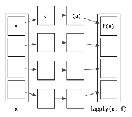
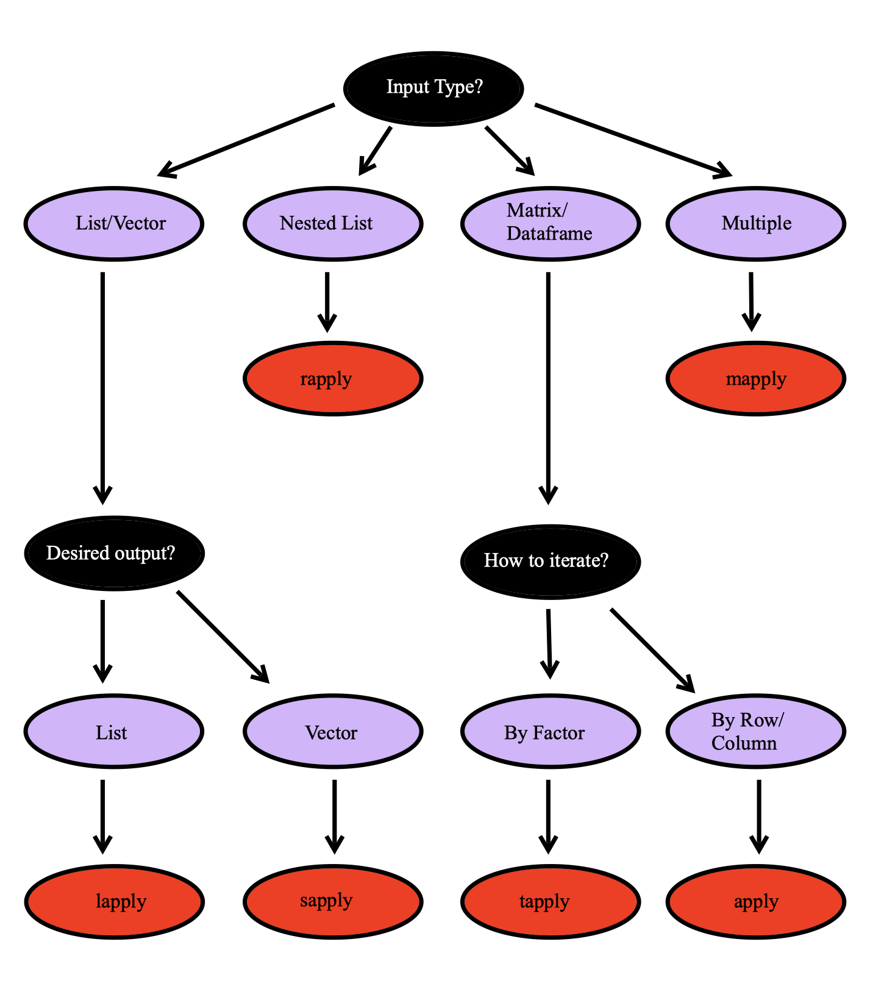
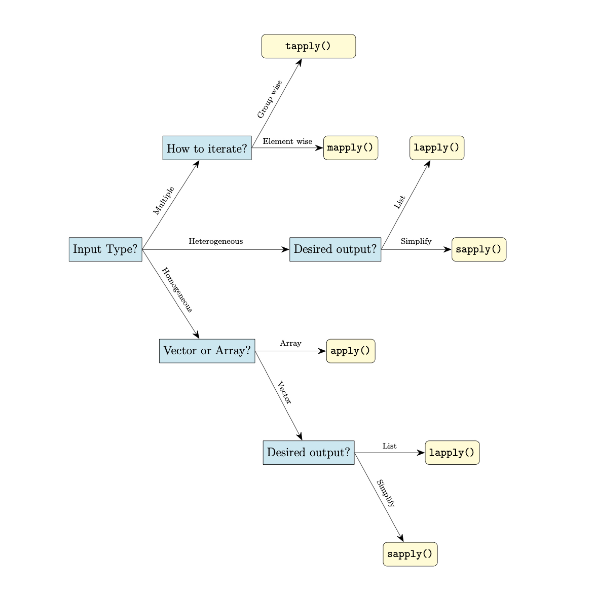

#  *apply Family of Functions 


## Introduction to the *apply family

You may have seen loops (like `for`, and `while`) in another class, which are used to  repeatedly execute some code. However, they are often slow in execution when it comes to processing large data sets in `R`.`R` has a more efficient and quick approach to perform iterations – **The *apply family**.

The `*apply` functions are used to vectorized functions in R and make them more efficient.  The `*apply` functions are technically **functionals**.  A **functional** in mathematics (and programming) is a function that accepts another function as an input.  Below are the most common forms of apply functions.

- `apply()`
- `lapply()`
- `sapply()`
- `tapply()`
- `mapply()`
- `replicate()`

These functions apply a function to different components of a vector/list/dataframe/array in a non-sequential way.  In general, if each element in your object is not dependent on the other elements of your object then an apply function is usually faster than a loop. 


```{r, echo = F, message=FALSE, warning=FALSE, fig.align='center', out.width="90%"}
library(knitr)

```


## apply() 

The `apply() `function is used to apply a function to the rows or columns of arrays (matrices). It assembles the returned values, and then returns it in a vector, array, or list. 

If you want to apply a function on a data frame, make sure that the data frame is homogeneous (i.e. all columns have numeric values,  all columns have character strings, etc). Otherwise, R will force all columns to have identical types using `as.matrix()`. This may not be what you want. In that case, you might consider using the `lapply()` or `sapply()` functions instead.

Description of the required `apply()` arguments:

- `X`: A array (or matrix)
- `MARGIN`: A vector giving the subscripts which the function will be applied over.
   + 1 indicates rows
   + 2 indicates columns
   + c(1, 2) indicates rows and columns
- `FUN`: The function to be applied
- `...`: Additional arguments to be passed to "FUN"


### Example: Built In Function {-}

```{r}
# Get column means 
data <- matrix(1:9, nrow=3, ncol=3)
data


apply(data, 2, mean)
```


```{r}
# Get row means 
apply(data, 1, sum)
```

### Example: User Defined Function {-}

You can use user-defined functions as well.

```{r}
apply(data, 2, function(x){
  
  # Standard deviation formula 
  y <- sum(x -mean(x))^2/(length(x)-1)
  
  return(y)
  })
```

### Returned Objects

The values that `apply()` returns depends on the function `FUN`.  If `FUN` returns an element of length 1, then `apply()` will return a vector.  If `FUN` *always* returns an element of length `n`>1, then `apply()` will return a matrix with `n` rows, and the number of columns will correspond to how many rows/columns were iterated over. Lastly, if `FUN` returns an object that would vary in length, then `apply()` will return a list where each element corresponds to a row or column that was iterated over.  In short, `apply()` prioritizes returning a vector, array (or matrix), and list (in that order). What is returned depends on the output of `FUN`. 

### Example: Extra Arguments, Array Output

```{r}

x <- cbind(x1 = 3, x2 = c(4:1, 2:5))

fun1 <- function(x, c1, c2){
  mean_vec <- c(mean(x[c1]), mean(x[c2]))
  return(mean_vec)
}

apply(x, 1, fun1,  c1 = "x1", c2 = c("x1","x2"))

```


### Example: List Output

```{r}
mat <- matrix(c(-1, 1, 0, 
                2, -2, 20, 
                62,-2, -6), nrow = 3)

CheckPos <- function(Vec){
  # Subset values of Vec that are positive 
  PosVec <- Vec[Vec > 0]
  
  # Return only the even values
  return(PosVec)
}

# Check Positive values by column 
apply(mat, 2, CheckPos)
```


## lapply() 

The `lapply()` function is used to apply a function to each element of the list. It collects the returned values into a list, and then **returns that list** which is of the same length.

Description of the required `lapply()` arguments:

- `X`: A list
- `FUN`: The function to be applied
- `...`: Additional arguments to be passed to `FUN`

```{r}
data_lst <- list(item1 = 1:5,
                item2 = seq(4,36,8),
                item3 = c(1,3,5,7,9))
data_lst 

data_vector <- c(1,2,3,4,5,6,7,8)
data_vector


lapply(data_lst, sum)

lapply(data_vector, sum)
```


```{r}
x <- list(a = 1:10, 
          beta = exp(-3:3), 
          logic = c(TRUE,FALSE,FALSE,TRUE))

# compute the list mean for each list element
lapply(x, mean)
```


Unlike `apply()`, `lapply()` will always return a list.  If the argument `X` is an object that is something other than a list then the `as.list()` function will be used to convert that object. Consider the built-in data set `iris` in R. If we use the `as.list()` function, each column will be converted into an element of a list. 

```{r}
head(iris)

str(as.list(iris))
```

Then if we use `lapply()` it will iterate over the columns.  We can find all values within a column that are bigger than the column mean (just looking at the numeric columns though).

```{r}
lapply(iris[,1:4], function(column){
  big_values <- column[column > mean(column)]
  return(big_values)
})
```


## sapply()

The `sapply()` and `lapply()` are very similar. The main difference is that `lapply()` always returns a list, whereas `sapply()` tries to simplify the result into a vector or matrix.  The output for `sapply()` is just like the output of `apply()`, it depends on the dimensions of the returned value for `FUN`. 

- If the return value is a list where every element is length 1, you get a vector. 

- If the return value is a list where every element is a vector of the same length (> 1), you get a matrix.

- If the lengths vary, simplification is impossible and you get a list.

Description of the required `sapply()` arguments:

- `X`: A list
- `FUN`: The function to be applied

```{r}
data_lst <- list(item1 = 1:5,
                 item2 = seq(4,36,8),
                 item3 = c(1,3,5,7,9))
data_lst

sapply(data_lst, sum)

lapply(data_lst, sum)
```


## tapply() 

The `tapply()` function breaks the data set up into groups and applies a function to each group.

Description of the required `sapply()` arguments:

- `X`: A 1 dimensional object
- `INDEX`: A grouping factor or a list of factors
- `FUN`: The function to be applied

```{r}
data <- data.frame(name=c("Amy","Max","Ray","Kim","Sam","Eve","Bob"), 
                  age=c(24, 22, 21, 23, 20, 24, 21),
                  gender=factor(c("F","M","M","F","M","F","M"))) 

data

tapply(data$age, data$gender, min)
```


## mapply() 

The `mapply()` function is a multivariate version of `sapply()`. It applies `FUN` to the first elements of each ... argument, the second elements, the third elements, and so on. 

Description of the required `mapply()` arguments:

- `FUN`: The function to be applied
- `...`: Arguments to vectorize over (vectors or lists of strictly positive length, or all of zero length).

```{r}
mapply(rep, times = 1:4, x = 4:1)
```


## replicate() 

The `replicate()` function is a wrapper for `sapply()`.  If we want to repeat an evaluation of an function call or an expression that does not require us to iterate through a data set or vector we can use `replicate()`.  


Description of the required `replicate()` arguments:

- `n`: 	 An integer containing the number of replications.
- `expr`: The expression (or function call) to evaluate repeatedly.


```{r}
replicate(n = 4, "Hello")

replicate(n = 10, factorial(4))

replicate(n = 5, sample(c("red", "blue")))
```


## How to Pick a Method

It can be difficult at first to decide which of these apply function you may want to use. In general, we can use the flow chart below as a quick guide. 

<!-- # ```{r, echo = F, message=FALSE, warning=FALSE, fig.align='center'} -->
<!-- # library(knitr) -->
<!-- #  -->
<!-- # ``` -->

{hieght=200%}


## Vectorizing If-Statments {#vectorizeifelse}


The `ifelse()` function is useful when we are vectorizing a simple if-else statment.  When we have something more complicated we either need to do a combination of `ifelse()` functions that are nested together, which can be hard to read, or we need to consider another option.  

Are second option is to use one of the `*apply` functions. There are many different types of apply functions, for now we will just focus on the most common one, the `sapply()` function.  


Let us consider a more complicated example where we might want to consider an `*apply` function. In the below example we want to find each value of `x` that is an even positive number, odd positive number, and non-positive number 

```{r}

x<- c(-3, 0, 3)

if(x >0){
  if(x%%2 ==0){
    type <- "even positive"
  } else {
    type <- "odd positive"
  } 
} else {
  type <- "non-positive"
}
```


With the above code we have an warning message because if-statements can only accept logical vectors of length 1, and our expression is generating a logical vector of length greater than 1.  To use `sapply()` to vectorized this operation we need to change this chain of if-statements into a function. 

```{r}
EvenOdd <- function(num){
  if(num > 0){
    if(num %% 2 == 0){
      type <- "even positive"
    } else {
      type <- "odd positive"
    } 
  } else {
    type <- "non-positive"
  }
  return(type)
}
```


This will still generate an error message if we call `EvenOdd(x)` because our input is still a vector greater than 1.  To use `sapply()` we can do the following:

```{r}
sapply(x, EvenOdd)
```


The first argument, labeled as `X` in the help file, is the object that contains the elements we want to apply the function to.  The second argument, labeled as `FUN` in the help file, is the function that is applied to each element of `X`.  We can make much more complicated if-statement changes and apply them to vectors using `sapply()`. 

If we wanted to vectorize a function that had multiple inputs like the `Toyfun` function seen in \@ref(elseif). we can do that with another `*apply` function, `mapply()`.  This function iterates over mutltiple inputs simultaneously.  Consider the following vectors 

```{r}
X_input <- c(1, 2, 3)
Y_input <- c(100, 50, 25)
Do_input <- c("Add", "Subtract", "Multiply")
```

Suppose we wish to add the first elements of `X_input` and `Y_input`, subtract the second elements `X_input` and `Y_input`, and multiply the last elements of `X_input` and `Y_input`.  We can do this iteratively all at once with `mapply()`. If we look at the `mapply()` help file the first two arguments are `FUN` and `...`.  The `FUN` argument is the function we wish to apply, and the `...` represents the inputted values we want to iterative over.  The vectors supplied in `...` will all be called one at a time.  That is, the first elements of all the vectors passed via `...` will be called first, followed by the second elements, and so on. 

```{r, echo = F}
Toyfun <- function(X,Y,Do){
  if(Do == "Add"){
    Z = X+Y

  }else if(Do =="Subtract"){
    Z = X-Y

  }else if(Do =="Multiply"){
    Z = X*Y

    
  }else if(Do =="Penguin"){
    Z = c("<('' )")
    
  } else{
    Z = c(X,Y)
  }
  
  return(Z)
}
```


```{r}
mapply(Toyfun, X = X_input, Y = Y_input, Do = Do_input)
```


## More Examples

To see some more examples of these functions in action.  We will use the `iris` data set which is a built in data set in R. This data set has four numeric columns, and one factor column, `Species`. Each row is a flower, and there are four different measurements of each flower. 

```{r}
head(iris)
summary(iris)
```

Find the maximum value for the numeric variables for each observation. 

```{r}
numeric_iris <- iris[,-5]
max_in_row <- apply(numeric_iris, 1, max)
head(max_in_row)
```

Determine the (arithmetic) mean of the sepal width for each species. 

```{r}
mean_species <- tapply(iris$Sepal.Width, INDEX = iris$Species, mean)
mean_species
```


Determine the (arithmetic) mean and the median of sepal width for each species. 

```{r}
my_avgs <- function(vec){
  the_mean <- mean(vec)
  the_median <- median(vec)
  return_object <- c(the_mean, the_median)
  names(return_object) <- c("mean", "median")
  return(return_object)
}

species_avgs <- tapply(iris$Sepal.Width, 
                      iris$Species,
                      my_avgs)
species_avgs
```


Make a plot of the sepal width and sepal length.  Make the points differ depending on the species type. 

```{r}

# Starting plot, make it blank 
plot(iris$Sepal.Length, iris$Sepal.Width, col = "white")


# Custom function to add the points
add_points <- function(the_data, ...){
  
  if(the_data[5]=="setosa"){
    points(x = the_data[1], 
           y = the_data[2], 
           col = "red", 
           pch = 0)
  } else if(the_data[5]=="virginica"){
    points(x = the_data[1], 
           y = the_data[2], 
           col = "blue", 
           pch = 2)
  } else{
    points(x = the_data[1], 
           y = the_data[2], 
           col = "green", 
           pch = 10)
    
  }
} 


# Use apply to add points
apply(iris, 1, add_points)
```

Make a plot of the sepal width and sepal length.  Make the points differ depending on the species type. Add the (arithmetic) mean of these two variables for each group. 

```{r}

# ------ PLOT FROM BEFORE
# Starting plot, make it blank 
plot(iris$Sepal.Length, iris$Sepal.Width, col = "white")
apply(iris, 1, add_points)
# ------ 


# Split the data into a list by factor
split_iris = split(iris, f = iris$Species)

# Iterate through the list and add (black) points to the plot
lapply(split_iris, function(species_data){
  points(mean(species_data$Sepal.Length), 
         mean(species_data$Sepal.Width), 
         pch = 16) 
})

```
Lets try using another example.  Suppose we wish to use the following formula (below) with `a = Sepal.Length`, `b = Sepal.Width`, and `c = Petal.Length`. 
$$ \frac{-b + \sqrt{b^2-4ac} }{2a}$$

Now there is more efficient ways to do this in R, but lets practice how we would do it with `mapply` as an example. 


```{r}
my_formula <- function(a, b, c){
  num <- (-b + sqrt(b^2 + 4*a*c))
  den <- 2*a
  
  answer <- num/den
  return(answer)
}

formula_results <- mapply(my_formula, 
                         a = iris$Sepal.Length, 
                         b = iris$Sepal.Width, 
                         c = iris$Petal.Length)
head(formula_results)
```


### Create a New Variable

<!-- # ```{r} -->
<!-- #  -->
<!-- # petal_size <- function(PLength, PWidth){ -->
<!-- #   if(PLength > mean(iris$Petal.Length) & PWidth >mean(iris$Sepal.Width)){ -->
<!-- #     PetalSize <- "Big" -->
<!-- #   } else if (PLength > mean(iris$Petal.Length) | PWidth >mean(iris$Sepal.Width)){ -->
<!-- #     PetalSize <- "Moderate" -->
<!-- #   } else { -->
<!-- #     PetalSize <- "Small" -->
<!-- #   } -->
<!-- #   return(PetalSize) -->
<!-- # } -->
<!-- #  -->
<!-- #  -->
<!-- # ``` -->


```{r}

petal_size <- function(PLength, BigCutOff, ModerateCutOff, SmallCutOff){
  if(PLength > BigCutOff){
    PetalSize <- "Big"
  } else if (PLength > ModerateCutOff){
    PetalSize <- "Moderate"
  } else if(PLength > SmallCutOff){
    PetalSize <- "Small"
  } else{
    PetalSize <- "Very Small"
  }
  return(PetalSize)
}

sapply(iris$Petal.Length,   # Data
       petal_size,          # Function
       BigCutOff = 5,       # Optional Arguments for function
       ModerateCutOff = 4, 
       SmallCutOff = 1.5)


```

## Additional Resources {-}

- http://adv-r.had.co.nz/Functionals.html


