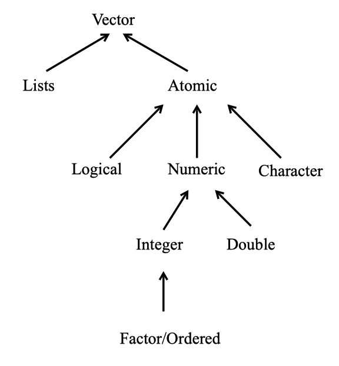
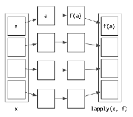
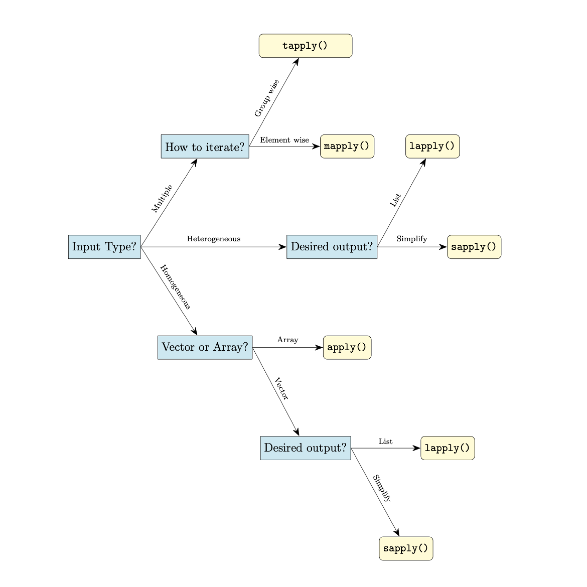

--- 
title: "STAT 107 Outline of Class Notes"
author: "Rebecca Kurtz-Garcia"
date: "`r Sys.Date()`"
site: bookdown::bookdown_site
documentclass: book
bibliography: [book.bib, packages.bib]
url: https://rpkgarcia.github.io/stat107_summer2022notes/
#cover-image: images/logo_stats.png
description: |
  Course notes for UCR's STAT 107.  An introduction to programming in R.
link-citations: yes
github-repo: rstudio/bookdown-demo
mainfont: Arial
monofont: "Courier New"
#monotonoptions: "Scale =0.7"
---


# Welcome {-}


Welcome to STAT 107! This document will contain and outline of the course notes throughout the quarter.  Please see the course website for an approximate schedule.  In each of the chapters there will be a list of links, resources, and videos for learning more about an individual topic.  This document will be updated constantly, be sure to check here for periodic updates.  In addition, this document does not serve as a substitute for in class instruction, but more as a guide for the general content we discuss.  Students are still expected to attend every lecture.

```{r, echo = F}
knitr::opts_chunk$set(tidy.opts = list(width.cutoff = 60), tidy = TRUE)
```

<!--chapter:end:index.Rmd-->

# Introduction to R

<!-- # ```{r, echo = F, message = F, comment = F, warning = F} -->
<!-- #  -->
<!-- # # This might be a problem  -->
<!-- # library(knitr) -->
<!-- # opts_chunk$set(tidy.opts=list(width.cutoff=20),tidy=TRUE) -->
<!-- # ``` -->

<!-- [Videos for this chapter are here!](https://drive.google.com/drive/folders/1wqLcBREQ3wahLH6Z7tAZEjxz11cFkgN2?usp=sharing) -->

In this chapter we introduce R and RStudio, which you’ll be using throughout this course to learn how to analyze real data and come to informed conclusions. To straighten out which is which: R is the name of the programming language itself, and RStudio is a convenient interface for using R.

As the course progresses, you are encouraged to explore beyond what we discuss; a willingness to experiment will make you a much better scientist and researcher. Before we get to that stage, however, you need to build some competence in R. We begin with some of the fundamental building blocks of R and Rstudio: the interface, data types, variables, importing data, and plotting data.

R is widely used by the scientific community as a no-cost alternative to expensive commercial software packages like SPSS and MATLAB. It is both a statistical software analysis system and a programming environment for developing scientific applications. Scientists routinely make available for free R programs they have developed that might be of use to others. Hundreds of packages can be downloaded for all types of scientific computing applications. This chapter was written by the help of @Desharnais2020. 


## Download and Install R and Rstudio

To get started, you need to download both the R and Rstudio software. Both are available for free and there are versions for *Linux*, *Mac OS X*, and *Windows*. It is suggested that you download R first and then Rstudio. R can be used without RStudio, but RStudio provides a convenient user interface and programming environment for R.

The details for downloading and installing these software packages varies depending on your computer and operating system. You may need permission to install the software on your computer. The links below provide access to a mirror archive at UCLA for downloading R and the developer’s site for downloading RStudio.

- To download R, go to the url [https://ftp.osuosl.org/pub/cran](https://ftp.osuosl.org/pub/cran). Choose the binary distribution appropriate for your computer.
   + *Windows* users will want to click on the link to “Download R for Windows” and choose “install R for the first time,” then “Download R 3.5.2 for Windows.”
   + *Mac OS* users will want to click “Download R for (Mac) OS X.” Download the install package for version R-3.5.2 If you are using Mac OS X 10.9-10.10, install version R-3.3.3. If you are using OS X 10.6-10.8, install version R-3.2.1.
    + *Linux* users will want to click on the link to “Download R for Linux.” You will need to choose the version of Linux that corresponds to your installation. Versions are available for Debian, RedHat, SUSE, and Ubuntu. 

- For RStudio, use the url [https://www.rstudio.com/products/rstudio/download/](https://www.rstudio.com/products/rstudio/download/). Choose the binary distribution appropriate for your computer. Installers are provided for a variety of platforms.

- For additional help please see this video:  [Getting Started 1 | How to Download and Install RStudio](https://ucr.yuja.com/V/Video?v=2365045&node=8476457&a=437885577&autoplay=1)


## The **RStudio** Interface 


We will begin by looking at the RStudio software interface. The RStudio program is referred to the window, and each section in the interface is a pane. 


```{r, echo = F, message=FALSE, warning=FALSE}
library(knitr)
knitr::include_graphics("images/rstudio.png")
```


Launch RStudio. You will see a window that looks like the figure above. The four panes of the window are described as follows:

  - The pane in the bottom left is the **R Command Console**, this is where you type R commands for immediate execution.

  - The pane in the upper left portion of the window is an area for editing R source code for scripts and functions and for viewing R data frame objects. New tabs will be added as new R code files and data objects are opened.

  - The pane in the upper right portion of the window is an area for browsing the variables in the R workspace **environment** and the R command line history.
    
   - The pane in the lower right portion of the window has several tabs. The *Files* tab is an area for browsing the files in the current working directory. The *Plot* tab is for viewing graphics produced using R commands. The *Packages* tab lists the R packages available. Other packages can be loaded. The *Help* tab provides access to the R documentation. The *Viewer* tab is for viewing local web content in the temporary session directory (not files on the web).
   

    
### Bottom Left Pane {-}

Let’s begin with the Console. This is where you type R commands for immediate execution. Click in the Command Console,  ">" symbol is the system prompt. You should see a blinking cursor that tells you the console is the current focus of keyboard input. Type:
```{r}
1+2
```

The result tells you that the line begins with the first (and only) element of the result which is the number 3. You can also execute R’s built-in functions (or functions you add).  Type the following command. 
```{r}
exp(pi)
```
    
    
In R, "pi" is a special constant to represent the number  and "exp" is the exponential function. The result tells you that the first (and only) element of the result is the number $e^{\pi}=$ 23.14069.

### Bottom Right Pane {-}

Now let’s look at the *Files* tab of the notebook at the lower right of the window. Every R session has a working directory where R looks for and saves files. It is a good practice to create a different directory for every project and make that directory the working directory. For example, let’s make a new directory called *MyDirectory*. (You can chose another name if you wish). 

1) Click on the **Files** tab of the notebook. You should see a listing of files in your default working directory.

2) Click on the small button with an ellipsis image on the right side of the file path above the directory listing.

3) Navigate to the folder where you want to create the new directory and click the **OK** button.

4) Click on the **New Folder** button just below the Files tab (see right).

5) Type **MyDirectory** in the panel that opens click on the folder in the Notebook.

6) Click the **More** button to the right of the New Folder button and select the menu option **Set as Working Directory**. This new folder is now the working directory for the current R session. This menu option is a short cut for a command that was automatically entered into the R console.

### Top Right Pane {-}

 Next we will look at the *R environment*, also called the *R workspace*. This is where you can see the names and other information on the variables that were created during your R session and are available for use in other commands.

In the R console type: 

```{r}
a <- 29.325
b <- log(a)
c <- a/b
```

Look at the Environment pane. The variables `a`, `b`, and `c` are now part of your R work space. You can reuse those variables as part of other commands.

In the R console type: 

```{r}
v <- c(a, b, c)
v
```

The variable `v` is a vector created using the *concatenate* function `c()`. (The concatenate should not be confused with the variable c that was created earlier. Functions are always followed by parentheses that contain the function arguments). This function combines its arguments into a vector or list. Look at the Environment panel. The text `num [1:3]` tells us that the variable `v` is a vector with elements `v[1]`, `v[2]`, and `v[3]`.

### Top Left Pane {-}

Now let’s look at the R viewer notebook. This panel can be used to data which are data frame objects or *matrix objects* in R.

We will begin by taking advantage of a data frame object that was built into R for demonstration purposes. We will copy it into a data frame object. In the R console, type:

```{r}
df <- mtcars
```

Let's view the data. On the right side of the entry for the `df` object is a button we can use to view the entries of the data frame. Click on the View Button. 

If your look in the notebook area in the upper left portion of the window, you can see a spreadsheet-like view of the data. This is for viewing only; you cannot edit the data. Use the scroll bars to view the data entries.

You can also list the data in the console by typing the name of the data fame object:

```{r}
df
```

The columns are labeled with the names of the variables and the rows are labeled with the names of each car. Each row represents the data values for one car; that is, each row is one observation.

## Comments 


Often times we will want to add a comment to our script document so we can remember special aspects later, and make the code easier to read and modify in the future.  To add a comment start the comment with a `#` symbol. This will make the remaining characters in a line a comment and R will not try to compile these lines. Go to the script document and type the following.  Highlight what you have typed and press "Run". 

```{r}
# This is a comment 
2+ 2

2 + 3 # Comments can also start in the middle of a line. 
```


## Operators {#operators}


An operator is a symbol that tells the compiler to preform a specific task.  There are several types of operators, some preform mathematical tasks, logical checks, and create new objects.  We will review a few of the basic operators here.  We will continue to discuss and introduce operators throughout this document. 

### Arithmetic Operators {-}

R was designed for statistical applications and as a necessity it needs to preform mathematical operations efficiently and effectively.  The first operators we discuss are a few of the basic arithmetic operations.  These are operations similar to that of a calculator. 

```{r}
# Addition 
2 + 3

# Subtraction 
2 - 3

# Multiplication 
2*3

# Division 
2/3

# Exponent 
2^3
```


### Relational Operators {-}

Relational operators are used to compare two values.  When using a relational operation R will return either `TRUE` or `FALSE`. 

```{r}
# Less than 
2 < 3

# Greater than 
2 > 3

# Less than or equal to 
2 <= 3

# Greater than or equal to 
2>= 3

# Not equal to 
2 != 3

# Equal to 
2 == 3
```


We can use all the same operators above if our object contains more than one element.  This will preform the above comparisons element by element. 

```{r}
v
v > 10
```

If we have two vectors of an unequal length then the checks will be preformed element-by-element but the values in the shorter vector will be *recycled*, or *repeated*.  

```{r}
w <- c(10, 1)
v > w
```

R evaluated the first and third element of `v` and compared it to the first element of `w`, and the second element of `v` to the second element of `w`.  In this case, R returned a *warning* alerting you that it recycled elements.  However, R will not always give a warning. 

### Logical operators {-}

Logical operators are similar to relational operators.  They are used to check "AND" and "OR" events.  We have the `&` symbol which returns `TRUE` only if BOTH conditions are true.  We also have the `|` symbol which returns `TRUE` if EITHER condition is true.  

```{r}
# Check if both operations are true. 
(2 < 3) & (5 < 4)

# Check if either operation is true. 
(2 < 3) | (5 < 4)
```

We can also negate a `TRUE` or `FALSE` value using the `!` symbol. 

```{r}
# Negate an operation 
!(2<3) 
```

Like relational operators from before, if we have more than one element the logical operations will be implemented element-by-element. 

```{r}
# AND event, compared element-by-element
(v > 10) & (4 < 5) 

# OR event, compared elmeent-by-elment
(v > 10) | (4 < 5) 
```

We also have the symbols `&&` and `||` which will ensure that only the first element in an object will be compared. 

```{r}
# AND event, only check the first element
(v > 10) && (4 < 5) 

# OR event, only check the first element
(v > 10) || (4 < 5) 
```


### Assignment Operators {-}

Assignment operators are used to assign values to a new object.  There are many types of assignment operators, and they operate slightly differently.  The two most common assignment operators are `=` and `<-`.  With these operators the value to the left of the operator is the name of the new object and the value on the right is what the object is now equal to. 
 
```{r}
x = 5
x

x <- 5
x
```
 
The majority of the time we can use these two assignment operators above interchangeably, there are some exceptions though.  There are several other assignment operators which are uncommon and should only be used by advanced users, `->`, `<<-`, and `->>`. 

When we create new objects it is called *binding*. Consider the code below. 

```{r}
v <- c(6, 2, 5)
```

In this line of code the object `c(6, 2 ,5)` is binded to the name `v`.  That is, `v` acts as a reference (or a placeholder) for the object `c(6, 2, 5)`.  Everywhere we see the object `v` we should mentally replace it with this vector. 


## Naming Conventions

R has rules when it comes to naming objects.  An object may start with a letter or a `.`, and the remaining characters may consist of letters, digits, `.` or `_`.  There are also special types of objects that have already established names in R. For example, `NULL`, `TRUE`, `FALSE`, `if`, and `function` should not be used as a new object name.  To see a list of these reserved object names type `?Reserved` in to your console. 


## Basic Calculations

There are many functions in R that work similarly to how we would see in excel, or in a calculator.  Most of these calculator-like functions take in a vector as input.  Vectors can have a single element, or multiple elements.  We call these **vectorized** functions.  There are in general two types of vectorized functions, **single element** functions, and **multiple element** functions. Single element functions take a vector as an input and applies the function to each element of this vector automatically. Examples include `exp()`, `log()` and `abs()`. Multiple element functions take a vector as an input and returns an object based on the entire vector.  Examples include `mean()`, `prod()`, and `sd()`. 

* `abs()`: Takes in a vector, and returns the absolute value of each element in the vector.

* `sum()`: Takes in a vector, and returns the sum of all element in the vector. 

* `prod()`: Takes in a vector, and returns the product of all elements in the vector. 

* `exp()`: Takes in a vector, and returns $e$ to the power of each element in that vector (i.e. $e^x$)

* `log()`: Takes in a vector, and returns the NATURAL LOG of each element in the vector. 

* `log10()`: Takes in a vector, and returns the log (base ten) of each element in the vector. 

* `mean()`: Takes in a vector, and returns the mean of the values in the vector.

* `median()`: Takes in a vector, and returns the median of the values in the vector.

* `var()`: Takes in a vector, and returns the variance of the values in the vector.

* `sqrt()`: If you give it a vector, it returns the square root of each element in the vector.  If you give it a single number, it returns the square root of the number.

* `sd()`: Takes in a vector, and returns the standard deviation of the values in the vector.

* `range()`: Takes in a vector, and returns the minimum AND maximum of the values in the vector.

Notice also that these functions take a single **vector** as input.  Consider the following two examples. 

```{r}

# Example 1: Three vectors of length 1 as input.  
# Only the first vector (i.e. 1) is used to calculate the mean
mean(1, 2, 3)

# Example 2: One vector of length 3 as input.
# All three numbers are used to calculate the mean. 
mean(c(1, 2, 3))
```

In the first function call three vectors, each of length 1, where supplied as input.  However, this function only uses a single vector as input.  Instead we need to make a vector, `c(1,2,3)`, so that all three numbers are considered when calculating the mean.  Sometimes these functions will automatically combine all data supplied in the function call into a single vector for you to combat this problem.  This is not always the case though!  Be sure to arrange the data in the correct way when calling your functions. 

## Floating Point Error 

Many programming languages calculate values using high level approximations of mathematical operations, instead of doing the mathematical operations directly.  R might show you a number that is an approximation or rounded version of what it tried to calculate.  However, R can keep track of more levels of decimal places than it is showing you.  For example, consider the built in object `pi`. 

```{r}
# Built in object
pi

# My pi
my_pi <- 3.141593

# Are these equal?
pi == my_pi
```

To us these numbers look identical, but that is not the case for the computer.  The built-in object `pi` actually has a lot more decimal places that the computer is not showing us.  This can happen with computations sometimes, even when formulas are mathematically equivalent.  To combat this problem, there are several things we can do.  One of which is to use the `round(x, d)` function. Here `x` is the numeber to round, and `d` is the amount of decimal points to round to. 

```{r}
pi_new <- round(pi, 3)

my_pi_new <- round(my_pi, 3)

pi_new == my_pi_new

```


## Additional Resources {-}

- [Chapter 1 of "CRAN Intro-to-R Manual"](https://cran.r-project.org/doc/manuals/r-release/R-intro.pdf)
- Videos: 
    + [Getting Started 1 | How to Download and Install RStudio](https://ucr.yuja.com/V/Video?v=2365045&node=8476457&a=437885577&autoplay=1)
    + [Getting Started 2 | Rstudio Introduction cont'd, More Tabs Explained](https://ucr.yuja.com/V/Video?v=2368643&node=8487538&a=437248619&autoplay=1)
    

<!--chapter:end:01-intro.Rmd-->

# Atomic Vectors  


At its core, R is an objected-oriented computational and programming environment. Everything in R is an object with different properties.  In this chapter we will go over vectors, these are the core fundamental objects used in R. A vector in R is a 1-dimensional object.  That is, it contains a sequence of elements in a particular order. For example, `v <- c(2, 6, 5)` is a vector with three elements.  The first element is a 2, the second is a 6, and third is a 5.  An object with just a single element, `w <- 3` is just a vector with only one value.  


R can represent different types of data. The types include `double`, `integer`, `complex`, `logical`, `character`, and `raw`. These are the basic fundamental objects we can use in R and are referred to as the `atomic` values. For our class we will not need the `complex` type which stores complex numbers, and in practice `raw` is rarely used. We will concentrate on the remaining four types. Unlike other object-oriented languages we do not need to specify what type of object we are creating when we create it.  Instead, R guesses the type of object you are creating.  To create an atomic vector we use the concatenate function `c()`, where each element of the vector is separated by a comma.  This function will always create an atomic vector. 

- `double`: A vector of real numbers (numbers which may contain decimal values).  We can create these vectors using decimal (12.34) or scientific form (.1234e2). When using numbers this is the default type used. 

- `integer`: A vector of integers (whole numbers).  We can create these vectors using a integer followed by a letter `L`, i.e. `5L`.

- `logical`: A vector containing only `TRUE` or `FALSE` values.  We can create the these vectors using `TRUE` and `FALSE` explicitly, or by doing `T` or `F`. 

- `character`: A vector containing strings.  A string is a sequence of characters made using double quotes or single quotes, i.e. "Hello" and 'Goodbye'. 

An atomic vector only contains elements of the same type.  If the function `c()` is given a mix of elements then it will convert these elements to be all of the same type according to a hierarchy of rules.  The only exception to this is for `NA` values.  The object `NA` is used to indicate missingness, or the lack of a value.  The value `NA` can occur anywhere for all types of vectors. To check the object type we can use the  `typeof()` function.  

Vectors are among the most common types that are used.  All of the different types of vectors we will learn about have special properties and a multitude of features that we can use.  We discuss some of their key properties here, but will continue exploring and learning about their features, and introducing more object types throughout the course.

## Examples 
### Double {-}

Vectors containing double vectors are perhaps the most common. These objects are comparable to doubles in the programming language C. Both the variables `a` and `b` are `double` vectors. When you type a number R will default to creating a double vector. 

```{r}
a <- 17.45
typeof(a)

b <- 5
typeof(b)

c <- c(1, 12.05, 123e-4)
typeof(c)
```


### Integer {-}

We can also create integer vectors which are specifically made to store integer values.  We can do this by following a whole number with the letter `L`. 

```{r}
a <- 5L
typeof(a)

b <-c(1L, 2L, 3L)
typeof(b)
```

Notice that when we define `b<-5` and `b <- 5L` and type `b` into our console it appears the same.  That is, to the user the two definitions look the same.  However, in R integers and doubles are stored in the computer differently and have different features.  For the most part, the difference between integers and doubles is negligable; however, sometimes it can produce strange errors. 


### Logical {-}

Logical values are either `TRUE` or `FALSE` and are created by using logical or relational operators.  In other words, they are created by using statements that compare variables. There are several ways to do logical statements as we saw in Section \@ref(operators). 

```{r}
n <- (10<11)
typeof(n)

m <- c(10<11, 4>5, 3!=1)
typeof(m)
```

We can also assign a value as `TRUE` or `FALSE` manually by setting it equal to `TRUE` or `FALSE`, or by using `T` or `F`. 

```{r}
c <- T
typeof(c)

# Can mix up TRUE/FALSE and T/F
d <-c(T, F, TRUE)
typeof(d)
```


### Character {-}

`Character` values are text. They are often used as data values and labels. 

```{r}

# Double quotes
first <- "George"
typeof(first)

# Single quotes
last <- 'Washington'
typeof(last)

full <- c(first, last)
typeof(full)
```


## Basic Features 

R is a vectorized language, meaning most of the procedures, functions, and operations have been optimized to work with vectors. It is typically advantageous to utilize this feature. 

### Length

We have already learned that we can create vectors using the function `c()`, but this can also be used to make a vector larger. To see how many elements are in a vector we use the `length()` function


```{r}
v1 = c(1, 5, 6)
typeof(v1)
length(v1)


v2 = c(-0.41, -1.20,  pi)
typeof(v2)
length(v2)

v = c(v1, v2)
typeof(v)
length(v)
v
```


### Vectorized Operations and Recylcing {#vecoperators}

Vectors can be used in arithmetic computations. If the two vectors are of the same length, the computations are performed element-by-element.

```{r}
v1 + v2

v1 * v2
```

Single numbers (scalars) will operate on all the vector elements in an expression. 

```{r}
5*v1

v1/3
```

If you have vectors of different sizes R will *recycle* values in the smaller vector in order to complete the operation.  Sometimes R will give you a *warning* for this, but often it does not. 

```{r}
a <- c(1, 2, 30)
b <- c(10, 20)

a + b 

a < b 
```


### Coercion 

As mentioned above, all elements within a vector must be of the same type.  If you attempt to create a vector where some elements are of a different type than the another then R will convert all the elements to be of one type.  For example, observe what happens when we try to create a vector with logical and double values. 

```{r}
d <- c(TRUE, F, TRUE, 5, 6, 10)
d 
typeof(d)
```

In the above example the values for `TRUE` where converted into `1` and `FALSE` was converted into a `0`. 

R did the above coercion automatically, but sometimes you will want to convert a vector type explicitly.  To do this we use the `as.*()` functions, where `*` is replaced by "double", "integer", "character", or "logical".  


```{r}
# Convert to a character vector
char_d <- as.character(d)
char_d
typeof(char_d)


# Convert to an integer vector
e <- c(1, 2, 3)
typeof(e)
e
e <- as.integer(e)
typeof(e)
e
```


It is not always possible to convert vector types.  Sometimes an element of a vector will fail to convert.  If this happens a warning may be given, and the value is often replaced by `NA`. 


### Testing

We can also *test* what type of object that we have using the `is.*()` function, where `*` is replaced by "logical", "double", "integer", or "character".  These function will return `TRUE` is `*` matches the `typeof()`  output, and will return `FALSE` if otherwise. 


```{r}
# Create a double vector 
a <- c(1, 2, 30)
typeof(a)


is.integer(a)   # Returns FALSE
is.double(a)    # Returns TRUE
```


### Names {#names}

You can name elements of a vector as well.  This will produce a *named vector*.  Instead of referring to an elements location in a vector by its order number, you can refer to the name.  We can create names for a vector using three different methods. 

1) When creating it. 

2) By assigning a character vector to `names()`

3) Inline with `setNames()`


To create a named vector using the first technique we use the `=` symbol where the name is on the left of the equal sign, and the element binded to that name is on the right. All of the atomic vectors can be defined so their elements are named. 

```{r}

# Using Technique 1 for creating a named vector. 
named1 <- c(first = "Abraham", last = "Lincoln")
named1
```

To create a named vector using the second technique we use the `names()` function. This is the most common technique. 


```{r}
# Using Technique 2 for creating a named  vector
named2 <- c(1, 2, 3)
names(named2) <- c("first", "second", "third")
named2
```


To create a named vector using the third technique we use the `setNames()` function.  This is the least common technique and is hardly used.  

```{r}
# Using Technique 3 for creating a named  vector
named3 <- c(T, F, T)
named3 <- setNames(named3, c("e1", "e2", "e3"))
named3
```


To see the list of names for a vector at any point use the `names()` function. When this function is on the right side of an assignment operator this will produce the names of each element of the vector. 

```{r}
# To see the names of a vector and not the elements
names(named3)
```

If you want to remove the names of a vector you can use two techniques.  The first technique is to redefined the vector you with to remove the names of with the `unname()` function.  The second technique uses the `names()` function and sets the names to be equal to `NULL`. 

```{r}
# Remove names using unname()
named2 <- unname(named2)
named2

# Remove names using names() and NULL
names(named3) <- NULL
named3
```


### typeof() and class()

The `typeof()` function returns the storage mode of an object, and the types of values this function will return is limited.  The six atomic types of vectors each are based on the six fundamental ways R stores data.  Thus when we make a standard vector, we can use the `typeof()` function to see which type of vector we have.  There is also a function called `class()` which is more common to use, and what we will focus on for the rest of the course.  The `class()` function returns very similar output as `typeof()`, but it can also return more specific types or forms of objects.  For example, perhaps you have a vector with special properties or set up.  Then you can assign this specific type of vector with a certain class that reflects these properties, and R will know to differentiate how it handles this object based on its class, instead of its storage mode (returned by `typeof()`).  The major difference between the output of `typeof()` and `class()` for atomic vectors is that when we have an integer or double vector the class function returns "numeric" for both.  

```{r}
v_int <- c(1L, 2L, 3L)
class(v_int)

v_dbl <- c(1, 2, 3)
class(v_dbl)
```

### Accessing Elements of a Vector {#index}

Individual elements of a vector can be obtained using an index in square brackets. An *index* is the location of an element in a vector.  For example, the vector `v_dbl<- c(10, 11, 12)` has three elements.  The first elements index is 1, the second elements index is 2, and so on.  A negative index removes that element from the vector. The `v_dbl[-1]` is the vector `v_dbl` with the first element removed. The concatenate function can be used to obtain two or more elements of a vector in any desired order. Here `v_dbl[c(3,2)]` returns the third and second elements of the vector `v_dbl`.

```{r}

v_dbl <- c(10, 11, 12)

# Only get the third element
v_dbl[3]

# Get all elements except the first one
v_dbl[-1]

# Get the third and second element 
v_dbl[c(3,2)]
```

## Summary {-}

- There are 6 types atomic vectors, but four we will primarily focus on: character, logical, integer, and double. 

- The `c()` function is used to create atomic vectors, and it combines vectors together. 

- All elements of a vector are of the same type. 

- `typeof()` and `class()` functions return what type of vector you have. 

- The `length()` function tells us how many elements are in a vector. 

- The `names()` and `setNames()` function can be used to create a named vector. 

- `as.*()` can be used to convert the type of vector. 

- `is.*()` can be used to test what type of vector you have. 

- We can access an element of a atomic vector by using `v[num]`, where `v` is the vector, and `num` is the index (or location) of the element we are trying to access. 

Summary of the vectors that we will be learning about. 

```{r, echo = F, message=FALSE, warning=FALSE, fig.align='center'}
library(knitr)

```


## Additional Resources {-}

- Chapters 2, 3, 4.1, 4.3, 5.1-5.3, 6 of [CRAN Intro-to-R Manual](https://cran.r-project.org/doc/manuals/r-release/R-intro.pdf)
- Videos: 
    + [Variables 1 | Types and Assignments](https://ucr.yuja.com/V/Video?v=2368642&node=8487537&a=1529691043&autoplay=1)
    + [Variables 2 | Nameing Conventions and Best Practices](https://ucr.yuja.com/V/Video?v=2368641&node=8487536&a=957339369&autoplay=1)
    + [Vectors 1 | Introduction](https://ucr.yuja.com/V/Video?v=2368859&node=8488053&a=283774152&autoplay=1)
- Chapters 4.6-4.8 of [Chapter 13 of "R for Programming in Data Science"](https://bookdown.org/rdpeng/rprogdatascience/) 
- Chapter 4 of [Adanvced R](https://adv-r.hadley.nz/index.html)

<!--chapter:end:02-atomic-vectors.Rmd-->

# Factors and Lists

Factor objects and lists are vectors with special properties.  Factors and lists are vectors because they a 1-dimensional sequence of elements.  Factors are primarily used for categorical data, and are technically a special form of an integer type vector.  However, we will simply refer to a factor vector a as a factor object.  Lists are vectors where type of each element can differ. In this chapter we introduce some of the unique properties of factors and lists. 

## Factors 

In real-world problems, you often encounter data that can be classified in categories. For example, suppose a survey was conducted of a group of seven individuals, who were asked to identify their hair color.

```{r}
hair <- c("Blonde", "Black", "Black", "Red", "Blonde", "Brown", "Black")
```


Here, the hair color is an example of categorical data. For the hair color variable we will typically want to store it as a factor, as opposed to a character vector. The different values that the factor can take are called levels. In R, you can create a factor with the `factor()`, or the `as.factor()` functions. 

```{r}
f <- factor(hair)
f
```

### Levels

Levels are one of the special properties of a factor object. Notice that when you print the factor, R displays the distinct levels below the factor. R keeps track of all the possible values in a vector, and each value is called a level of the associated factor. The `levels()` function shows all the levels from a factor.

```{r}
levels(f)
```


If your vector contains only a subset of all the possible levels, then R will have an incomplete picture of the possible levels. Consider the following example of a vector consisting of directions.  Notice that "South" is noticeably missing. 

```{r}
directions <- c("North", "West", "North", "East", "North", "West", "East")
f <- factor(directions)
f
```

Notice that the levels of your new factor do not contain the value “South”. R thinks that North, West, and East are the only possible levels. However, in practice, it makes sense to have all the possible directions as levels of your factor. To add all the possible levels explicitly, you specify the `levels` argument of the function `factor()`.

```{r}
# Make sure all possible categories are listed using the levels argument
f <- factor(directions,
            levels = c("North", "East", "South", "West"))
f
```

R lets you assign abbreviated names for the levels. You can do this by specifying the `labels` argument of `factor()`.

```{r}
f <- factor(directions,
            levels = c("North", "East", "South", "West"),
            labels = c("N", "E", "S", "W"))
f
```

### Ordered Factor

Sometimes data has some kind of natural order between elements. For example, sports analysts use a three-point scale to determine how well a sports team is competing: 

**loss < tie < win**.

In market research, it’s very common to use a five point scale to measure perceptions: 

**strongly disagree < disagree < neutral < agree < strongly agree**.

Such kind of data that is possible to place in order or scale is known as **ordinal data**. We can store ordinal data as an ordered factor. To create an ordered factor, use the `factor()` function with the argument `ordered=TRUE`.  

```{r}
record <- c("win", "tie", "loss", "tie", "loss", "win", "win")
f <- factor(record, 
            ordered = TRUE)
f
```


You can manually change which levels are lower and higher based on the order that the levels are listed. 

```{r}
record <- c("win", "tie", "loss", "tie", "loss", "win", "win")
f <- factor(record, 
           ordered = TRUE, 
           levels = c("win", "tie", "loss"))
f

```


If you have no observations in one of the levels, you can drop it using the `droplevels()` function.

```{r}
record = c("win", "loss", "loss", "win", "loss", "win")
f = factor(record,
           levels = c("loss", "tie", "win"))

droplevels(f)

```

## Factors - Basic Features 

### Length 

Factor objects have a lot of the same features as atomic vectors.  In general, most of the features and functions we had for atomic vectors work with factors.  For example, we still use the `length()` function to see how many elements are in a factor. 

```{r}
length(f)
```


### Coercion 

Coercion also works similarly.  We can use `as.factor()` to create a factor object from a pre-existing vector.  As we have seen in the previous examples, the `factor()` function also works. 

```{r}
record <- c("win", "loss", "loss", "win", "loss", "win")
f <- as.factor(record)
f
```

To convert a factor object to a non-factor object we still use the `as.*()` function.  In general, it is usually easiest to convert character vectors to factor vectors, and vice versa.  When we convert a factor to an integer or double vector the different levels of the factor are converted to integers in order for each level. That is, the first level listed is converted to a 1, the second level listed is converted to a 2, and so on. 

```{r}

# Convert to a character vector 
as.character(f)

# Convert to an integer vector 
as.integer(f)
```


### Testing/Class

We can also test if we have factor or an ordered factor using `is.*()` as we did before. 

```{r}
record <- c("win", "loss", "loss", "win", "loss", "win")
f <- factor(record, ordered = T)


# Test if the character vector is a factor
is.factor(record)

# Test if we have a factor (includes both ordered and not ordered factors)
is.factor(f)

# Test if we have an ordered factor (only includes ordered factors)
is.ordered(f)
```

With all types of objects we can use the `class()` function. As mentioned in the previous section, this function returns the name of the type of object that you have, unlike `typeof()` which returns the storage mode.  The output of `class()` returns name of a object with particular properties.  For instance, a factor object.  A factor object is stored like an integer vector but it has "levels" which can be utilized in special ways. 

```{r}
# Returns storage mode (not recommended)
typeof(f)

# Returns class, which is the name of a collection of objects with similar properties 
# (Recommended)
class(f)
```

### Names 

Like standard vectors, we can name the elements in a factor using the same three techniques discussed in \@ref(names). 

```{r}
# Using Technique 1 for creating a named vector. 
named1 <- c(sally = "win", tom = "win", ed = "lost", jane = "tie")
named1 <- factor(named1)
named1
```


### Accessing Elements

We can also access elements of a factor object using the same standard techniques described for accessing elements in a vector \@ref(index). 

```{r}
# Obtain the first element
named1[1]

# Obtain the forth and second elements
named1[c(4, 2)]
```


### Frequency Tables 

The `summary()` function will give you a quick overview of the contents of a factor.


```{r}
hair <- c("Blonde", "Black", "Black", "Red", "Blonde", "Brown", "Black")
hair <- factor(hair)
summary(hair)
```


The function `table()` tabulates observations.

```{r}
table(hair)
```

We can also use the `table()` and `summary()` functions on atomic vectors, and they will operate in a similar way.  However, these functions are particularly utilized for factor objects. 


The `table()` function can also tabulate two-way frequency tables. 

```{r}
hair <- c("Blonde", "Black", "Black", "Red", "Blonde", "Brown", "Black")
own_pets <- c(TRUE, FALSE, TRUE, TRUE, FALSE, FALSE, FALSE)

hair <- factor(hair)
own_pets <- factor(own_pets)


# Two way table
table(hair, own_pets)
```


## Lists 

A *list* is an array of objects. Unlike other types of vectors, the elements in a list can belong to different classes. Lists are useful for packaging together a set of related objects. We can create a list of objects in our environment by using the `list()` function.

```{r}
# A list of mixed datatypes
lst <- list(1L, c("abc", "ABC"), 1.23, TRUE)
lst
```
Looking at the output above we can see that this output is structured differently than a standard vector.  The location of each element of a list is denoted by [[]] instead of [].  


The best way to understand the contents of a list is to use the structure function `str()`. It provides a compact display of the internal structure of a list.

```{r}
lst <- list(1, c("abc", "ABC"), 1.23, TRUE)
str(lst)
```

Above we see that we have a list with 4 elements.  The first element is of class "numeric" and contains a single number, 1.  The second element is of "character" and contains two elements, which is indicated by [1:2].  The third and fourth elements are of class "numeric" and "logical", and each contain a single element. 

To see the class of each indivdiual element of a list we can use the following command. 

```{r}
sapply(lst, class)
```


### Nested Lists 


A list can contain sublists, which in turn can contain sublists themselves, and so on. This is known as *nested list* or *recursive vectors*.

```{r}
lst <- list(1, 3, c("abc", "ABC"), list("a","b","c"), TRUE)
str(lst)
```


## List - Basic Features 

### Length 

Despite looking different and being stored differently than atomic vectors and factors, lists have many of the same properties and features.  For example, we still can use the `length()` function to determine how many elements are in a list. 


```{r}
lst <- list(1, 3, c("abc", "ABC"), list("a","b","c"), TRUE)
length(lst)
```

In the example of both there are 5 items in a list.  The first two elements are double vectors of length 1, the third element is a character vector of length two, the fourth element is  a list of length three, and the fifth element is a logical vector of length 1. 
Add elements to a list using `c()` as we did before with atomic vectors. 

```{r}
lst_char <-  list("a", "b", "c")
lst_num <- list(100, 99, 0)
lst <- c(lst_num, lst_char)
str(lst)
```


### Coercion 


We can convert atomic vectors and factors into lists by simply using the `as.list()` function. The `as.list()` function lets each element in a vector correspond to each element in the list.  So the first element of the vector becomes the first element of the list, the second element of the vector becomes the second element of the list, and so on. We could also use the `list()` function but this will convert a vector into a list in a different way.  

```{r}
num_vec <- c(1, 2, 3)
num_lst <- as.list(num_vec)
str(num_lst)
```


We can convert lists to one of the other types of vectors using the `as.*()` function with the desired vector type as we did earlier.  However, if we do not have a desired type in mind we can also use the `unlist()` function.  The `unlist()` function takes all atomic objects in a list and creates an atomic vector. In this case R will "guess" which type of atomic vector you would like.

```{r}
unlist(num_lst)
```


### Testing/Class

We can determine if an object is a list or not by using `is.list()` or the `class()` functions. 

```{r}
is.list(num_lst)

class(num_lst)
```


### Names


Lists can also be named, and often are.  It is very common to created named lists because lists can have a mix of different types objects.  We can create a named list using all the same techniques that we used for creating named vectors (\@ref(names)) . Notice, we do not have to create a name for every element in a list.  Below we see the first two elements are named, and the last is not. 

```{r}
lst <- list(first = "Abraham", last = "Lincoln", 1860)
lst
```


### Accessing Elements

Accessing elements in a list is a little different than accessing elements in a vector.  As you may have already noticed, when a list is outputted into our console the elements in the list are denoted by their index number inside of double brackets, i.e. [[2]].  To access this individual element in a list we use double brackets.  This isolates that individual element, and the class of this element is no longer a list but the class of the original element. 

```{r}
lst[[1]]
class(lst[[1]])
```

We can still use single brackets to access elements in a list, but this method of indexing simply subsets the list.  That is, it still returns us a list, just a smaller one based on the indices called. 

```{r}
lst[1]
class(lst[1])

lst <- list(1, 3, c("abc", "ABC"), list("a","b","c"), TRUE)
lst[c(3, 1)]
class(lst[c(3,1)])
```


## Summary {-}

- Factors are special types of vectors which are primarily used for categorical data. 

- Factors can be ordered or unordered. 

- We create factor objects using the `factor()` function. 

- Lists are vectors which can have a mix of classes/types of objects. 

- We create a factor or list using the functions `factor()` or `list()` 

- We can use the same basic functions with factors and lists as we do with atomic vectors: `length()`, `as.*()`, `is.*()`, `class()`

- We have the same basic properties with factors and lists as we do with atomic vectors: 

    + `length()` determine how long an object is
    
    + `c()` combine two objects of the same class together
    
    + same naming techniques
    
    + same indexing strategies
    
- We can also access individual elements of a list using [[]], which isolates an element and takes it out of the list structure. 


## Additional Resources {-}

- Chapters 4.10, 4.11 of [Chapter 13 of "R for Programming in Data Science"](https://bookdown.org/rdpeng/rprogdatascience/) 
- Chapters 


<div class="webnots-question webnots-notification-box">
**Excercises**

1) Build a factor object with 3 levels, and 5 elements. 

2) Convert the `directions` vector above to a factor with the levels `North, west, East, South`.  What happened to the values for `West`?

3) Can we convert a logical vector into a factor vector?  What about the other way around?

4) Create a list with four elements:

    - a character vector of length 2 that contains your first and last name
    
    - a numeric vector of length 1 that contains your age
    
    - a factor object from somewhere in this chapter
    
    - an object of your choice
    
5) Adjust/redefine your list in (4) so that way it is a named list. 
</div>

<!--chapter:end:03-factors-and-lists.Rmd-->

# Matrices, Data Frames, and More 

## Matrices

A matrix is a two dimensional array of data of **the same type**. The matrix function, `matrix()`, can be used to create a new matrix.

```{r}
m <- matrix(c(1, 9, 2, 0, 5, 7, 3, 8, 4), 
           nrow=3, ncol=3)
m
```

R labels the rows and columns for us in the output. The matrix is filled column-by-column using the elements of the vector created by the concatenate function. The matrix `m` above is a matrix composed of doubles (the atomic object).  This is the default type of matrix R creates, and it is by far the most common matrix used. However, we can also create integer matrices, logical matrices, and character matrices. 

```{r}
# Example of a matrix with logical values
m_logical <- matrix(c(T, T, T, F, F, F, T, T), 
                    nrow = 4, ncol = 2)
m_logical 
```

### Vectorized Operations 

As with vectors, matrices can be used in arithmetic operations with scalars and other matrices of the same size. We still have all the same basic vectorized operations. 

```{r}
m2 <- m/2
m2
m *m2
```


## Data Frames 


Like a matrix, a data frame is a rectangular array of values where each column is a vector. However, unlike a matrix, the columns can be different data types. We can create a set of vectors of the same length and use the `data.frame()` function to make a data frame object.

```{r}
age <- c(1, 8, 10, 30, 31)
gender <- c("Female", "Female", "Male","Female","Male")
married <- c(FALSE, FALSE, FALSE, TRUE, TRUE)
simpsons <- data.frame(age, gender, married)
simpsons
class(simpsons)
```

To see all the class of each column in a data frame we can use the following command. 

```{r}
sapply(simpsons, class)
```


### Column Names

Data frames always have column names.  In the example above we used vectors to create a data frame.  When we use this technique then the name of the vector is automatically selected as the column name.  If we have inputted a vector like `c(1, 2, 3, 4, 5)` as an argument in the `data.frame()` function instead of an object name, then R would have guessed what to name the column.  Matrices do not have this property.  Matrices do not usually have column or row names (but they can, as we will see below).  In contrast, data frames always have column names, and often have row names too.  In the following section we discuss how to change the row and column names of both matrices and data frames explicitly. 

## Basic Features of Matrices/Data-Frames

### Dimensions 

To access and determine the size or dimensions of a matrix and data frame there are three important functions.  We no longer would want to use the `length()` function because that is for 1-dimsional objects.  Since matrices and data frames are 2-dimensional objects we now must consider both dimensions.  The three functions we can use to do this are `dim()`, `nrow()`, and `ncol()`.  The `dim()` function returns the number of rows and the number of columns.  The `nrow()` just returns the number of rows, and `ncol()` just returns the number of columns. 

```{r}
dim(simpsons)

nrow(simpsons)

ncol(simpsons)
```

### Accesing Elements 

Indices can be used to obtain the elements of a matrix and data frame, but now we must consider both the row and column.  We can access an individual point in a matrix or data frame using `[row, colum]`, where `row` is the row index and `column` is the column index.

```{r}
m <- matrix(c(1, 9, 2, 0, 5, 7, 3, 8, 4), 
           nrow=3, ncol=3)
m[2,2]
```

We can access multiple elements using the `c()` function.  Note we must use the `c()` function to separate the rows and columns we are trying isolate because the common inside the single brackets separates the dimensions. 

```{r}

# Isolate multiple individual points. 
m[c(1,3), c(1,3)]
```

We can also isolate entire rows or columns by leaving one of the dimensions blank. 

```{r}

# Isolate the second row
m[2,]

# Isolate the third column 
m[,3]
```

We can think of these individual rows or columns as an individual vector. 

```{r}
vec <- simpsons[,2]
vec
```


### Coercion 

We often do not need to convert matrices and data frames, but if we do we can use the `as.matrix()` or `as.data.frame()` on a pre-existing object to convert it into a matrix or data frame.  The most common type of coercion that we have for 2-dimensional objects is changing the class of a column in a data frame.  To do this we can redefine this class explicitly using indexing. 

```{r}
# Changing the class of a single column 
simpsons[, 1] <- as.factor(simpsons[, 1])

sapply(simpsons, class)

simpsons

```


### Testing/Class

We can test or determine what type of object we have using the `class()` function.  Again, this function will always return something for a given object.  If we have a data frame or matrix it will return "data.frame" or "matrix", respectively.  We can also use the `is.matrix()` or `is.data.frame()` functions which will return `TRUE/FALSE` values. 

### Names 

With both matrices and data frames we can name the rows and columns.  Data frames will always have column names, but matrices do not have to have them.  It is very commmon to name the rows and columns for a data frame, but not as common for matrices.  Matrices are most often used for linear algebra calculations.  To see the row or column names of a 2-dimensional object we can use the `rownames()` and `colnames()` functions. 

```{r}
rownames(simpsons)

colnames(simpsons)
```

To change these names we use the same functions, and just manually reassign the values for them. 

```{r}
rownames(simpsons) <- c("Maggie", "Lisa", "Bart", "Marge", "Homer")
simpsons

colnames(simpsons) <- c("Age", "Gender", "Married")
simpsons
```


## Other Object Types and the Global Environment

There are more objects then what we have discussed above. For example, many of the advanced functions create specific objects generated by that specific function.  There are hundreds, and possibly thousands, of such objects.  These objects generally are special cases of lists, factors, and other various types of objects that we have defined in this section.  The objects we have described here are the building blocks of most values we will be working with. Functions like `class()` and `length()` are also considered as objects, but are of a different type.  We discuss functions in more detail in section \@ref(functions).  

There are also built-in, or special objects in R.  For example, the object `pi` is an object already defined. These built-in values and functions can be written over, but that is not advised.

```{r}
pi
```

Every time we create an object we see that the Global Environment tab in the top right pane updates.  The object we have created is now listed in the Global Environment. This is a collection of all *user created* objects in R, that R knows about, and that R can easily call.  Built-in objects, such as `pi`, will not be listed here. 

## Summary {-}

- The basic and most common 2-dimensional objects are matrices and data frames. 

- Matrices must contain all data of the same type. 

- Data frames can have different classes between columns, and always have column names.

- We can create a matrix or data frame using the `matrix()` and `data.frame()` functions. 

- Many vectorized operations still work for 2-dimensional objects. 

- We can look at and name both rows and columns using `rownames()` and `colnames()`.

- To see the dimensions of a 2-dimensional object we use `dim()`, `nrow()` and `ncol()`. 

- We can check if we have a matrix or data frame by using `class()` or `is.*()`. 

- To access elements of a 2-dimsional object we use `[row, column]`. 


<!--chapter:end:04-matrices-and-dataframes.Rmd-->

# Indexing


When we wish to extract elements of an object like a vector, list, data frame, or matrix, we use a process called *indexing*.  The process of indexing, is also sometimes called *subsetting*. In R the *index* of an object is the numeric location of that object.  For example, consider the vector `vec <- c(100, 20, 3)`.  The index of the first element is 1, the index of the second element is 2, and the so on.  We have already seen a few examples of indexing for vectors and factors, lists, and 2D objects.  In this section we more formally describe a plethora of indexing techniques.  Indexing can be hard to master in R because of the many options, and the different types of objects.  In this section we will describe the basic indexing techniques for atomic vector and factors, lists, matrices, and data frames.  The indexing between the methods are all related, so it useful to talk about them all together. At the end of this section we give examples of a few features and applications we can do with indexing. 

## Atomic Vectors and Factors {#VectorIndex}

We have already seen a little big of indexing with vectors (atomic, factors, and lists).  Now we will discuss indexing in more detail for 1D Objects.  We will focus specifically on atomic vectors.  The techniques here can be used with other types and classes of vectors though.  For indexing with vectors we only have one indexing operator, `[]`.  We also have four general strategies that we will focus on. Suppose we wish to preform indexing on a vector `vec`. 

```{r}
# Generate a random vector with the following code 
set.seed(10)
vec <- sample(1:100, 10)  # numeric vector with 10 values
vec
```

- Four basic strategies: 
    + **positive integer**: When using the positive integer strategy we use a vector `index` which only contains positive integers of the indexes.  This vector can be of any positive finite length.  That means it can be of length 1, length 10, or even length 10000.  We use this operator by calling `vec[index]`, which will return the elements of `vec` by their indices as ordered from `index`. 
    + **negative integer**: The negative integer strategy works similarly.  This time we consider a vector `index` which only contains negative integers, and must have a positive length between 1 and the length of `vec`.  These correspond to the elements of `vec` you would like to exclude.  
    + **logical elements**: When using the logical strategy we use a vector `index` which contains only logical (`TRUE/FALSE`) values.  In this strategy `index` must be the same length as the vector `vec`.  If it is not, R will use *recycling* to complete the command. The `TRUE` values in `index` represent the elements of `vec` you wish to keep, and `FALSE` values represent the elements you wish to exclude. 
    + **names**:  If `vec` is a named vector we can also use the names to preform indexing.  In this case the vector `index` should be a character vector where each element of the vector is the name of an element in `vec` that we wish to keep.  We can not use a negative operator, or a negative sign with this strategy to exclude variables.  
  
We can not mix and max these strategies within a command. We can only use one strategy at a time. 
    
### Example: Positive Integers {-}

```{r}
# Obtaining a single element 
vec[1]

# Obtaining several elements: Get 1st, 2nd, 3rd element
vec[c(1, 2, 3)]

# Get mutliples of the same element
index <- c(3, 2, 1, 1, 1, 2, 3)
vec[index]
```


### Example: Negative Integers {-}

```{r}
# Remove first element
vec[1]

# Remove several elements: 1st, 2nd, 3rd 
vec[-c(1, 2, 3)]

# Equivalent to above 
index <- c(-1, -2, -3)
vec[index]
```

### Example: Logical Values {-}

```{r}


# `index` should be the same length as `vec`
index <- c(T, T, T, T, F, 
           F, F, F, F, T)
vec[index]

# When `index` is not of the same length as `vec`, we have recycling
# Keeps every other element 
index <- c(T, F)
vec[index]
```


### Example: Names {-}
```{r}
# Give names to each element in `vec`
names(vec) <- LETTERS[1:10]

# Return Elements: A, B, D
index <- c("A", "B", "D")
vec[index]

```


## Lists 

Although lists are 1D objects, they have three different operators: `[]`, `[[]]`, and `$`.  The first operator works the same way as we saw above for atomic vectors.  We can use all four strategies we used in the prior section, and a new list will appear according to the indexing order. The new operators are `[[]]` and `$`, these operators are very similar.  They both can only isolate one element in the list, and they return this element in its particular class.  That is, if the second element in the list is data frame, then a data frame is returned with the `[[]]` and `$` operators. 

### Double Brackets

With the double brackets operator `[[index]]` we can put the index number for the element we want returned, or if we have a named list, we can put the name of the element we desire.  Remember, you can only isolate one element in the list using this operator, so `index` must be of length 1.  

```{r}
# Create a named list
# Recall: name = value 
lst1 <- list(first = c("Hello", "Goodbye"), second = c(1, 2, 3), third = c(T, F, T))

# Create a nested list with names 
lst2 <- list(e1 = lst1, e2 = "Stat 107 Rules")

# See structure of the list 
str(lst2)

# Isolate second element by name (maintains class of the element)
lst2[["e2"]]
class(lst2[["e2"]])

# Isolate second element by integer (maintains class of the element) 
lst2[[2]]
class(lst2[[2]])

# Isolate nested elements
lst2[[1]][[2]]
```


### Dollar Sign 

After the dollar sign operator `$` we put the name of the desired element.  You can only isolate one element in the list using this operator, and you can only access elements using their names. However, if you have 

```{r}

# Isolate second element by name (maintains class of the element)
lst2$e2

# Isolate nested elements
lst2$e1$second
```


You can also mix and match indexing methods for lists.

```{r}
lst1$second[2]
```


## Matrices

For matrices we will only consider three indexing techniques, these are by far the most popular. There is only one operator we need to consider for matrices, and it is the same one we use for vectors `[]`. Inside this operator you can put in two vectors, or a single vector. 

### Two Vectors 

Using two vectors when indexing a list is by far the most common, and the recommended way to index a matrix.  It is easy to read, and standard practice.  For this technique you use `[row, column]`, where `row` is a vector of index values of the rows you wish to isolate, and `column` is a vector of the index values of the columns you wish to isolate.  The vectors `row` and `column` support positive integers, negative integers, logical vectors, and character vectors with row and column names.  That is, we can index the rows and columns of a matrix in the same way we did before with standard vectors, but now we have two dimensions to consider. Like before, the vectors `row` and `column` must be all positive values, all negative values, all logical, or only contain the respective names. However, the values between vectors can differ.  For example, `row` can be a vector of positive integers, and `column` can be a vector of logical values. In general, a matrix returns another matrix, or it returns a vector. 

```{r}

my_m <- matrix(1:9, nrow = 3, ncol = 3)
colnames(my_m) <- c("C1", "C2", "C3")
my_m

# Obtain a full row 
my_m[1,]

# Obtain a full column 
my_m[,2]

# All rows but the first, and get the last two columns 
my_m[-1, c("C2", "C3")]
```

 
### Single Vector

Matrices can be thought of as a special shaped atomic vector where the first elements of the vector are the first column (from top to bottom), the next elements are the second column (top to bottom), and so on.  In fact, R supports indexing matrices using this idea.  If attempt to subset a matrix using `[index]`, where `index` is a single vector, then the values of `index` will correspond register the values of the matrix in this order.  

It is not particularly common to index in this way, and not recommended because it is not particularly clear. 

```{r}
my_m[1]

my_m[c(1, 9)]

my_m[-c(1, 9)]
```


## Data frames 

Data frames can be indexed in all the ways that matrices can be indexed above.  They also have a few more techniques.  At its core, can think of data frames as a special type of list in which each element of the list is a vector of the same length. Data frames have three indexing operators `[]`, `[[]]`, and `$`.  The `[]` operator works identically for data frames, as it does matrices, that is we can supply this operator two vectors `[row, column]` or one `[index]`. Thus, we will focus on the other two operators.  Recall from indexing lists that `[[]]` and `$` can only access one element of a list.  When using `[[]]` and `$` on data frames these operators can only access one *column*. 

### Example: Double brackets {-}
```{r}
# Use Built In Data Set: Iris
head(iris)           # Preview Data Set
sapply(iris, class)  # Class of Each Column 
summary(iris)        # Summary Statistics of Each Column 


# Isolate column with positive integer
# Returns a vector, not a data frame with one column 
iris[[1]]

# Isolate column with name (Same as above)
# Returns a vector, not a data frame with one column
iris[["Sepal.Length"]]

```


### Example: Dollar Sign {-}

```{r}
# Isolate column with name (Same as above)
# Returns a vector, not a data frame with one column
iris$Sepal.Length
```


## Features and Applications 

In this section we will go over some features and applications of using indexing techniques. These are special functions and things that we can do with the indexing we dicussed so far. 


### Indexing and Reassignment 

Recall the vector `vec` we created above. With all of the indexing techniques we discussed before, we can combine indexing with reassignment.  We can reassign values inside of a vector via their index number.  This can be done with all the objects and techniques we have learned. For example, recall the vector `vec` we created above.  We can reassign the first three elements of `vec` to be 62. 

```{r}
# `vec` from above
# Generate a random vector with the following code 
set.seed(10)
vec <- sample(1:100, 10)  # numeric vector with 10 values
vec

# reassign first three values of vec using index
vec[1:3] <- 62
vec 
```

The only values that are changed are the ones we isolated via indexing.  Lets see another example with logical values. In this example we use the logical indexing technique to isolate only values that meet a certain condition.  So the vector `index_to_change` contains logical values where `TRUE` indicates that the values in `vec` are greater than 50, and `FALSE` if otherwise.  So when we use `vec_chr[index_to_change]` it changes all elements which correspond to `TRUE` to be equal to `Big`.  It does not update any other elements in the vector `vec_chr`.


```{r}
# Make a character vector  
vec_chr <- as.character(vec)

# Reassign elements to "Big" if they are a big number
# Do not change other elements
index_to_change <- vec>50
vec_chr[index_to_change] <- "Big"
vec_chr
```


Here is another example where we reassign a column name of the matrix `my_m` to be "my_c2". 
```{r}
# Recall matrix 
my_m

# Reassign just one column name 
colnames(my_m)[2] <- "my_c2"
```

Now lets reassign the value in the second row, second column to be `NA`. 

```{r}
my_m[2, "my_c2"] <- NA
my_m
```

### Ordering/Integer Indexing

As we saw above, we can also using indexing with positive integers and names to rearrange values in an object.  If we want to do a rearrangement based on smallest to largest value (or vice versa), or alphabetical (or reverse alphabetical), we can do this directly with the `order()` function. This function returns the ranks of the variable being sorted. 

```{r}
# Example data frame 
group <- c("G1", "G2", "G1", "G1", "G2")
age <- c(35, 30, 31, 28, 40)
height <- c(65, 70, 60, 72, 68)
pets <- c(TRUE, TRUE, FALSE, FALSE, TRUE)
mydata <- data.frame(group, age, height, pets)
mydata

# Indices in smallest to largest order
order(mydata$age)

# Rearrange data frame to be from shortest to tallest
mydata[order(mydata$age),]


mydata[order(mydata$group, mydata$age),]
```

We can sort by more than one variable. Including more than one variable allows a "nested sort," where the second variable, third variable, etc., is used when there are ties in the sorting based on the previous variables. Let’s first sort by `group` alone, and then by `group` followed by `age` and see what we get.


```{r}
# Sort just by "group" 
mydata[order(mydata$group), ]

# Rearrange data frame FIRST by "group", SECOND by "age"
mydata[order(mydata$group, mydata$age), ]

```

To reorder a vector from smallest to largest we can also consider the `sort()` function. 

```{r}
sort(mydata$age)
```


### Adding Elements/Rows/Columns

To add an element/row/column to an object we can also use indexing and the assignment operator.  To do so, we put the new index number or index name with our indexing operator, and assign a value.  This only works when the new index number is only one more then current length or dimensions.  

```{r}
# Adding an element to vec
vec[length(vec)+1] <- 1000
vec

# Adding a column to data frame Iris 
iris$new_column <- "Hello"
iris[1:10,]  # Output first ten rows to preview 

# Adding another new column to Iris 
iris[, (ncol(iris)+1)] <- "Goodby"
iris[1:10,]  # Output first ten rows to preview 
```


### Delete Elements/Rows/Columns

If we wanted to completely delete a element in a vector we can use the assignment operator. 


```{r}
# Recall the vector 
vec
vec_copy <- vec

# Strategy 2 - Redefine Object: Delete the third element of vec
vec_copy <- vec_copy[-3]
vec_copy

```


This method also works the same way with 2D objects and lists. In addition we can also use `NULL`. Recall that `NULL` is used to completely delete an object, in contrast to `NA`, which removes the value but saves the space. 

```{r}
# Strategy 1 - NULL: Delete a column 
iris$new_column <- NULL
iris[1:10, ] # Preview first 10 rows 

# Strategy 2 - Redefine Object: Delete a column 
iris <- iris[, -ncol(iris)]
iris[1:10, ] # Preview first 10 rows 
```


### Select Based on Condition

So far we have not used logical vectors to index that much yet.  Logical indexing is actually very helpful and common!  One of the big reasons we use logical vectors for indexing is to select elements that meet a certain condition.  For example, maybe we want only want to display elements of a vector that are larger than 50. 

```{r}
# diplays elements of vec that are larger than 50
vec[vec > 50]
```


We can also reassignment elements of a vector that meet a certain condition. This uses ideas from 5.5.1. 

```{r}
# Reassign values in vec2 to be NA if they are greater than 50. 
vec2 <- vec 
vec2[vec2>50] <- NA
vec2
```


We can of course also use this strategy on all other objects that support the `[]` operator, which is everything so far!

```{r}
# display rows of iris that have species == "setosa"
iris[iris$Species=="setosa", ]
```


### Convert Indexing Techniques

With all these methods it can sometimes be difficult to remember which is which.  However, we will often find ourselves naturally gravitating to one technique over another.  There are different operators and functions in R that help us convert the different techniques.  For example, the `which()` function helps us switch from logical indexing to positive integer indexing. 

```{r}
# Switch from logical strategy, to positive integer strategy 
index <- which(vec >50)
index
vec[index]
```


The `%in%` operator helps us make a check if elements in the object `values` are in the set `keep`, i.e. `values %in% keep`.  

```{r}
# Returns logical vector of column names to keep 
keep <- c("species", "Sepal.Length")
colnames(iris) %in% keep

```


## Summary {-}

- Indexing operators `[]`, `[[]]`, `$`

- `[]`: Used with 1d and 2d objects 
  + Positive Integers
  + Negative Integers
  + Name 
  + Logical
      
- `[[]]`: Used with lists or Data frames.  Can only isolate one element or column. 
  + Positive Integers
  + Name 
  
- `$`: Used with lists or Data frames.  Can only isolate one element or column. 
  + Name 
  
- Indexing can be combined with reassignment. 

- Some important functions and operators to remember: `order()`, `sort()`,  `which()`, `%in%`. 


<!--chapter:end:05-indexing.Rmd-->

# Working with Data Sets

In this section we discuss different methods for loading data sets into our R session.  There are many different files we can create and import.  We will focus our attention on loading csv files because they tend to be easier to import, and they are one of the more typical file types that are used. In the second half of the this chapter we introduce some more basic data manipulation strategies and helpful functions when working with data sets beyond indexing. 


## Getting Data Sets in Our Working Environment {#LoadData}

### Built-In Data {-}

As discussed last week, there are built in objects which are not loaded into the global environment, but can be called upon at any time.  For example `pi` returns the value `r pi`.  Similarly, there are built in data sets that are ready to be used and loaded at a moments notice.

1) To see a list of built in data sets type in the console: 

```{r}
data()
```

2) These data sets can be used even if they are not listed in the global environment. For example, if you would like to load the data set \texttt{cars} in the global environment, run the following command: 

```{r, eval = F}
data("cars")
```


### Importing From Your Computer{-}

Although built-in data sets are convient, most the time we need to load our own datasets. We load our own data sets by using a function specifically designed for the file type of interest.  This function usually uses the file path location as an argument. This can be done in many different ways; however, we will only go over two. 

**Option 1**

1) Download the file `InsectData.csv` from **ELearn**.  Save this file in a spot in your computer you will remember. 

2) In the **Environment** window (upper left window), click on the **Import Dataset** button.  A drop down menu will appear.  Select the **From Text (base)...** option.  Find the file `InsectData.csv` and select it. 

3) A pop up menu will appear giving you options for loading in the file, and showing a preview of what the file will look like once loaded. Select the appropriate options and click **Import**.

4) A new line of code has generated in the console which will read the data into your current environment.  Copy and paste this into your R script document if you would like to save this line of code for later.  You will have to reload this file into your environment each time you start a new R session and would like to use this file. 

**Option 2**

1) Download the file `InsectData.csv` from **ELearn**.  Save this file in a spot in your computer you will remember. 

2) In the lower right hand window select the **File** tab.  Now search for the file which you have saved `InsectData.csv`.  

3) Click on the file `InsectData.csv` in order to see a dropdown menu.  Select **Import Dataset...**

4) A window will appear which will give you options and a preview of your file. Select appropriate options if needed then click **Import**. 

5) A new line of code has generated in the console which will read the data into your current environment.  Copy and paste this into your R script document if you would like to save this line of code for later.  You will have to reload this file into your environment each time you start a new R session and would like to use this file. 


### Import From Online {-}

We can also download data sets from online in a variety of different ways. Below is one option.  With this method we are using the same `InsectData.csv` file, but it has been posted online.  We feed the url of where the data set has been posted into the `read.csv()` function in order to open the file. 

```{r}

the_url <- "https://raw.githubusercontent.com/rpkgarcia/LearnRBook/main/data_sets/InsectData.csv"
the_data <- read.csv(the_url)
```


## Basic Data Manipulation

Lets recall a few useful things about data frames. As we learned already, data sets are contained in an object called a data frame. One can view this as a specialized table or matrix of rows and columns, where each column is a data variable, such as height or age, and each row is a single observation. All of the values within a column must be the same data type (numeric,factor, logical, etc.). Data frames can be created or called within R, imported from text or spreadsheet files, or imported from the web. 

```{r}
group <- c("G1", "G2", "G1", "G1", "G2")
age <- c(35, 30, 31, 28, 40)
height <- c(65, 70, 60, 72, 68)
pets <- c(TRUE, TRUE, FALSE, FALSE, TRUE)

mydata <- data.frame(group, age, height, pets)
mydata
```


The `summary()` function is a powerful command that gives you some summary statistics about the variables in the data frame. 

```{r}
summary(mydata)
```

The summary statistics are listed below the names of the variables. Since pets is a logical variable, R gives you the frequencies of each unique value. In this example there are three values of `TRUE` and two values of  `FALSE`. Since age and weight are numeric, R computes and returns the minimum, 1st quartile (25th percentile), median, mean, 3rd quartile (75th percentile), and maximum values. If you have many data values, this is a quick way to get a feel for how the data are distributed.


Just like we did for vectors, we can also use the `table()` to cross-tabulate categorical data.  Let’s create a frequency table for the different groups.

```{r}
table(mydata$group)
```

 We can also create a frequency table of pet status for both groups. 

```{r}
table(mydata$group, mydata$pets)
```

### Subset {-}

We already discussed how powerful indexing techniques can be, and various different ways to use indexing to subset a data set. We also have the `subset()` function which accomplishes much of the same tasks, and can be used as an alternative to many indexing operations. For example, we can subset a data frame by isolating all rows that belong to group "G1". 

```{r}
group1 <- subset(mydata, mydata$group == "G1")
group1
```


To subset by all values which are NOT equal to a condition we can use the logical operator `!=`.
```{r}
group2 <- subset(mydata, mydata$group != "G1")
group2
```

### Adding Columns {-}

One can add a new variable (column) to a data frame by defining a new variable and assigning values to it. Below we add a `weight` variable to the data frame.

```{r}
wghts <- c(169, 161, 149, 165, 155)
wghts

mydata$weight <- wghts
mydata
```

We can also add a new column using the `cbind()` function. 

```{r}
mydata <- cbind(mydata, wghts)
mydata
```

### NA values {-}

In addition, if we have a missing value, or a blank value, we can use the object `NA` to indicate the lack of a value. 

```{r}
fav_color <- c("Red", NA, "Purple", NA, "Red")

mydata <- cbind(mydata, fav_color)
mydata
```

We can drop check for `NA` values using the `is.na()` function. 

```{r}
is.na(mydata)
```

We can remove all rows with `NA` values using `na.omit()`. 
```{r}
na.omit(mydata)
```


### NULL {-}

One can drop a variable (column) by setting it equal to the `R` value `NULL`.

```{r}
mydata$wghts <- NULL
mydata
```

Be careful using these methods. Once a variable or row is dropped, it’s gone. 

### Adding Rows {-}

Rows can be added to a data frame using the `rbind()` (row bind) function. Because our columns have different data types, we will create a list object and then add it as a new row. 


```{r}
newobs <- list("G1", 23, 62, FALSE, 160, "Blue")
newdata <- rbind(mydata, newobs)
newdata
```

We can also use `rbind()` to append one data frame to another. We can do this with the variables `group1` and `group2` created above still exist in your R environment. 

```{r}
group1
group2
rbind(group1, group2)
```


## Summary {-}

- How to get data
    + Use default data sets `data()`
    + Load csv files with `read.csv()` and `read_csv()`
    + Download data from online 
- Data manipulation functions to keep in mind
    + `table()`, `summary()`
    + `subset()`
    + `rbind()`, `cbind()`
    + `na.omit()`, `is.na()`

<!--chapter:end:06-loading-data.Rmd-->

# Functions {#functions}

In R we have functions, functions are another type of object in R.  We use functions in order to preform a series of tasks repeatedly, or preform these tasks in different settings.  They can make our code much more efficient.  We can build our own functions or we can use built in functions. Here we describe both types and their properties. Parts of this chapter where adapted by @r-func and @dummies2015. 


## Build Your Own Function

 To define a function, a name is assigned and the keyword `function` is used to denote the start of the function and its argument list. Functions are created using the `function()` directive and are stored as R objects just like anything else. In particular, they are R objects of class *function*. Functions can be passed as arguments to other functions. Functions can be nested, so that you can define a function inside another function.


Below is the **general template**

```{r, eval = F}
function_name <- function(arg){
  # Function Body 
  ....
  return(return_value)
}
```

In this template we have the following key components

- `function_name`: This is the actual name of the function. It is stored in R environment as an object with this name.
- `function`: A directive which tells R a function is being created. 
- `arg`:  An argument is a placeholder. When a function is invoked, you pass a value to the argument. Arguments are optional; that is, a function may contain no arguments. Also arguments can have default values.
- `function body`:  The function body contains a collection of statements that defines what the function does.
- `return_value`: The output value of the function.  If `return(return_value)` is not supplied then the return value of a function is the last expression in the function body to be evaluated. Your function can only return one object. This object can be any class of object you desire, like a vector, list or data frame, but you may only return one object.


Below is an example of converting a temperature from Fahrenheit to Celsius. 

```{r}
# Convert temperature from Fahrenheit (F) to Celsius (C)
# ARGUMENTS: temp_F, a numeric vector of length 1 in F units
# RETURNS:   temp_C, a numeric vector of length 1 in C units
fahrenheit_to_celsius <- function(temp_F){
  temp_C = (temp_F - 32) * 5 / 9
  return(temp_C)
}
```

In this example the function name is `fahrenheit_to_celsius`, there is only one input or argument, `temp_F`, and the output is the object `temp_C`.

Now if we would like to "call" this function we can simply put into the command console the function name and desired input.  

```{r}
# Convert 87F to Celsius
fahrenheit_to_celsius(temp_F = 87)
```


What would happen if we tried to call this function without supplying an input?  This would result in an error. 

```{r,eval=F}
# temp_F not defined. 
fahrenheit_to_celsius()
```


```
Error in fahrenheit_to_celsius() : 
  argument "temp_F" is missing, with no default
```

With functions we can define function arguments to have default values.  These default values are used only if the user did not supply an argument value. Observe the example below. 

```{r}

# An example function, does simply algebra 
# ARGUMENTS: a = 1 (default), a numeric vector of length 1 
#            b, a numeric vector of length 1
# RETURNS:   d, a numeric vector of length 1
example_func <- function(a = 1, b){
  c = a + b
  d = c + 1
  
  # returns a+b+1
  return(d)
}

# Call example function
example_func(a= 2, b= 3)
example_func(b = 3)
```


Further notice that R has three ways to match function inputs to the formal arguments of the function definition. R attempts to match inputs to arguements in the following order. 

1) by complete name

2) by partial name (matching on initial *n* characters of the argument name)

3) by position

After running a function command R first attempts to match arguments by complete name, then by partial name, and then by position.  If it unable to match inputs to an argument it then uses the default argument value, if one exists.

Observe: 

```{r}
example_func(2, 3)
example_func(b = 3, a = 2)
example_func(a = 2, b = 3)
```


## Lexical Scoping 

With all these examples of functions, notice that in your global environment, only the function name was added.  The function arguments, return values, and all objects defined inside the function are not a part of the global environment.  This is not a mistake.  We can define objects locally, or temporarily, when using functions.  These objects are created and used only when the function is running, and quickly discarded once the function finishes. They never are listed in the global environment.  

Sometimes you may have an object defined in multiple places.  When this happens, R uses a system of rules to determine which definition it will use. In other words, how and where we define an object determines the objects *scope*, or range of places that we can use this object. The system of rules R uses for searching for objects is called *lexical scoping*, as opposed to other types of scoping. With this system R looks for objects that are called in a function within the itself, then any enclosing environments, then the global environment, and lastly looking at objects in packages or built-in objects. This is the same searching method that we see in Python and Java.  

```{r, echo = F, message=FALSE, warning=FALSE, fig.align='center', fig.height=3}
library(knitr)
knitr::include_graphics("images/Scoping.png")
```

## Built-In Functions

R has functions built-in to it just like excel.  You can call these built-in function at any time.  We have already seen a few of these functions. 

- `c()`
- `class()`
- `matrix()`
- `data.frame()`


Below are a few more examples using the built-in dataset `mtcars`, we will use `mtcars$mpg` as a vector of data to analyze. 


* `mean()`: Takes in a vector, and returns the mean of the values in the vector.

```{r}
mean(mtcars$mpg)
```

* `median()`: Takes in a vector, and returns the median of the values in the vector.

```{r}
median(mtcars$mpg)
```

* `var()`: Takes in a vector, and returns the variance of the values in the vector.

```{r}
var(mtcars$mpg)
```

* `sqrt()`: If you give it a vector, it returns the square root of each element in the vector.  If you give it a single number, it returns the square root of the number.

```{r}
sqrt(mtcars$mpg) 
```

* `sd()`: Takes in a vector, and returns the standard deviation of the values in the vector.

```{r}
sd(mtcars$mpg)
```


* `range()`: Takes in a vector, and returns the minimum AND maximum of the values in the vector.

```{r}
range(mtcars$mpg)
```

* `quantile()`: Takes in a vector as the first argument, and a vector of values between 0 and 1 (any number of values) for the second argument.  It will return the corresponding quantiles of the values in the first vector specified by the second vector.

To get the $10^{th}$ and $90^{th}$ percentiles:

```{r}
quantile(mtcars$mpg,c(0.10,0.90))
```


* `summary()`: You can give this a dataset OR a vector.  It returns some summary information about the values in the dataset or vector.

```{r}
summary(cars$speed)
```

One of the great advantages of using R is that there is a ton of resources available to learn about it.  However, this can also be a disadvantage because of the vast amount of information available. The best and first resource you should look at when trying learn more about R functions is the **Help files**.

## Vectorization 


## Help Files 

The Help files are in R and can be viewed from the lower right window by clicking the *Help* tab.  Here you can search by function name to read about it. Each built in function has a help files, sometimes similar functions are grouped together in the same file. The R Help Files are typically the best resource to get help. 

The R Help files follow a fairly standard outline. You find most of the following sections in every R Help file:

- **Title**: A one-sentence overview of the function.

- **Description**: An introduction to the high-level objectives of the function, typically about one paragraph long.

- **Usage**: A description of the syntax of the function (in other words, how the function is called). This is where you find all the arguments that you can supply to the function, as well as any default values of these arguments.

- **Arguments**: A description of each argument. Usually this includes a specification of the class (for example, character, numeric, list, and so on). This section is an important one to understand, because arguments are frequently a cause of errors in R.

- **Details**: Extended details about how the function works, provides longer descriptions of the various ways to call the function (if applicable), and a longer discussion of the arguments.

- **Value**: A description of the class of the value returned by the function.

- **See also**: Links to other relevant functions. In most of the R editors, you can click these links to read the Help files for these functions.

- **Examples**: Worked examples of real R code that you can paste into your console and run.


An alternative way to view a functions help file is by typing `?` followed by the function name, or by typing `help(function_name)`. 

```{r}
# Find a help file for the function `rep`
?rep
help(rep)
```


If you are not sure exactly which function you want, you can use `??` followed by what you believe the function name is to look at a list of functions. 


```{r}
??rep
```


## The ... Argument {#dots}

There is a special argument function `...` that can be used.  Sometimes we call a function within a function that has a different set of arguments.  We can use the `...` argument as a general placeholder for passing along any additional arguments in a function call. 

```{r}

# An example function, uses the ... argument and calls fun2()
# ARGUMENTS: x , a numeric vector of length 1 
#            ..., all additional arguments to be passed to fun2()
# RETURNS:   z, a numeric vector of length 1
fun1 <- function(x, ...){
  y = fun2(...)
  z = x + y 
  return(z)
}

# Support function for fun1()
# ARGUMENTS: a , a numeric vector of length 1 
# RETURNS:   b, a numeric vector of length 1
fun2 <- function(a){
  b = a^2
  return(b)
}

# Returns 1 + 2^2 = 5
fun1(1, 2)
```


We can also use the `...` argument in a nested fashion. 

```{r}

# An example function, uses the ... argument and calls fun2()
# ARGUMENTS: x , a numeric vector of length 1 
#            ..., all additional arguments to be passed to fun2()
# RETURNS:   z, a numeric vector of length 1
fun1 <- function(x, ...){
  y = fun2(...)
  z = x+ y
  return(z)
}

# Support function for fun1(), calls fun3()
# ARGUMENTS: a , a numeric vector of length 1 
#            ..., all additional arguments to be passed to fun3()
# RETURNS:   c, a numeric vector of length 1
fun2 <- function(a, ... ){
  b = fun3(...)
  c = a^2 + b 
  return(c)
}

# Support function for fun1() and fun2(), called by fun2()
# ARGUMENTS: n , a numeric vector of length 1 
# RETURNS:   n, a numeric vector of length 1
fun3 <- function(n){
  n = sqrt(n)
  return(n)
}

#  Returns:  1 + 2^2 + sqrt(4) = 7 
fun1(1, 2, 4)

# Returns:  1 + 2^2 + sqrt(4) = 7 
# Define each input explicitly 
fun1(x = 1, a = 2, n = 4)

```

When using the `...` argument it is customary to always place `...` at the end of a function argument list, as it can be difficult for R to determine which arguments are to be passed to the next function.  If possible, it is good practice to explicitly define the arguments to avoid an error. 

## Generic Functions 

In R we have something called *generic functions* which are functions that behave differently depending on the class type of one of the arguments.  Typically generic functions depend on the class of the first argument.  The functions `mean()`, `summary()`, and `plot()` are all generic functions. These functions act as a "middle man" or a "dispatcher". The generic function calls the actual function you desire.  For example, when we call `summary()` and the first argument is a `lm` object, then the summary function that is actually run is `summary.lm()` which may have its own help file. 

## Additional Resources {-}

- [Chapter 14 of "R for Programming in Data Science"](https://bookdown.org/rdpeng/rprogdatascience/functions.html#the-...-argument) 
- [Chapter 13 of "Advanced R"](https://adv-r.hadley.nz/s3.html)
- Videos:
    + [R Functions 1 | Anatomy of a Function](https://ucr.yuja.com/V/Video?v=2390137&node=8588230&a=1409376127&autoplay=1)
    + [R Functions 2 | Getting Help](https://ucr.yuja.com/V/Video?v=2368890&node=8488096&a=1477744713&autoplay=1)
    + [R Functions 3 | Argument Order and Default Values](https://ucr.yuja.com/V/Video?v=2368889&node=8488095&a=762120086&autoplay=1)
    + [Writing Functions 1 | Introduction](https://ucr.yuja.com/V/Video?v=2700489&node=9649685&a=1404409900&autoplay=1)
    + [Writing Functions 2 | 4 Fundamental Steps](https://ucr.yuja.com/V/Video?v=2700492&node=9649688&a=604881114&autoplay=1)
    

<!--chapter:end:07-functions.Rmd-->

# If Statements

If statements are a type of control flow structure.  Control structures help us control how many times code is executed, and when it will be executed.  This is helpful because sometime we only want our program to run if certain conditions are met.  

## If 

In R we can also execute commands only if certain conditions are met using the `if` operator.  This feature in R checks a logical value (`<value>`) and if it is `TRUE` then a sequence of commands within `{}` will be ran.  If `<value>` is `FALSE`, then the commands inside of `{}` will not be ran. 


```{r, eval = FALSE}
if(<value>){
  # Commands 
}

```


Below we have an example. The code will only be executed if `x` is a positive number. 

```{r}
x = 3

if(x>0){
  type = "positive"
}
type 
```

In the example above we have a relational operator which returns a logical value. This logical value was equal to `TRUE` so the code was executed. 

## If Else 

We can pair an  `if` statement with an `else` value.  After the `else` object we can define another sequence of commands inside of `{}`.  The `else` value is paired with the immediate previous `if` statement.  If this `if` statement is `FALSE` then the `else` code will run.  If the `if` statement is `TRUE` then the `else` code will not be executed. 

```{r}
x = -3

if(class(x) == "numeric"){
  type = "number"
} else {
  type = "not a number"
}
type
```

## Else If {#elseif}

Sometimes we will want to do a sequence of checks that are all related, and we will only want code to run if the previous `if` statements were `FALSE` and another criteria is `TRUE`.  We can use `else if` to implement these rules. 

```{r}
x = -3


if(x>0){
    type = "positive"
} else if (x <0) {
    type = "negative"
} else if(x == 0){
    type = "zero"
} else {
    type = "Error"
}

type 
```

The command for the `if` statement will only run if `x>0`, and the rest of the code will not be implemented. 

The first `else if` commands will only execute if the first `if` statement was `FALSE` and `x<0`. 

The second `else if` commands will only execute if the previous `else if` and `if` statements were `FALSE` and `x==0`.  

If the previous `if` statement and all previous `else if` statements are `FALSE` then the `else` code will be executed. 


Here is another example with an `if else` chain.
```{r}
Toyfun <- function(X,Y,Do){
  if(Do == "Add"){
    Z = X+Y

  }else if(Do =="Subtract"){
    Z = X-Y

  }else if(Do =="Multiply"){
    Z = X*Y

    
  }else if(Do =="Penguin"){
    Z = c("<('' )")
    
  } else{
    Z = c(X,Y)
  }
  
  return(Z)
}
Toyfun(2,4,"Add")
Toyfun(2,4,"Subtract")
Toyfun(2,4,"Penguin")
Toyfun(2,4, "Typo")
```


## Nested If Chains

We can make `if-else` chains nested within each other. 

```{r}
x <- 105
if(x>0){
  if(x>100){
     type = "large positive number"
  } else {
     type = "positive number"
  }
} else if(x<0) {
  type = "negative number"
} else if(x==0){
  type = "zero"
}else {
  type = "Error"
}

type 
```


## Ifelse {#ifelse}

One of the critical things about if-statements is that they require that we use only ONE `TRUE\FALSE` value inside the condition that is checked.  For example, consider the following: 

```{r}
x <- -3:3

if(x > 0){
  type <- "positive"
} else{
  type <- "non-negative"
}

type
```


When we run the above line of code we obtain a "Warning" message.  Recall that warning messages are given when R compiled an expression, but the program suspects that the result was not the user wanted.  A "Error" message is when the expression could not be compiled. In this case the expression `x>0` produces a vector of logical values that has length greater than 1, when the condition for an if-statement is expecting a logical vector of length 1. If-statements are one of the few things in base R that are not automatically **vectorized**. 

In R we are used to **vectorized functions and operations**.  We say that a function or operation is vectorized when we can use the function or operation to every element in a vector in an efficient way.  We saw a few examples of vectorized operations already in  \@ref(vecoperators).  Below we have an example of using a vectorized approach with a function, and non-vectorized approach. 

```{r}
# Non-vectorized
c(log(1), log(2), log(3))

# Vectorized
log(1:3)
```


In the the second call the function `log()` is efficiently applied to each element of the vector that is used as the input.  The vectorized approach is efficiently computationally, and it is also efficient in typing.  For much larger vectors it would be (human) time consuming to apply the log function to each element. 

When we want to do a vectorized approach for if-statements we generally have two options.  The first, and simplest, option is the `ifelse()` function. The first argument of this function is a logical value, the second and third arguments are what to do if the value is `TRUE` or `FALSE`, respectively. Be sure to check out the help file for this function!

```{r}
x <- -3:3
type <- ifelse(x>0,  "positive", "non-positive")
type 
```


Here is another example that we can use to find all cars in the `mtcars` data set that have a high horsepower and are fuel efficient, i.e. cars have `mpg > 25` and `hp > 60`.

```{r}
fast_efficient <- ifelse(mtcars$mpg > 25 & mtcars$hp>60, TRUE, FALSE)
sum(fast_efficient)/length(fast_efficient)
```


## Additional Resources {-}

- [Chapter 13 of "R for Programming in Data Science"](https://bookdown.org/rdpeng/rprogdatascience/functions.html#the-...-argument) 
- Videos:
    + [Control Flow 1 | if Statements](https://ucr.yuja.com/V/Video?v=2369005&node=8488277&a=1089164180&autoplay=1)
    + [Control Flow 2 | if else Statements](https://ucr.yuja.com/V/Video?v=2369004&node=8488276&a=68950775&autoplay=1)
    + [Control Flow 3 | else if Statements](https://ucr.yuja.com/V/Video?v=2369003&node=8488275&a=577245814&autoplay=1)
    + [Control Flow 4 | ifelse Function](https://ucr.yuja.com/V/Video?v=2369002&node=8488274&a=2043700498&autoplay=1)
    + [Control Flow 5 | switch Function](https://ucr.yuja.com/V/Video?v=2369001&node=8488273&a=523725749&autoplay=1)

<!--chapter:end:08-if-statements.Rmd-->

#  *apply Family of Functions 


## Introduction to the *apply family

You may have seen loops (like `for`, and `while`) in another class, which are used to  repeatedly execute some code. However, they are often slow in execution when it comes to processing large data sets in `R`.`R` has a more efficient and quick approach to perform iterations – **The *apply family**.

The `*apply` functions are used to vectorized functions in R and make them more efficient.  The `*apply` functions are technically **functionals**.  A **functional** in mathematics (and programming) is a function that accepts another function as an input.  Below are the most common forms of apply functions.

- `apply()`
- `lapply()`
- `sapply()`
- `tapply()`
- `mapply()`
- `replicate()`

These functions apply a function to different components of a vector/list/dataframe/array in a non-sequential way.  In general, if each element in your object is not dependent on the other elements of your object then an apply function is usually faster than a loop. 


```{r, echo = F, message=FALSE, warning=FALSE, fig.align='center', out.width="90%"}
library(knitr)

```


## apply() 

The `apply() `function is used to apply a function to the rows or columns of arrays (matrices). It assembles the returned values, and then returns it in a vector, array, or list. 

If you want to apply a function on a data frame, make sure that the data frame is homogeneous (i.e. all columns have numeric values,  all columns have character strings, etc). Otherwise, R will force all columns to have identical types using `as.matrix()`. This may not be what you want. In that case, you might consider using the `lapply()` or `sapply()` functions instead.

Description of the required `apply()` arguments:

- `X`: A array (or matrix)
- `MARGIN`: A vector giving the subscripts which the function will be applied over.
   + 1 indicates rows
   + 2 indicates columns
   + c(1, 2) indicates rows and columns
- `FUN`: The function to be applied
- `...`: Additional arguments to be passed to "FUN"


### Example: Built In Function {-}

```{r}
# Get column means 
data <- matrix(1:9, nrow=3, ncol=3)
data


apply(data, 2, mean)
```


```{r}
# Get row means 
apply(data, 1, sum)
```

### Example: User Defined Function {-}

You can use user-defined functions as well.

```{r}
apply(data, 2, function(x){
  
  # Standard deviation formula 
  y <- sum(x -mean(x))^2/(length(x)-1)
  
  return(y)
  })
```

### Returned Objects

The values that `apply()` returns depends on the function `FUN`.  If `FUN` returns an element of length 1, then `apply()` will return a vector.  If `FUN` *always* returns an element of length `n`>1, then `apply()` will return a matrix with `n` rows, and the number of columns will correspond to how many rows/columns were iterated over. Lastly, if `FUN` returns an object that would vary in length, then `apply()` will return a list where each element corresponds to a row or column that was iterated over.  In short, `apply()` prioritizes returning a vector, array (or matrix), and list (in that order). What is returned depends on the output of `FUN`. 

### Example: Extra Arguments, Array Output

```{r}

x <- cbind(x1 = 3, x2 = c(4:1, 2:5))

fun1 <- function(x, c1, c2){
  mean_vec <- c(mean(x[c1]), mean(x[c2]))
  return(mean_vec)
}

apply(x, 1, fun1,  c1 = "x1", c2 = c("x1","x2"))

```


### Example: List Output

```{r}
mat <- matrix(c(-1, 1, 0, 
                2, -2, 20, 
                62,-2, -6), nrow = 3)

CheckPos <- function(Vec){
  # Subset values of Vec that are positive 
  PosVec <- Vec[Vec > 0]
  
  # Return only the even values
  return(PosVec)
}

# Check Positive values by column 
apply(mat, 2, CheckPos)
```


## lapply() 

The `lapply()` function is used to apply a function to each element of the list. It collects the returned values into a list, and then **returns that list** which is of the same length.

Description of the required `lapply()` arguments:

- `X`: A list
- `FUN`: The function to be applied
- `...`: Additional arguments to be passed to `FUN`

```{r}
data_lst <- list(item1 = 1:5,
                item2 = seq(4,36,8),
                item3 = c(1,3,5,7,9))
data_lst 

data_vector <- c(1,2,3,4,5,6,7,8)
data_vector


lapply(data_lst, sum)

lapply(data_vector, sum)
```


```{r}
x <- list(a = 1:10, 
          beta = exp(-3:3), 
          logic = c(TRUE,FALSE,FALSE,TRUE))

# compute the list mean for each list element
lapply(x, mean)
```


Unlike `apply()`, `lapply()` will always return a list.  If the argument `X` is an object that is something other than a list then the `as.list()` function will be used to convert that object. Consider the built-in data set `iris` in R. If we use the `as.list()` function, each column will be converted into an element of a list. 

```{r}
head(iris)

str(as.list(iris))
```

Then if we use `lapply()` it will iterate over the columns.  We can find all values within a column that are bigger than the column mean (just looking at the numeric columns though).

```{r}
lapply(iris[,1:4], function(column){
  big_values <- column[column > mean(column)]
  return(big_values)
})
```


## sapply()

The `sapply()` and `lapply()` are very similar. The main difference is that `lapply()` always returns a list, whereas `sapply()` tries to simplify the result into a vector or matrix.  The output for `sapply()` is just like the output of `apply()`, it depends on the dimensions of the returned value for `FUN`. 

- If the return value is a list where every element is length 1, you get a vector. 

- If the return value is a list where every element is a vector of the same length (> 1), you get a matrix.

- If the lengths vary, simplification is impossible and you get a list.

Description of the required `sapply()` arguments:

- `X`: A list
- `FUN`: The function to be applied

```{r}
data_lst <- list(item1 = 1:5,
                 item2 = seq(4,36,8),
                 item3 = c(1,3,5,7,9))
data_lst

sapply(data_lst, sum)

lapply(data_lst, sum)
```


## tapply() 

The `tapply()` function breaks the data set up into groups and applies a function to each group.

Description of the required `sapply()` arguments:

- `X`: A 1 dimensional object
- `INDEX`: A grouping factor or a list of factors
- `FUN`: The function to be applied

```{r}
data <- data.frame(name=c("Amy","Max","Ray","Kim","Sam","Eve","Bob"), 
                  age=c(24, 22, 21, 23, 20, 24, 21),
                  gender=factor(c("F","M","M","F","M","F","M"))) 

data

tapply(data$age, data$gender, min)
```


## mapply() 

The `mapply()` function is a multivariate version of `sapply()`. It applies `FUN` to the first elements of each ... argument, the second elements, the third elements, and so on. 

Description of the required `mapply()` arguments:

- `FUN`: The function to be applied
- `...`: Arguments to vectorize over (vectors or lists of strictly positive length, or all of zero length).

```{r}
mapply(rep, times = 1:4, x = 4:1)
```


## replicate() 

The `replicate()` function is a wrapper for `sapply()`.  If we want to repeat an evaluation of an function call or an expression that does not require us to iterate through a data set or vector we can use `replicate()`.  


Description of the required `replicate()` arguments:

- `n`: 	 An integer containing the number of replications.
- `expr`: The expression (or function call) to evaluate repeatedly.


```{r}
replicate(n = 4, "Hello")

replicate(n = 10, factorial(4))

replicate(n = 5, sample(c("red", "blue")))
```


## How to Pick a Method

It can be difficult at first to decide which of these apply function you may want to use. In general, we can use the flow chart below as a quick guide. 

<!-- # ```{r, echo = F, message=FALSE, warning=FALSE, fig.align='center'} -->
<!-- # library(knitr) -->
<!-- # knitr::include_graphics("images/ApplyFlowChart.png") -->
<!-- # ``` -->

{hieght=200%}


## Vectorizing If-Statments {#vectorizeifelse}


The `ifelse()` function is useful when we are vectorizing a simple if-else statment.  When we have something more complicated we either need to do a combination of `ifelse()` functions that are nested together, which can be hard to read, or we need to consider another option.  

Are second option is to use one of the `*apply` functions. There are many different types of apply functions, for now we will just focus on the most common one, the `sapply()` function.  


Let us consider a more complicated example where we might want to consider an `*apply` function. In the below example we want to find each value of `x` that is an even positive number, odd positive number, and non-positive number 

```{r}

x<- c(-3, 0, 3)

if(x >0){
  if(x%%2 ==0){
    type <- "even positive"
  } else {
    type <- "odd positive"
  } 
} else {
  type <- "non-positive"
}
```


With the above code we have an warning message because if-statements can only accept logical vectors of length 1, and our expression is generating a logical vector of length greater than 1.  To use `sapply()` to vectorized this operation we need to change this chain of if-statements into a function. 

```{r}
EvenOdd <- function(num){
  if(num > 0){
    if(num %% 2 == 0){
      type <- "even positive"
    } else {
      type <- "odd positive"
    } 
  } else {
    type <- "non-positive"
  }
  return(type)
}
```


This will still generate an error message if we call `EvenOdd(x)` because our input is still a vector greater than 1.  To use `sapply()` we can do the following:

```{r}
sapply(x, EvenOdd)
```


The first argument, labeled as `X` in the help file, is the object that contains the elements we want to apply the function to.  The second argument, labeled as `FUN` in the help file, is the function that is applied to each element of `X`.  We can make much more complicated if-statement changes and apply them to vectors using `sapply()`. 

If we wanted to vectorize a function that had multiple inputs like the `Toyfun` function seen in \@ref(elseif). we can do that with another `*apply` function, `mapply()`.  This function iterates over mutltiple inputs simultaneously.  Consider the following vectors 

```{r}
X_input <- c(1, 2, 3)
Y_input <- c(100, 50, 25)
Do_input <- c("Add", "Subtract", "Multiply")
```

Suppose we wish to add the first elements of `X_input` and `Y_input`, subtract the second elements `X_input` and `Y_input`, and multiply the last elements of `X_input` and `Y_input`.  We can do this iteratively all at once with `mapply()`. If we look at the `mapply()` help file the first two arguments are `FUN` and `...`.  The `FUN` argument is the function we wish to apply, and the `...` represents the inputted values we want to iterative over.  The vectors supplied in `...` will all be called one at a time.  That is, the first elements of all the vectors passed via `...` will be called first, followed by the second elements, and so on. 

```{r, echo = F}
Toyfun <- function(X,Y,Do){
  if(Do == "Add"){
    Z = X+Y

  }else if(Do =="Subtract"){
    Z = X-Y

  }else if(Do =="Multiply"){
    Z = X*Y

    
  }else if(Do =="Penguin"){
    Z = c("<('' )")
    
  } else{
    Z = c(X,Y)
  }
  
  return(Z)
}
```


```{r}
mapply(Toyfun, X = X_input, Y = Y_input, Do = Do_input)
```


## More Examples

To see some more examples of these functions in action.  We will use the `iris` data set which is a built in data set in R. This data set has four numeric columns, and one factor column, `Species`. Each row is a flower, and there are four different measurements of each flower. 

```{r}
head(iris)
summary(iris)
```

Find the maximum value for the numeric variables for each observation. 

```{r}
numeric_iris <- iris[,-5]
max_in_row <- apply(numeric_iris, 1, max)
head(max_in_row)
```

Determine the (arithmetic) mean of the sepal width for each species. 

```{r}
mean_species <- tapply(iris$Sepal.Width, INDEX = iris$Species, mean)
mean_species
```


Determine the (arithmetic) mean and the median of sepal width for each species. 

```{r}
my_avgs <- function(vec){
  the_mean <- mean(vec)
  the_median <- median(vec)
  return_object <- c(the_mean, the_median)
  names(return_object) <- c("mean", "median")
  return(return_object)
}

species_avgs <- tapply(iris$Sepal.Width, 
                      iris$Species,
                      my_avgs)
species_avgs
```


Make a plot of the sepal width and sepal length.  Make the points differ depending on the species type. 

```{r}

# Starting plot, make it blank 
plot(iris$Sepal.Length, iris$Sepal.Width, col = "white")


# Custom function to add the points
add_points <- function(the_data, ...){
  
  if(the_data[5]=="setosa"){
    points(x = the_data[1], 
           y = the_data[2], 
           col = "red", 
           pch = 0)
  } else if(the_data[5]=="virginica"){
    points(x = the_data[1], 
           y = the_data[2], 
           col = "blue", 
           pch = 2)
  } else{
    points(x = the_data[1], 
           y = the_data[2], 
           col = "green", 
           pch = 10)
    
  }
} 


# Use apply to add points
apply(iris, 1, add_points)
```

Make a plot of the sepal width and sepal length.  Make the points differ depending on the species type. Add the (arithmetic) mean of these two variables for each group. 

```{r}

# ------ PLOT FROM BEFORE
# Starting plot, make it blank 
plot(iris$Sepal.Length, iris$Sepal.Width, col = "white")
apply(iris, 1, add_points)
# ------ 


# Split the data into a list by factor
split_iris = split(iris, f = iris$Species)

# Iterate through the list and add (black) points to the plot
lapply(split_iris, function(species_data){
  points(mean(species_data$Sepal.Length), 
         mean(species_data$Sepal.Width), 
         pch = 16) 
})

```
Lets try using another example.  Suppose we wish to use the following formula (below) with `a = Sepal.Length`, `b = Sepal.Width`, and `c = Petal.Length`. 
$$ \frac{-b + \sqrt{b^2-4ac} }{2a}$$

Now there is more efficient ways to do this in R, but lets practice how we would do it with `mapply` as an example. 


```{r}
my_formula <- function(a, b, c){
  num <- (-b + sqrt(b^2 + 4*a*c))
  den <- 2*a
  
  answer <- num/den
  return(answer)
}

formula_results <- mapply(my_formula, 
                         a = iris$Sepal.Length, 
                         b = iris$Sepal.Width, 
                         c = iris$Petal.Length)
head(formula_results)
```


### Create a New Variable

<!-- # ```{r} -->
<!-- #  -->
<!-- # petal_size <- function(PLength, PWidth){ -->
<!-- #   if(PLength > mean(iris$Petal.Length) & PWidth >mean(iris$Sepal.Width)){ -->
<!-- #     PetalSize <- "Big" -->
<!-- #   } else if (PLength > mean(iris$Petal.Length) | PWidth >mean(iris$Sepal.Width)){ -->
<!-- #     PetalSize <- "Moderate" -->
<!-- #   } else { -->
<!-- #     PetalSize <- "Small" -->
<!-- #   } -->
<!-- #   return(PetalSize) -->
<!-- # } -->
<!-- #  -->
<!-- #  -->
<!-- # ``` -->


```{r}

petal_size <- function(PLength, BigCutOff, ModerateCutOff, SmallCutOff){
  if(PLength > BigCutOff){
    PetalSize <- "Big"
  } else if (PLength > ModerateCutOff){
    PetalSize <- "Moderate"
  } else if(PLength > SmallCutOff){
    PetalSize <- "Small"
  } else{
    PetalSize <- "Very Small"
  }
  return(PetalSize)
}

sapply(iris$Petal.Length,   # Data
       petal_size,          # Function
       BigCutOff = 5,       # Optional Arguments for function
       ModerateCutOff = 4, 
       SmallCutOff = 1.5)


```

## Additional Resources {-}

- http://adv-r.had.co.nz/Functionals.html


<!--chapter:end:09-apply-family.Rmd-->

# Packages {#packages}

`R` packages are a collection of `R` functions, complied code and sample data. They are stored under a directory called "library" in the `R` environment. By default, `R` installs a set of packages during installation. More packages are added later, when they are needed for some specific purpose. When we start the `R` console, only the default packages are available by default. Other packages which are already installed have to be loaded explicitly to be used by the `R` program that is going to use them.

All the packages available in `R` language are listed at [R Packages](https://cran.r-project.org/web/packages/available_packages_by_name.html).

To see a list of all packages installed on your device. 
```{r}
library()
```


To see a list of all packages that are currently loaded (note that yours will likely look different). 

```{r}
search()
```


When adding a new package to our library we only have to install it once. We can do so with the following command.

```{r, eval = F}
install.packages("library name")
```

Alternatively, we can also go to the lower left hand window and select the *Packages* tab.  Then hit the button **Install**.  A dropdown menu will appear where we can search for the package name. 

Before a package can be used in the code, it must be loaded to the current R environment. You also need to load a package that is already installed previously but not available in the current environment.

```{r, eval = F}
library("library name")
```


For example, suppose we wanted to install and load the package "ggplot2", (a very popular package for making plots).  We would type the following commands. 


```{r, eval = F}
# Install package (only need to do this once)
install.packages("ggplot2")

# Load into working environment (need to do this for each new R session)
library("ggplot2")
```

It might seem strange to (1) have to download packages tto use features and (2) have to load these packages each time we wish to use them; however, there are several good reasons for doing packages in this way, and this system is considered a feature.  We don't have all possible packages available to us at all times because that is a lot of information that R would need to store at once which could make our computer lag.  These packages are also always being updated at different rates with different features.  Most users will only utilize packages in CRAN, so having to update R each session for features you may never use would be tedious.  Furthermore, there are several packages which contain objects and functions with the same name. 


## Namespace Collisions  

Every time we load a package into our environment the results for the `search()` function changes.  The most recently added package is always listed after the global environment, followed by the second most recent, and so on. 
The `search()` function tells us how R searches for an object that we called.  For example, consider the following command. 

```{r}
v <- c(1,2,3)
mean(v)
```

In this case R is searching for the function mean first in the global environment, and then in the package in the order that appears in the output of the `search()` function.  The package `base` is always last.  In our case the function `mean()` is only defined in the base package.  If you want to call a function from a specific package explicitly and want to be sure there is no confusion you can type the package name followed by `::` and the desired command. 

```{r}
base::mean(v)
```

This can be useful, but is not usually necessary. 


```{r, eval = F,echo=F}

### Resources


# I did use these resources. 
- https://www.dummies.com/programming/r/how-to-use-the-r-help-files/

```


<!--chapter:end:10-packages.Rmd-->

# Text Data

In this section we give an introduction to strings and string operations, how to extracting and manipulating string objects, and an introduction to general search methods. 

We have focus on character objects in particular because a lot of the "messy" data comes in character form. For example, web pages can be scraped, email can be analyzed for network properties and survey responses must be processed and compared. Even if you only care about numbers, it helps to be able to extract them from text and manipulate them easily.

In general we will try to stick to the following distinction. However, many people will use the term "character" and "string" interchangeably. 

- ***Character***: a symbol in a written language, specifically what you can enter at a keyboard: letters, numerals, punctuation, space, newlines, etc.

```
'L', 'i', 'n', 'c', 'o', 'l', 'n'
```

- ***String***: a sequence of characters bound together
```
'Lincoln'
```

Note: R does not have a separate type for characters and strings

```{r}
class("L")
class("Lincoln")
```


## Making Strings

Use single or double quotes to construct a string, but in general its recommeded to use double quotes. This is because the R console showcases character strings in double quotes regardless of how the string was created, and sometimes we might have single or double quotes in the string itself.

```{r}
'Lincoln'
"Lincoln"
"Abraham Lincoln's Hat"
"As Lincoln never said, 'Four score and seven beers ago'"
'As Lincoln never said, "Four score and seven beers ago"'
```

The space, `" "` is a character; so are multiple spaces `"   "` and the empty string, `""`.

Some characters are special, so we have "escape characters" to specify them in strings.
- quotes within strings: `\"`
- tab: `\t`
- new line `\n` and carriage return `\r` -- use the former rather than the latter when possible.


Recall that strings (or character objects) are one of the atomic data types, like `numeric` or `logical`. Thus strings can go into scalars, vectors, arrays, lists, or be the type of a column in a data frame. We can use the `nchar()` to get the length of a single string. 

```{r}
length("Abraham Lincoln's beard")
length(c("Abraham", "Lincoln's", "beard"))
nchar("Abraham")
nchar("Abraham Lincoln's beard")
nchar(c("Abraham", "Lincoln's", "beard"))
```


We can use `print()` to display the string, and `cat()` is used to write the string directly to the console. If you're debugging, `message()` is R's preferred syntax.

```{r}
presidents <- c("Fillmore","Pierce","Buchanan","Davis","Johnson")

print("Abraham Lincoln")

cat("Abraham Lincoln")

cat(presidents)

message(presidents)
```


## Substring Operations


***Substring***: a smaller string from the big string, but still a string in its own right. 

A string is not a vector or a list, so we ***cannot*** use subscripts like `[[ ]]` or `[ ]` to extract substrings; we use `substr()` instead.

```{r}
phrase <- "Christmas Bonus"
substr(phrase, start=8, stop=12)
```

We can also use `substr` to replace elements:

```{r}
substr(phrase, 13, 13) = "g"
phrase
```


The function `substr()` can also be used for vectors.


`substr()` vectorizes over all its arguments:

```{r}
presidents

substr(presidents,1,2)   # First two characters

substr(presidents,nchar(presidents)-1,nchar(presidents))   # Last two

substr(presidents,20,21)    # No such substrings so return the null string

substr(presidents,7,7)      # Explain!
```


## Dividing Strings into Vectors


`strsplit()` divides a string according to key characters, by splitting each element of the character vector `x` at appearances of the pattern `split`.

```{r}
scarborough.fair = "parsley, sage, rosemary, thyme"
strsplit(scarborough.fair, ",")
strsplit(scarborough.fair, ", ")
```

Pattern is recycled over elements of the input vector:

```{r}
strsplit(c(scarborough.fair, "Garfunkel, Oates", "Clement, McKenzie"), ", ")
```

Note that it outputs a `list` of character vectors.


## Converting Objects into Strings


Explicitly converting one variable type to another is called ***casting***. Notice that the number "7.2e12" is printed as supplied, but "7.2e5" is not.  This is because if a number is exceeding large, small, or close to zero, then R will by default use scientific notation for that number. 

```{r}
as.character(7.2)            # Obvious
as.character(7.2e12)         # Obvious
as.character(c(7.2,7.2e12))  # Obvious
as.character(7.2e5)          # Not quite so obvious
```

## Versatility of the paste() Function

The `paste()` function is very flexible. With one vector argument, works like `as.character()`.

```{r}
paste(41:45)
```

With 2 or more vector arguments, it combines them with recycling.
```{r}
paste(presidents,41:45)
paste(presidents,c("R","D"))  # Not historically accurate!
paste(presidents,"(",c("R","D"),41:45,")")
```

We can changing the separator between pasted-together terms. 

```{r}
paste(presidents, " (", 41:45, ")", sep="_")
paste(presidents, " (", 41:45, ")", sep="")
```


We can also condense multiple strings together using the `collapse` argument.

```{r}
paste(presidents, " (", 41:45, ")", sep="", collapse="; ")
```

Default value of `collapse` is `NULL` -- that is, it won't use it. 

## Substitution 

The functions `gsub()` and `sub()` are used to searcch for a pattern, and then substitue the matches.  The function `gsub()` finds and replaces all matches, and the `sub()` finds and replaces only the first match. 

```{r}
scarborough.fair <- "parsley, sage, rosemary, thyme"

gsub(", ", "-", scarborough.fair) # replace all matches 

sub(", ", "-", scarborough.fair) # replace one match 
```


## Text of Some Importance

Consider the following quote from Abraham Lincoln.  Often times we will want to study or analyze a block of text.  To 

  >"If we shall suppose that American slavery is one of those
  >offenses which, in the providence of God, must needs come, but which, having
  continued through His appointed time, He now wills to remove, and that He
  gives to both North and South this terrible war as the woe due to those by
  whom the offense came, shall we discern therein any departure from those
  divine attributes which the believers in a living God always ascribe to Him?
  Fondly do we hope, fervently do we pray, that this mighty scourge of war may
  speedily pass away.  Yet, if God wills that it continue until all the wealth
  piled by the bondsman's two hundred and fifty years of unrequited toil shall
  be sunk, and until every drop of blood drawn with the lash shall be paid by
  another drawn with the sword, as was said three thousand years ago, so still
  it must be said "the judgments of the Lord are true and righteous
  altogether."


We can read in the file with the following commands. 

```{r}
the_url <- "https://raw.githubusercontent.com/rpkgarcia/LearnRBook/main/data_sets/al1.txt"
al1 <- readLines(the_url, warn = FALSE)

# How many lines in the file 
length(al1)

# See the object
al1
```

Lets create a new vector where each element is a portion of text seperated by a comman ",". 

```{r}
al1.phrases <- strsplit(al1, ",")[[1]]
al1.phrases 
```


## Search

We can search through text strings for certain patterns.  Some particularly helpful functions for doing this are `grep()` and `grepl()`.  The `grep()` function 

Narrowing down entries: use `grep()` to find which strings have a matching search term

```{r}
# Returns indices for which element in al1 has the term "God"
grep("God", al1.phrases)

# Returns T/F values for which indices have the term "God" 
grepl("God", al1.phrases)

# Returns the the elements in al1 that have the term "God" 
al1.phrases[grep("God", al1.phrases)]
```

## Vectorizing Text Functions

A lot of the text functions above can only search or use one pattern at a time.  For example, consider a situation in which we want to find all occurrences of the letters "a", "b", and "c" for the `presidents` vector. 


```{r}
presidents <- c("Fillmore","Pierce","Buchanan","Davis","Johnson")
abc <- c("a", "b", "c")


grepl(abc, presidents)
```
We can only search for one pattern at a time. To make this search more versatile we either have to do multiple searches, use regular expressions (see Chapter \@ref(Regex)), or use some of the `*apply` functions. We saw examples of how to vectorize functions we created in Section \@ref(vectorizeifelse).  We can use these same methods with built in functions in R. Lets consider the example above again, but this time we will use `sapply()`.  Notice that we have several arguments that we are using for `grepl()`.  If we want to apply a function to multiple elements in a vector but this function has several arguments that is not a problem with `sapply()`.  The function `sapply()` has a `...` argument which we learned about in Section \@ref(dots).  The extra arguments are passed on to the function call because of this `...` argument. 


```{r}
presidents_abc <- sapply(abc, grepl, x = presidents)
presidents_abc
```


Each row corresponds to an element in the vector `presidents`, and each column contains `TRUE\FALSE` values depending on if the particular letter was present for that row.

We can use `any()` and `all()` functions to determine if the *any* or *all* of the letters "a", "b" and "c" are present in a presidents name, respectively. We can do this with the `apply()` function.  The `apply()` function iterates over a matrix instead of a vector.  This function has three key arguments: `X`- the matrix we are iterating over, `MARGIN`- indicates if we iterate over rows (1) or columns (2), and `FUN`- the function to apply to each row or column of `X`.  For instance, if we want to see which president has *any* of the letters present, we can do this individually for each row. 

```{r}
any(presidents_abc[1,])
any(presidents_abc[2,])
any(presidents_abc[3,])
any(presidents_abc[4,])
any(presidents_abc[5,])

```

This is inefficient, messy, and takes up space in our code.  To instead, we can *apply* the *any* function to each row of our matrix. This returns the same values as above. 

```{r}
# Do the president names have the letters "a", "b" OR "c"
apply(presidents_abc, 1, any)
```

Similarly, for the `all()` function we can check if the presidents have the letters "a", "b", AND "c". 

```{r}
# Do the president names have the letters "a", "b" AND "c"
apply(presidents_abc, 1, all)
```

## Regular Expressions

We will cover regular expressions more thoroughly in Chapter \@ref(Regex), however, there are some important notes we should mention now.  Most of the functions we discussed are not searching for simple strings of text, instead they are searching for something called "regular expressions".  These are strings of text where some symbols and characters have special meanings.  The symbols that have special meanings are: . \ | ( ) [ { ^ $ * + ?.  We call these *metacharacters*, and they are not treated like normal characters.  For example, the "." charcter is treated as a "any" character.  If we try to use `grep()`, `grepl()`, `gsub()` or `sub()` with a "." we will not get what we are expecting. 

```{r}
string <- "Hello neighbor."
gsub(".", "PERIOD", string)
```
 
If we want to use one of the metacharacters *without the special meaning* we need to use an escape key `\\`.  

```{r}
gsub("\\.", "PERIOD", string)
```

This escape key removes the special property, and works for all metacharacters. 

## Word Count Tables 

Now lets break up the data set by spaces.  We do this in hopes that it will separate each word as an element. 

```{r}
al1.words <- strsplit(al1, split=" ")[[1]]
head(al1.words)
```


We can now tabulate how often each word appears using the `table()` function.  Then we can sort the frequencies in order using `sort()`.

```{r}
wc <- table(al1.words)
wc <- sort(wc, decreasing=TRUE)
head(wc, 250)
```

Notice that punctuation using these methods is still present. 

```{r}
# These are different
wc["He"] # exists
wc["he"] # does not exist
```

In addition, all our words and string subsets are case sensitive. 
```{r}
# What happens when we look for a word that is not in our 
# word count table? 

which(names(wc)  == "That")
wc["That"]
```


## Wordcloud Package

Another package that is particularly useful for working with text data is the `wordcloud` package.  This package extends the standard Base R plotting, and allows us to build word clouds.  It uses the same general principals and features that we do with Base R. 

Lets use the same Abraham Lincoln speech again. We will start by make everything lower case, and replace all whitepsace with a single space for consistency. 

```{r}
library(wordcloud)

the_url <- "https://raw.githubusercontent.com/rpkgarcia/LearnRBook/main/data_sets/al1.txt"
al1 <- readLines(the_url, warn = FALSE)

# make everything lower case
al1 <- tolower(al1)

# see all individual words by spliting by white space
al1.words <- strsplit(al1, " ")

# Word count table 
wc <- table(al1.words)
wc <- sort(wc, decreasing = T)

# Fixed issues from previous section
head(wc, 30)

# The unique words in the table 
names(wc)[1:6]


# Default plot (there is some randomness to how this plot is made, see Help file)
wordcloud(words = names(wc),
          freq = wc) 

```

In a word cloud the `freq` argument controls how large the words will appear.  In this case we let the size of the words be proportional to the frequency.  There are a lot of extra features we can add to word clouds, feel free to explore them! 

```{r}
# Changing a few settings (Feel free to change more!! :) Have fun with it)
wordcloud(words = names(wc),
          freq = wc, 
          min.freq = 2, 
          random.order = F, 
          colors = c("purple", "blue"))
```


<!--chapter:end:11-text-analysis.Rmd-->

# Base R Plotting

## Load A Big Data Set


Let use some of the methods above, and others, to analyze a real data set. The Behavioral Risk Factor Surveillance System (BRFSS) is an annual telephone survey of 350,000 people in the United States. As its name implies, the BRFSS is designed to identify risk factors in the adult population and report emerging health trends. For example, respondents are asked about their diet and weekly physical activity, their HIV/AIDS status, possible tobacco use, and even their level of healthcare coverage. The BRFSS Web site (http://www.cdc.gov/brfss) contains a complete description of the survey, including the research questions that motivate the study and many interesting results derived from the data. We will focus on a random sample of 20,000 people from the BRFSS survey conducted in the year 2000. While there are over 200 variables in this data set, we will work with a smaller subset.

We begin by loading the data set of 20,000 observations into the R workspace and examine some of its attributes.

```{r}
source("http://www.openintro.org/stat/data/cdc.R")
```

After a brief time, a new data frame cdc appears in the workspace. Each row representing a case (a person surveyed) and each column representing a variable.

To get general information on each variable, use the `summary()` function. 

```{r}
summary(cdc)
```

The variables `genhlth` and `gender` are character variables. The `summary()` command reports the frequencies of the unique values. The variables `exerany`, `hlthplan`, and `smoke100` are yes/no variables coded as 1=yes or 0=no. They represent the existence or absence or regular exercise, the presence of a healthcare plan, and whether or not the person smoked 100 cigarettes in their lifetime. The means are the proportion of “yes” responses. The variables `height`, `weight`, `wtdesire`, and `age` are numeric variables. The `summary()` command gives information on the means, medians, quartiles and range of values.


Since this is a very large data set, we wouldn’t want to list all the data. We can use the functions `head()` and `tail()` to list the first and last few rows.
```{r}
head(cdc)
tail(cdc)
```
## Histograms 

Histograms are one of the fundamental ways that we can represent a data set.  In a histogram we typically have the frequency or proportion on the y-axis, and the x-axis is segmented into mutually exclusive sections.  The height of the bins corresponds to amount of observations that fall within a specific range. We can create a histogram using the `hist()` function. 

Most of the basic R plots have default settings. For example, the x-axis, y-axis, number of bins, titles, and labels all change depending on the vector supplied into the function. 


```{r}
# Look at the help file 
?hist 


hist(cdc$height)
hist(cdc$weight)
hist(cdc$age)
```

The output appears in the *Plots* panel of *RStudio*. You can use the arrows to the left of the *Zoom* button the switch among the three plots.

There are several settings in base R plots that are similar.  For example, in base R plots typically we can change the title, x-axis label, and y-axis label with `main`, `xlab`, and `ylab` arguments. 

```{r}
hist(cdc$weight, main="Distribution of Weight",xlab="Weight (kg)")
```

There are also function specific arguments. For example, we can control the number of bins to create. 

```{r}
hist(cdc$weight, main="Distribution of Weight",xlab="Weight (kg)",
     breaks = 20)
```


Use `col` argument to change the colors used for the bars. By using the `border` argument, you can even change the color used for the border of the bars.

```{r}
hist(cdc$weight, breaks=20, main="Distribution of Weight",
     xlab="Weight (kg)", 
     border = "mediumpurple4",
     col = "mediumpurple1")

```

There are several ways we can add **colors** to `R`.

- **Using Color Names**: `R` programming has names for 657 colors. You can take a look at them all with the `colors()` function, or simply check this R color pdf.

- **Using Hex Values as Colors**: Instead of using a color name, color can also be defined with a hexadecimal value. We define a color as a 6 hexadecimal digit number of the form `#RRGGBB`. Where the `RR` is for red, `GG` for green and `BB` for blue and value ranges from `00` to `FF`. For example, `#FF0000` would be red and `#00FF00` would be green similarly, #FFFFFF would be white and `#000000` would be black.

- **Using RGB Values** The function `rgb()` allows us to specify red, green and blue component with a number between 0 and 1. This function returns the corresponding hex code discussed above.

- **Using a Color Palette**: R programming offers 5 built in color palettes which can be used to quickly generate color vectors of desired length. They are: `rainbow()`, `heat.colors()`, `terrain.colors()`, `topo.colors()` and `cm.colors()`. We pass in the number of colors that we want

You can also place values on top of bars; which will help you interpret the graph correctly. You can add them by setting the labels argument to `TRUE`.

```{r}
hist(cdc$height[1:1000],
     col="dodgerblue3",
     labels=TRUE, 
     ylim = c(0, 200), 
     breaks = 18)
```

Often you want to compare the distributions of different variables within your data. You can overlay the histograms by setting the `add` argument of the second histogram to `TRUE`.

```{r}
# random numbers
h1 <- rnorm(1000,6)
h2 <- rnorm(1000,4)

# Overlay two histograms
hist(h1,
     col=rgb(1,0,0,0.25))
hist(h2,
     col=rgb(0,0,1,0.25),
     add=TRUE)

```


For more options, look up “hist” in the *Help* panel of *RStudio*.

```{r}
?hist
```


## Boxplot

Let’s produce a boxplot for the first 1000 values of the height variable.

```{r}
boxplot(cdc$height[1:1000])
```

The line in the center is the median. The bottom and top of the box are drawn at the first ($Q_1$) and third ($Q_3$) quartiles (same as the 25th and 75th percentiles). The difference between the third and first quartiles is called the interquartile range ($Q_3-Q_1$). This is the height of the box. The lines above and below the box are called the whiskers. The upper whisker is either the third quartile plus 1.5 times the interquartile range, $Q3 +1.5(Q_3-Q_1)$, or the largest data value, whichever is smallest. Similarly, the lower whisker is either the first quartile minus 1.5 times the interquartile range, $Q1-1.5(Q_3-Q_1)$, or the smallest data value, whichever is largest. If data values exceed the whiskers, they are considered outliers (according to the $IQR$ method, see Homework 2) and are plotted as circles. Boxplots are often used to represent numeric data. 

One can use boxplots to compare different groups using `~` character.  On the right side of `~` is the numeric variable, and the left side of `~` is a grouping variable (character, logical, factor). 

```{r}
boxplot(cdc$height[1:1000] ~ cdc$gender[1:1000])
```

## Scatter Plot

We can create a scatter plot using the `plot()` function in R.  This is generic function, which means that it will behave differently depending on the inputted values. For now we will on creating a simple $X$ vs $Y$ plot, which is what we typically want. 

```{r}

# Help file for the GENERIC function
?plot

# Help file for plot when using a simple X vs Y input
?plot.default
        
# Run the command    
plot(cdc$height, cdc$weight)
```

Notice that this help file has many of the same arguments as we saw with the `hist()` function.  For example, `xlab`, `ylab`, `main`, and `col`. A lot of Base R plotting functions are related and use the same techniques and arguments. 

```{r}
# Plot using HEX color system 
plot(cdc$height, cdc$weight, 
     xlab = "Height", 
     ylab = "Weight", 
     col = "#33F3FF")
```
Other interesting features we may want to consider is having different colors points on our plot.  We can supple the `col` argument for a vector the colors we want plotted. If the vector of is the same length as the number of rows in our data set, then the index of the vector of colors corresponds to the index of the point being plotted.  If the vector of colors is not the size, then colors are generated using recycling. For example, below only two colors were supplied.  This means every other point in the data set had a different color. 

```{r}
# Plot using HEX color system 
plot(cdc$height, cdc$weight, 
     xlab = "Height", 
     ylab = "Weight", 
     col = c("#33F3FF", "#A833FF"))
```
There are lots of other features we can change.  Consider changing `cex`, `type`, `bg`, `pch`, `ylim`, `xlim`. 

## Pie Charts

We will now look at some of the qualitative data that are not numbers, but categories or groups. The `table()` function can be used to tabulate categorical data. The `genhlth` variable has five categories, we can use `table()` to find the frequencies. 


```{r}
table(cdc$genhlth)
```

Since the sample size is 20,000, we can divide by n to get proportions.

```{r}
table(cdc$genhlth)/20000
```

Pie charts are also used for categorical data.  Options are also available for the `pie()` function. 

```{r}
pie(table(cdc$genhlth)/20000)
```

Options are also available for the pie() function. 

```{r}
colors = c("green", "blue", "yellow", "pink", "red")
pie(table(cdc$genhlth)/20000, col = colors, main = "General Health")
```


## Adding Straight Lines 

Often you want to draw attention to specific values or observations in your graphic to provide unique insight. You can do this by adding markers to your graphic. For example, adding mean line will give you an idea about how much of the distribution is above and below the average. You can add such marker by using the `abline()` function.

```{r}

# Add a line on a histogram 
hist(cdc$weight, breaks=20, main="Distribution of Weight",
     xlab="Weight (kg)", 
     border = "mediumpurple4",
     col = "mediumpurple1")

abline(v=mean(cdc$weight),
       col="mediumblue",
       lty=2,
       lwd=2)
```


```{r}
# Add a line on scatter plot 
plot(cdc$height, cdc$weight, 
     xlab = "Height", 
     ylab = "Weight", 
     col = "darkblue")

# Make a solid line 
abline(h = median(cdc$weight), col = "red", lwd = 2)

# Make a dashed line
abline(h = median(cdc$wtdesire), col = "red", lty = 2)
```


## Adding Lines Between Points 

Sometimes, we would rather add a line connecting two points, rather than a continuous vertical, horizontal or linear line.  To do this we can use the `lines()` function.  

```{r}
# Add a line on scatter plot 
plot(cdc$height, cdc$weight, 
     xlab = "Height", 
     ylab = "Weight", 
     col = "darkblue")

# Add a line connecting two points. 
lines(x = c(55, 84),
      y = c(400, 200),  col = "red", lwd = 2)

# Add a line connecting a series of points
lines(x = c(50,   60,  70,  80,  90),
      y = c(100, 350, 225, 300, 425), col = "green", lwd = 2)
```


## Adding Individual Points 

Similarly we can also add points to any base R graph using the `points()` function. 

```{r}
# Add a line on scatter plot 
plot(cdc$height, cdc$weight, 
     xlab = "Height", 
     ylab = "Weight", 
     col = "darkblue")

# Make a solid line 
points(mean(cdc$height), mean(cdc$weight), col = "red", pch = 16)

# Sample random points to plot 
set.seed(62)
random_index = sample(1:nrow(cdc), 20)
points(cdc$height[random_index], cdc$weight[random_index], 
       col = "yellow", pch = 8)
```

In the `points()` help file we can see a separate section called `pch values` which contains the different types of points that Base R can create. 


Notice that the `abline()` function had arguments `lty`, and `lwd`.  In addition, the `points()` function had the arguments `cex` and `bg`.  The description for these arguments is in the `par` help file which contains a master set of graphical parameter arguments. In this file we can also see that `main`, `xlab`, and `ylab` are also listed. 

## The par() Help File 

The `par` file contains graphical arguments that are common in base R graphics functions.  We can look inside this help file for even more arguments that may not be listed in the Base R plotting functions like `hist()`, `plot()`, `points()`, and `abline()`.  


It is also a function that can adjust global plotting window parameters.  For example, suppose we wish to have multiple plots on plotting window.  We can control this with `mfrow`.  When adjusting global plotting parameters it is best to always revert back to the default settings when you are done.  


```{r}
# Change plot window to have 3 columns and 1 row of plots
par(mfrow = c(1, 3))

# Three plots in one window 
hist(cdc$height)
hist(cdc$weight)
hist(cdc$age)

# Revert back to default 
par(mfrow = c(1,1))
```

## Adding Legends

We can also consider adding a legend to our new graph using the `legend()` function. This function lets us put our own unique labels on different plotting aspects we created.  Note that the function arguments like `col`, `lty`, and `pch` are used to dictate what should be on the legend.  

We control were the legend goes by using the first argument. This first argument `x` can be the the location on the x-axis, or it can be a keyword such as: "bottomright", "bottom", "bottomleft", "left", "topleft", "top", "topright", "right" and "center". 


```{r}

# Add a line on a histogram 
hist(cdc$weight, breaks=20, main="Distribution of Weight",
     xlab="Weight (kg)", 
     border = "mediumpurple4",
     col = "mediumpurple1")

abline(v=mean(cdc$weight),
       col="mediumblue",
       lty=2,
       lwd=2)

legend("topright", 
       legend = c("Mean Weight"),
       lty = 2, 
       col = "mediumblue", 
       lwd = 2)
```


```{r}
# Add a line on scatter plot 
plot(cdc$height, cdc$weight, 
     xlab = "Height", 
     ylab = "Weight", 
     col = "darkblue")

# Make a solid line 
abline(h = median(cdc$weight), col = "red", lwd = 2)

# Add a single point
points(mean(cdc$height), mean(cdc$weight), col = "red", pch = 16)

# Sample random points to plot 
set.seed(62)
random_index = sample(1:nrow(cdc), 20)
points(cdc$height[random_index], cdc$weight[random_index], 
       col = "orange", pch = 8)

# Make a legend
legend("topleft", 
       legend = c("All Data Values", 
                  "Mean", 
                  "Sample", 
                  "Median Weight"), 
       pch = c(1, 16, 8, NA), 
       col = c("darkblue", "red", "orange", "red"), 
       lty = c(NA, NA, NA, 1))

```


## What makes a good plot? 

It takes practice both to create and identify good plots.  In general plots should have the following properties. 

1) **Informative Title**:  A title should contain a concise description of what is being plotted.  In general, when thinking of a title consider including: who, what, when, where, why, and how. Depending the context and audience you might not need all of these elements. For instance, if you have a standard scatter plot, you do not necessarily need to list "Scatter Plot". This font should be larger compared to other text on the plot.  The title should fit comfortably on the figure. 


2) **Appropriately Labeled Axis**: Use appropriate axis labels.  Instead of simply saying "X" or "Y", say what the variables of these axises are.  Include the units of measurement on theses axis labels.  Use correct capitalization and punctuation.  Make sure the font is reasonably sized.  A rule of thumb is for it to be about half the size of the title font.  Make sure tick marks and unit intervals on an axis are consistent and appropriate for the scale. 

3) **Nothing Cutoff**: Points, lines, titles, labels, text should all fit comfortably on the plot.  There should not be excessive white space, and we should not have values so zoomed in that we cannot see other points.  With particularly large data sets we can consider taking a simple random sample, and only plotting those points for ease of readability.   

4) **Units of measurement listed**: Include units of measurement for the different axises, and for additional graphical parameters as necessary.

5) **Legends (when applicable)**: Legends should be included if elements of the plot differ by different variables.  Legends can be within the plotting area, or outside of the plotting area.  Legends can vary greatly depending on the context.  Often times the legend font is smaller than else where on the plot.  

6) **Communicate a Clear Message**: When creating plots it can be tempting to make the plot be too generic or add several elements.  Try to have one clear message and objective when creating a plot.  Make sure to know your audience.  That will also dictate how much you can communicate, and what level of detail needs to be included. 

This is not an exhaustive list, but contains a general quick check list of items to consider when creating plots. What constituents a "bad" plot and a "good" plot can be subjective. Use your best judgment and be creative.  


```{r}
plot(iris$Sepal.Length, iris$Petal.Length, 
     col = factor(iris$Species),
     pch = as.integer(factor(iris$Species)), 
     main = "Anderson's Iris Data (1935): Sepal Length vs Petal Length", 
     xlab = "Sepal Length (cm)", ylab = "Petal Length (cm)")

legend("bottomright",
       legend = c("Setosa", "Versicolor", "Virginica"), 
       col = c(1, 2, 3), 
       pch = c(1, 2, 3))
```

<!--chapter:end:12-baseR-plotting.Rmd-->

# Extending Base R Graphics

Base R Graphics can be greatly extended.  There are several packages, functions, and features that we can add to our standard graphics. 

## The "maps" Package

Base R plotting is very powerful and has many features.  However, sometimes you want to create something specialized or create a more unique type of plot.  There are a lot of plotting tools that can be added to base R plots by using packages. Packages are covered in more detail in Section \@ref(packages). 

We specifically consider the `maps` package which lets us create different types of maps in R.  The most important function in this package is the function `map()`.  This function generates various types of maps depending on the inputted values.  If we input nothing, then the function defaults to creating a map of the world with lines dividing the different countries. 

```{r}
library(maps)
map()
```

The first argument for the function `map()` is called `database`. This argument is expecting a character vector of length 1. The element in this vector corresponds to the map you want to create. As we saw above, the default for this package is to create a world map, this corresponds to when argument is `database= "world"`.  The values this argument can support are: "world", "usa", "state", and "county". 

```{r}
par(mfrow = c(2, 2))
# world map 
map("world")

# USA map 
map("usa")
map("state")
map("county")
par(mfrow = c(1,1))
```

Within these maps we can specify specific regions that we may want plotted. In general, it supports the names of countries, and states in the US. To specify a region to be plotted we use the `region` argument, which is the second argument of the function. 

```{r}
par(mfrow = c(1,2))
map("world", regions = "Switzerland")
map("state", regions = "oklahoma")
par(mfrow = c(1,1))
```

These functions have some of the same features of our normal Base R functions.  For example, we can still add points and lines to these graphs, but now we have to do it in the correct coordinate system.  


For example, we can plot the locations of world cities that are capitals using the data set `world.cities` which is part of the `maps` package using the base R plot function `points()`. 

```{r}
map("world")
captial_cities = world.cities[world.cities$capital==1, ]
points(captial_cities$long, captial_cities$lat, col = "red")
```

The maps package does not use the standard base R label arguments like `main, xlab, ylab`.  However, if we wish to have a map with labels we can use the function `map.text()` instead of `map()`. This is essentially the same function as `map()`, but it defaults to labeling the graph for us.  If we want to add our own custom label we use the `labels` argument. 

```{r}
par(mfrow = c(1,2))
# Default Label 
map.text("world", regions = "Switzerland")

# Custom Label 
map.text("state", regions = "oklahoma", labels = "Custom Label Here")
par(mfrow = c(1,1))
```

## Some additional Packages to consider

Extend Fonts and Colors

- [showtext](https://cran.r-project.org/web/packages/showtext/): Extend the fonts of R

- [emojis](https://cran.r-project.org/web/packages/emojifont/): Add emojis to plots. 

- [viridis](https://cran.r-project.org/web/packages/viridis/index.html): Color palettes for common forms of color blindness and/or color vision deficiency. 

- [RColorBrewer](https://cran.r-project.org/web/packages/RColorBrewer/index.html): Color palettes particularly common for maps. 

- [wesanderson](https://cran.r-project.org/web/packages/wesanderson/index.html): Color palettes generated mostly from 'Wes Anderson' movies.


More Plot Formats 

- [corrplot](https://cran.r-project.org/web/packages/corrplot/): Provides a visual exploratory tool on correlation matrix that supports automatic variable reordering to help detect hidden patterns among variables.

- [heatmp](https://cran.r-project.org/web/packages/heatmap3/): Create heat maps. 

- [riverplot](https://cran.r-project.org/web/packages/riverplot/): Implements Sankey or Ribbon plots. 

- [sinaplot](https://cran.r-project.org/web/packages/sinaplot/): Creates enhanced jitter strip chart, where the width of the jitter is controlled by the density distribution of the data within each class. 

- [vcd](https://cran.r-project.org/web/packages/vcd/): Visualization techniques, data sets, summary and inference procedures aimed particularly at categorical data. 

- [visreg](https://cran.r-project.org/web/packages/visreg/): If you know about linear regression, you can use this make advanced linear regression plots. 

- [vioplot](https://cran.r-project.org/web/packages/vioplot/index.html): Creates violin plots which are a combination of a box plot and a density plot (density plots look kinda like histograms). 

For even more packages that extend Base R graphics: https://blog.insileco.io/wiki/rgraphpkgs/


```{r, eval = F, include = F}
library("emojifont")
set.seed(123)
x <- rnorm(10)
set.seed(321)
y <- rnorm(10)
plot(x, y, pch=emoji("cat"), col = "red", family = 'EmojiOne', cex =3 )
#text(x, y, labels=emoji('smiley'), cex=1.5, col='black', family='EmojiOne')
```


<!--chapter:end:13-Extending-Base-R-Graphics.Rmd-->

# Loops {#loops}
Loops are another type of control flow structure.  They dictate how many times a series of commands should be run.  There are two type of loops, a `while` loop and a `for` loop.  These two loops operate similarly and are found in other programming languages such as `C` and `Python`. 


## While Loop

A `while` loop is used when you want to perform a task indefinitely, until a particular condition is met. It’s a condition-controlled loop. 


```{r, echo = F, message=FALSE, warning=FALSE, fig.align='center'}
library(knitr)
knitr::include_graphics("images/WhileLoop.png")
```

The loop will continue until the condition is `FALSE`. 


```{r}
x = 5

# If statement is true, keep running the loop 
while (x != 0 ) {
  print(x)
  x = x - 1
}
```


If the condition is false at the start, the while loop will never be executed at all.

```{r}
x = 0

# If statement starts as TRUE,  the loop will never run 
while (x != 0 ) {
  print(x)
  x = x - 1
}
```


## For Loops
The `for` statement in R is a bit different from what you usually use in other programming languages. Rather than iterating over a numeric progression, R’s `for` statement iterates over the items of a vector or a list. The items are iterated in the order that they appear in the vector.


```{r, echo = F, message=FALSE, warning=FALSE, fig.align='center'}
library(knitr)
knitr::include_graphics("images/ForLoop.png")
```


```{r}
# Iterate through a vector
colors <- c("red","green","blue","yellow")

for (x in colors) {
  print(x)
}
```

```{r}
lst <- list(3.14, "Hi", c(1,2,3))

for (i in lst) {
  print(i)
}
```

If you need to execute a group of statements for a specified number of times, use sequence operator : or built-in function `seq()`.

```{r}
# Print 'Hello!' 3 times
for (x in 1:3) {
  print("Hello!")
}
```


```{r}
for (x in seq(from=2,to=8,by=2)) {
  print(x^2)
}
```


## Break 

The `break` statement is used to exit the loop immediately. It simply jumps out of the loop altogether, and the program continues after the loop.

```{r}
x <- 5

# If statement starts as TRUE,  the loop will never run 
while (x != 0 ) {
  print(x)
  x = x - 1
  
  if(x == 2){
    print("Entered IF statement, stop loop")
    break 
  }
  
}
```

**If not given an adequate stopping criteria or break statement the loop will continue forever.** For example, if we started the above examples at `x = -2`. The `break` statement is particularly important for the `while` loop. 


The `break` statement can also be used in a `for` loop. It simply jumps out of the loop altogether, and the program continues after the loop.

```{r}
colors <- c("red","green","blue","yellow")
for (x in colors) {
  if (x == "blue"){
       break 
  }
  print(x)
}
```

The `for` loops do not have the same risk of "running forever", like `while` loops have. 

## Next 

We can also use the `next` command in both `for` loops and `while` loops in order to skip executing a command. 


```{r}
for(i in 1:10){
  
  i <- i^2
  
  if(i <5){
    next
  }
  
  print(i)
}
```

The code inside the loop will run until it reaches the `next` statement.  Once 

## Nested Loops

We can also create loops within loops.  We refer to creating loops within other loops as a nested loop. 


```{r}
for(i in 1:10){
  for(j in 1:3){
    statement = paste("i=", i, ", j=", j)
    print(statement)
  }
}
```

Here is an example of a nested loop which changes the elements of matrix to be the product of the row and column location. 

```{r}
my_matrix <- matrix(NA, nrow = 5, ncol = 5)

for(i in 1:nrow(my_matrix)){
  for(j in 1:nrow(my_matrix)){
    my_matrix[i,j] = i*j
  }
}

my_matrix
```


## Examples 

A few more examples. 


### Example 1

Below we create a function that has only one argument, `vec`, an arbitrary numeric vector. This function create a new vector containing all elements in `vec` whole numbers, and returns this new vector. If there are no whole numbers in `vec`, then it returns `NA`.


```{r}
# Create a subset of x which only contains whole numbers
# ARGUMENTS: vec, a numeric vector 
# RETURNS: whole_vec, a vector containing all whole numbers
#                   will equal NA if there are no whole numbers
whole_num <- function(vec){
  
  # Initialize whole_vec
  whole_vec <-NULL
  
  # For loop, go through each element in vec 
  for(i in vec){
    if( i == round(i)){
      whole_vec <- c(whole_vec, i)
    } 
  }
  
  # Check to make sure there was at least one whole number
  if(length(whole_vec)==0){
    whole_vec = NA
  }
  
  return(whole_vec)
}


# Test case 
tester <- c(1, 3, 5.5, 10.8, pi, 62)
whole_num(tester)  # Should return 1, 3, 62

```


### Example 2

Below we create a function that has only one argument, `bound`, a numeric object of length one. This function returns the minimum number of subsequent whole numbers (starting from 1) that must be added together in order to reach (or surpass) `bound`.  For example, suppose `bound=16`.  Then `1+2+3+4+5 = 15`, and `1+2+3+4+5+6 = 21`.  Thus, the function would return `6`. 


```{r}
get_num <- function(bound = 16){
  
  # Initialize values
  total <- 0 
  i <- 0
  
  # Use while loop to reach bound 
  while(total <= bound){
    i <- i + 1
    total <- total + i 
  }
  return(i)
}

get_num(15)
```


## Additional Resources

- [Chapter 13 of "R for Programming in Data Science"](https://bookdown.org/rdpeng/rprogdatascience/functions.html#the-...-argument) 
- Videos:
    + [Control Flow 6 | while loops](https://ucr.yuja.com/V/Video?v=2369000&node=8488272&a=151697133&autoplay=1)
    + [Control Flow 7 | while loops Bisection Method](https://ucr.yuja.com/V/Video?v=2368999&node=8488271&a=621919520&autoplay=1)
    + [Control Flow 8 | infinite while loops](https://ucr.yuja.com/V/Video?v=2368998&node=8488270&a=1160986069&autoplay=1)
    + [Control Flow 9 | for loop Intro](https://ucr.yuja.com/V/Video?v=2368997&node=8488269&a=148930850&autoplay=1)
    + [Control Flow 10 | break and next](https://ucr.yuja.com/V/Video?v=2368996&node=8488268&a=160173707&autoplay=1)
    + [Control Flow 11 | nested for loops](https://ucr.yuja.com/V/Video?v=2368995&node=8488267&a=316843892&autoplay=1)
    + [Programming Loops vs. Recursion - Computerphile](https://www.youtube.com/watch?v=HXNhEYqFo0o)

<!--chapter:end:14-loops.Rmd-->

# Simulation 


## What Are Simulation Studies

Simulation studies are used in statistics to verify theoretical results, and to do "what-if" experiments.  The are commonly used in a variety of applications and fields.  Often times we have a particular theory or an idea about how things work.  In order to verify that our theory is correct we can simulate a data set with known properties, and then check if the data set matches our theory. In short, a simulation study is a computer experiment that involves creating data that is used to estimate probabilities, densities, statistics, and compare performance of methods.  


Simulations are very important, and can range greatly in complexity.  We will focus on simple techniques in this section. For a more complete discussion on simulation studies in statistics, and best practices see this freely available article online at [https://onlinelibrary.wiley.com/doi/10.1002/sim.8086](https://onlinelibrary.wiley.com/doi/10.1002/sim.8086).  

## Review Random Variables and Probability 

Before discussing how to simulate data with specific properties we review the concept of a random variable.  This discussion is adapted primarily from Chapter 3 and 4 of @OpenIntro.  A **random variable** is a random process or variable with a numeric outcome. Each outcome is associated with a particular probability. The **distribution** of a random variable is a map for the possible outcomes and the respective probabilities. Distributions can be in the form of tables, histograms, and formulas. Random variables in general have a typical value which is called the **expected value**, this is the most common value we would expect the random variable to be.  However, in practice random variables also have variability, so we do not expect to obtain the expected value for every random variable.

Some examples of random variables include: what side a fair sided coin lands on, what side a dice lands on, and how tall an adult bison is. We can ask about specific probabilities associated with this random variables.  Some probabilities are easier to find than others: 

- Suppose we flip a fair sided coin. What is the probability we land on a head?

- Suppose we role a fair d6. What is the probability we land on a 5 or a 6?

- Suppose we measure the height of an adult bison (in feet). What is the probability the height is between 4ft and 6ft?


### Probability 

We like to analyze random variables and study the probability of a particular set of outcomes, an **event**. There are two types of probabilities we can think of.  

- **Empirical Probability**: a probability based on, concerned with, or verifiable by observation or experience

  - Based on observed/sample data
      
  - Let $X=$ the number of times we observe an event, and $n=$ the number of trials
      
  - The empirical probability of an event is $\hat{p} = \frac{X}{n}$
  
  - Also known as the sample estimate

- **Theoretical Probability**: a probability based on a system of ideas intended to explain something, especially one based on general principles independent of the thing to be explained.

  - Based on a statistical, physical, or biological principals.

  - It is a probability we would expect “in theory”.
       
  - Denoted by $p$
       
  - Sometimes called the hypothesized probability


In real life we do not know the true probability, instead we have a probability we expect *in theory*, and we estimate a probability using *empirical/sample* data.  Then we check if our estimate and theory are similar.  Both types of probabilities follow the same rules and axioms we learn in introductory statistics courses. 


### Fundamental Theorem of Statistics

<center>
{hieght=200%}
</center>

The fundamental theorem of statistics (FTS) connects empirical probabilities and theoretical probabilities together.  This theorem goes by many names: *Central Limit Theorem* , *Law of Large Numbers*, etc.  It is the "Superman" of statistical theories, and is HUGELY important in statistics. For many statistical inference methods (confidence intervals, p-values, hypothesis tests), we have a theory (theoretical probability), we get a sample and calculate an estimate (empirical probability), and then we check if the two types are similar to each other and make a conclusion. The FTS says that our empirical probability eventually will converge to the true probability as the sample size gets larger.  So if our empirical probability and theoretical probability are close together, then are theory is likely to be correct.  In contrast, if they are not close together, are theory is likely to be wrong. 


<div class="webnots-information webnots-notification-box">

By the ***Fundamental Theorem of Statistics***, we expect that our empirical probabilities converge to the theoretical/true probabilities as the sample size increases.

$$\hat{p} \rightarrow p$$

</div>


Many different versions of this theorem, and different names for the theorem. We have discussed this theorem in terms of probabilities, but we can also talk about it in terms of statistics, like the arithmetic mean. The principal is the same though, the empirical estimate will eventually converge to the true value as the sample size increases.  This means bigger samples are more likely to converge to the truth, but how big should it be?

## Simulating an Event

Suppose we have a fair sided coin and want to know the probability of flipping a heads.  Our knowledge about coins tells us that the probability should be 0.5.  This is the probability we expect **in theory** based on outside knowledge.  However, we can also simulate flipping a coin, and estimating the probability of getting a head. Suppose we flip a coin 10 times and count how many heads we observe: H, H, T, T, T, T, H, T, T, T

We can create a data frame which shows are estimated probability based on the number of simulations we have. 

```{r}
NumHeads <- c(1, 1, 0, 0, 0, 0, 1, 0, 0, 0)
CumHeads <- cumsum(NumHeads)
EstHeads <- CumHeads/1:length(NumHeads)

results <- data.frame(NumHeads, CumHeads, EstHeads)
results
```


Each row $i$ of the data frame represents simulation $i$.  The first column denotes when a head was observed, using a 1 for head and 0 for tails. The second column has the number of heads by simulation $i$, this is known as the *cumulative number of heads*. The third column has the estimated/empirical probability of observing a heads using all the information up to simulation $i$, which we can denote as $\hat{p}_i$. Our final estimate for probability of observing a heads using this simulation study is $\hat{p}_{10} = 0.3$. Is this a good simulation study?

### Running Average Plot 

If we only flip the coin a few times, then the estimated probability that may not be accurate due to random fluctuation.  However, the more coin flips we consider the more likely the estimated probability approaches the truth (which we known due to FTS).  A fair question to ask with simulations is: "how many simulations do we need?". There are rigorous rules that we can use to determine how many simulations we need until our estimate converges to the truth; however, we will focus on summary tables and visualization tools for now.  We know we have enough simulations when our estimate seems to "stabilize". We can track the statistics or the estimated probability as we consider more simulations. We can visualize this using a **running average plot**, also known as a **cumulative proportion plot**.  In a running average plot we have the number of trials on the x-axis, and the estimated probability using all data up to trial $i$ on the y-axis. For example, consider the first five coin flips above: 1, 1, 0, 0, 0.  Then the estimated probability of successes using "n" number of trials is the following.

- When the number of trials is $n = 1$, the estimated probability of a head is $\hat{p}_1 = (1)/1 = 1$
- When the number of trials is $n = 2$, the estimated probability of a head is $\hat{p}_2 = (1+1)/2 = 1$
- When the number of trials is $n = 3$, the estimated probability of a head is $\hat{p}_3 = (1+1+0)/3 = 2/3$
- When the number of trials is $n = 4$, the estimated probability of a head is $\hat{p}_4 = (1+1+0+0)/4 = 2/4$
- When the number of trials is $n = 5$, the estimated probability of a head is$\hat{p}_5 = (1+1+0+0+0)/5 = 2/5$


```{r}
plot(1:length(NumHeads), results$EstHeads, 
     main = "Running Average Plot", 
     xlab = "Simulation", 
     ylab = "Estimated Probability", 
     type = "b", 
     ylim = c(0, 1))
```


Clearly, 10 coin flips is not enough. The plot is a bit erratic, and our final estimate is 0.3. We know we have not done enough simulations because we know the probability of getting a head is 0.5. 

### Set Seed 

Another problem is the simulation itself.  If you repeated this simulation you would get a very different answer. Often times when running a simulation we will want to use the same numbers over and over again.  The function `sample()` generates values randomly though, which means each time we call this function we will get new and different values.  In order to make sure our values are consistent each time we run R, or across computers we can set the seed.  The seed determines the way the computer generates our random numbers. Normally the seed is random, so each time `sample()` is called we get a new random sequence.  Using the `set.seed()` function will make sure that the sequence stays the same. Notice with different seeds we get different results.


```{r, echo = F}

par(mfrow= c(2, 2))

set.seed(1)
NumHeads <- sample(c(1,0), 10, replace = T) 
CumHeads <- cumsum(NumHeads)
EstHeads <- CumHeads/1:length(NumHeads)

plot(1:length(NumHeads), EstHeads , 
     main = "Running Average Plot (Seed = 1)", 
     xlab = "Simulation", 
     ylab = "Estimated Probability", 
     type = "b", 
     ylim = c(0, 1))


set.seed(26)
NumHeads <- sample(c(1,0), 10, replace = T) 
CumHeads <- cumsum(NumHeads)
EstHeads <- CumHeads/1:length(NumHeads)

plot(1:length(NumHeads), EstHeads , 
     main = "Running Average Plot (Seed = 26)", 
     xlab = "Simulation", 
     ylab = "Estimated Probability", 
     type = "b", 
     ylim = c(0, 1))


set.seed(100)
NumHeads <- sample(c(1,0), 10, replace = T) 
CumHeads <- cumsum(NumHeads)
EstHeads <- CumHeads/1:length(NumHeads)

plot(1:length(NumHeads), EstHeads , 
     main = "Running Average Plot (Seed = 100)", 
     xlab = "Simulation", 
     ylab = "Estimated Probability", 
     type = "b", 
     ylim = c(0, 1))


set.seed(321)
NumHeads <- sample(c(1,0), 10, replace = T) 
CumHeads <- cumsum(NumHeads)
EstHeads <- CumHeads/1:length(NumHeads)

plot(1:length(NumHeads), EstHeads , 
     main = "Running Average Plot (Seed = 321)", 
     xlab = "Simulation", 
     ylab = "Estimated Probability", 
     type = "b", 
     ylim = c(0, 1))
par(mfrow= c(1, 1))
```

### Stopping Rules

It can be difficult to know when to stop the simulation. In general we need enough simulations so that way the estimate becomes *stable*.  That is, until the plot stops behaving erratically regardless of the seed.  [You can try this simulation on your own, and see when how many simulations you need for the estimate to become stable and try different seeds](https://rpgarcia.shinyapps.io/Coin1/).  


Some simulations studies implement an **stopping rule**.  A common stopping rule is to stop the simulation when $|p_i - p_{i-1}| < c$, where $c$ is some small number like 0.001. When using a stopping rule like this it is a good idea to initialize your simulations with a few trials to prevent stopping really early. 

```{r}
# Initialize results with 10 simulations 
set.seed(1)
NumHeads <- sample(c(1,0), 10, replace = T) 
CumHeads <- cumsum(NumHeads)
EstHeads <- CumHeads/1:length(NumHeads)
results <- data.frame(NumHeads, CumHeads, EstHeads)
i <- nrow(results)

# Make a while loop that stops once estimate stablizes 
while(abs(results$EstHeads[i] - results$EstHeads[i-1])> 0.001){
  new_sim <- sample(c(1,0), 1, replace = T) 
  new_cum_sum <- sum(results$NumHeads, new_sim)
  new_est_prob <- new_cum_sum/i
  new_row <- c(new_sim, new_cum_sum, new_est_prob)
  
  results <- rbind(results, new_row) 
  
  i <- i + 1

  # Safety precaution to prevent loop running forever
  if(i >10000){
      break
  }
}

tail(results)
```

It looks like it took 489 simulations to stabilize. 

```{r}
plot(1:nrow(results), results$EstHeads, 
     main = "Running Average Plot", 
     xlab = "Simulation", 
     ylab = "Estimated Probability", 
     type = "b", 
     ylim = c(0, 1))
```


### Another Example

We can also look at more complicated examples.  For example, consider flipping 10 coins for each simulation and we want to know the probability getting three heads or less. This is a harder question, so we might consider creating a function to generate the results more succinctly. The function below returns a 1 if there are less than `less_than_value` heads out of ten coin flips. 

```{r}
heads_to_check <- function(less_than_value){
  flip_results <- sample(c("Heads", "Tails"), 10, replace = T)
  index_heads <- which(flip_results== "Heads")
  num_heads <- length(index_heads)
  
  if(num_heads<=less_than_value){
    heads_less_than_value <- 1
  } else {
    heads_less_than_value <- 0
  }
  
  return(heads_less_than_value)
}
```


Now each time we call this function it generates the random data for us. The following code generates three simulations.

```{r}
heads_to_check(3)
heads_to_check(3)
heads_to_check(3)
```


This is useful, but it is impractical to call this function hundreds of times.  Instead, we can use a loop to repeatedly call the function until the probability of observing less than three heads out of ten stabilizes.  If we also have a general idea of how many simulations we want already, we can use the `replicate()` function.

```{r}
# Calling this function 1000 times is easier with replicate()
set.seed(26)
results <- replicate(1000, heads_to_check(3))

# Store Data
results <- data.frame(results, cum_sum = cumsum(results))
results$est_prob <- results$cum_sum/1:nrow(results)

head(results)

# Make running average plot
plot(1:nrow(results), results$est_prob, 
     ylab = "Estimated Prob", 
     xlab = "Simulation", 
     main = "Running average plot: 3 or less heads, from 10 flips")

```

[To play with this simulation on your own click here.](https://rpgarcia.shinyapps.io/coin10/) 

## Working with Known Distributions


We can do simulation studies on more than just a single probability. We can also do simulation studies to learn about the distribution of a random variable. Random variables generate observations according to some sort of pattern. These patterns are referred to as distributions, and can be analyzed visually, and analytically (i.e. through formulas).


Using a formula as a representation for a density is very versatile and useful. For these functions we have **parameters** which are values that let us further customize the function representation of a density to the specific random variable that we have. Let $X$ be a random variable, and $x$ be some observed value. 


If $X$ is a random variable that can only take on values that are discrete (usually integers) then we say the probability of observing some a particular value, say $x$, is denoted $p(x)$. There are extremely well known discrete densities that random variables tend to follow and that are available in R.   A few of them are listed below. 

- **Binomial**: 

$$p(x) = \binom{n}{x} p^x (1-p)^{n-x} \hspace{1cm} x = 0, ..., n$$

- **Poison**: 
$$p(x) = λ^x exp(-λ)/x! \hspace{1cm} x = 0, ..., n$$

- **Negative Binomial:**

$$Γ(x+n)/(Γ(n) x!) p^n (1-p)^x   \hspace{1cm} x = 0, ..., $$

If $X$ is a random variable that can be any value within a range of numbers then we denote the density function of this random variable by $f(x)$, this is a continuous random variable. As with discrete random variables, there are extremely well known continuous densities that random variables tend to follow and that are available in R.   A few of them are listed below. 


- **Uniform:**

$$f(x) = 1/(max-min)$$


- **Log-Normal:**

$$f(x) = 1/(√(2 π) σ x) e^{-((log{(x)} - μ)^2 / (2 σ^2))} \hspace{1cm} 0 <x < \infty$$

- **Exponential:**

$$f(x) = λ {e}^{- λ x} \hspace{1cm} 0 <x < \infty$$

- **Normal**:
$$f(x) = 1/(√(2 π) σ) e^{-((x - μ)^2/(2 σ^2))} \hspace{1cm} -\infty <x < \infty$$

- **t-Distribution**

$$f(x) = Γ((n+1)/2) / (√(n π) Γ(n/2)) (1 + x^2/n)^-((n+1)/2)\hspace{1cm} -\infty <x < \infty$$

To see a complete list of well known distribution functions (or densities) that R already has see the help file `?Distributions`. 

### Generating Random Variables

Each distribution available in base R is listed in `?Distributions`.  Each of the distributions has a link to their corresponding help file which lists four main functions: `dxxx()`, `pxxx()`, `qxxx()` and `rxxx()`. These are the density function, cumulative distribution function, quantile function, and a random number generator for the particular random variable of interest.  The letters `xxx` are replaced by an code for the particular random variable. The density function (`dxxx()`) generates the relative probability of observing a particular value. The cumulative distribution function (`pxxx()`) generates the probability of observing a particular value, and anything smaller than this value.  The quantile function (`qxxx()`) generates what value corresponds to a given percentile.  Lastly, the random number generator (`rxxx()`) will generate a random variable according to the given distribuiton/density. We will focus only on `dxxx()` and `rxxx()`. 

For example, go to `?Distributions` and click on `dnorm` which corresponds to the normal distribution (in the bottom third of the list).  Here you will see the functions `dnorm()`, `pnorm()`, `qnorm()`, and `rnorm()`.   To generate a normal random variable with mean 0 and standard deviation 1 we can use the following command. 


```{r}
# Generate a single normal random variable with mean 0 and standard deviation 1
rnorm(1)


# Generate 20 normal random variables with mean 0 and standard deviation 1
rnorm(20)
```


However, as we saw in the previous section, these common distribution functions have parameters which let us further customize the behavior of the random variable. We can change the parameters of any of the distributions in R using the function arguments. 

```{r}
# Normal random variable with mean 10, and standard deviation 0.5 
rnorm(1, mean = 10, sd = 0.5)

# Normal random variable with mean 10, and standard deviation 0.5 
rnorm(20, mean = 10, sd = 0.5)
```


To find the relative probability of observing a particular value for a normal distribution we use `dnorm()`. 


```{r}
# Relative probability of observing the value 0.25
# for a normal random variable with mean 0 and standard devation 1
dnorm(0.25)

# Relative probability of observing the value 0.25, -0.5, 2
# for a normal random variable with mean 0 and standard devation 1
dnorm(c(0.25, -0.5, 2))
```

## Simulating a Distribution


Recall a binomial random variable $x$. The random variable denotes the number of "successes", where there are $n$ trials.  Each trial has the same probability of success, $p$.  Each trial is also independent.  The probability of failure is $(1-p)$. 


The *analytical* expression for the probability of the random variable having *exactly* $x$ successes from $n$ trials is below.

$$ p(x) = \frac{n!}{(n-x)!x!} p^x (1-p)^{(n-x)}$$

Simulating a distribution is similar to simulating event.  However, instead of looking at one probability (say $x\leq3$) we look at the probability of all possible outcomes of the random variable. This is a very similar process as before, but now we have a lot more outcomes to consider. Below we have a simulation for a binomial random variable where $n= 10$, and $p = 0.25$.

```{r, echo = F}

par(mfrow = c(1, 2))
set.seed(62)
num_sims <- 100
parameter_n <- 10
parameter_p <- 0.25

results <- rbinom(num_sims, parameter_n,  parameter_p)
hist(results, breaks = -1:(parameter_n), main = "100 Simulations", xlab = "X", freq = F,ylim = c(0, .30))

# True probability denoted   
for(i in 0:parameter_n){
    lines(c(i-1, i), 
          c(dbinom(i, parameter_n, parameter_p),
            dbinom(i, parameter_n, parameter_p)), col = "red", lwd = 2)
}


set.seed(62)
num_sims <- 3000
parameter_n <- 10
parameter_p <- 0.25

results <- rbinom(num_sims, parameter_n,  parameter_p)
hist(results, breaks = -1:(parameter_n), main = "3000 Simulations", xlab = "X", freq = F, 
     ylim = c(0, .30))

# True probability denoted   
# True probability denoted   
for(i in 0:parameter_n){
    lines(c(i-1, i), 
          c(dbinom(i, parameter_n, parameter_p),
            dbinom(i, parameter_n, parameter_p)), col = "red", lwd = 2)
}

par(mfrow = c(1, 1))
```


For this example we know what the true probabilities should be because binomial random variables are very well studied.  The red lines indicate the truth.  How would we know when to stop if we didn't know the truth?  Again, we look for stability.  Just as before, we can pick a particular probability (or column in the histogram) and observes when it starts to stabilize. 

If we want, we can even go a step further and look at *all* probabilities (or columns in the histogram) and check when it starts to stabilize.  [To play with this simulation click here](https://rpgarcia.shinyapps.io/binomial/).  

Caution! Our rule will change based on the situation!  Even with the binomial distribution, we may find different stopping rules depending on $n$ and $p$. Without seeing the "true probability". Try different values of $n$ and $p$, and see at what point you think the histogram becomes "stable". How different where your answers? Did your histogram ever appear stable before it converged to the truth?

## Simulating a Statistic/Mean

We already saw a simulation study based on a single probability, and for a distribution. Simulation studies also apply to certain statistics, like the (arithmetic) mean. Just like probabilities, we have two versions of the mean.

- The theoretical/true/population mean 
$$\mu$$
- The sample/empirical/estimated mean 

$$\hat{\mu} \text{   or   } \overline{x}$$

 Examples 

- The average number of cars that go through an intersection an hour. 

- The average height of an adult bison (in feet).


<div class="webnots-information webnots-notification-box">
The FTS applies to means, just like it applies to probabilities of an event.  That is, as our sample size increases, are empirical mean should converge to the theoretical mean. 

$$\hat{\mu} \rightarrow \mu$$
</div>


For example, it well known that mean for the binomial distribution is $np$, which we can solve with algebra.  We can verify our algebra with a simulation study. [Click here to see see an example of this in action.](https://rpgarcia.shinyapps.io/means_running_binomial/)


## Some More Tools 


### sample()

The `sample()` function is a powerful tool that can let you create your own unique random sequence. We have already used it several times. You can sample values with replacement, or without replacement.  You can also assign certain probabilities to certain events.  This is a particularly helpful function for rearranging rows, and for generating a sequence of categorical variables. For example, we can simulate a coin flip. 


```{r}
sample(c("Heads", "Tails"), size=1 , prob = c(0.5, 0.5))
```

Below is the code for simulating 10 coin flips. 

```{r}
sample(c("Heads", "Tails"), size=10 , prob = c(0.5, 0.5), replace = TRUE)
```

We can set the seed like we did before in order to insure we keep getting the same sample each time we run this code.  

```{r}
set.seed(1)
sample(c("Heads", "Tails"), size=10 , prob = c(0.5, 0.5), replace = TRUE)
```

We can also change the probabilities of observing certain events. 


```{r}
set.seed(1)
sample(c("Heads", "Tails"), size=10 , prob = c(0.1, 0.90), replace = TRUE)
```


### Adding curves to graphs

Often times when generating data or using a real-world data set we might want to see how well a well known distribution fits a particular data set.  We can do so by adding the proposed density function on to a histogram which contains the data set of interest.  For example, suppose we wish to see if a normal distribution with mean of 3.5 and standard deviation of 1.14 fits the old faithful data set for eruption times. We can add this density function on top and see if it approximately fits the data. 


```{r}
hist(faithful$eruptions, 
     main = "Eruption Times of Old Faithful", 
     xlab = "Time (in minutes)", 
     breaks = seq(0, 7, by = .5), 
     freq = FALSE)

curve(dnorm(x, 3.5, 1.14), add = TRUE)
```

Now lets generate 272 normal random variables with mean 3.5 and standard deviation of 1.14 and see how well are generated data matches the density function. 

```{r}
gen_data <- rnorm(272, mean = 3.5, sd = 1.14)

hist(gen_data, 
     main = "Simulated Data", 
     xlab = "X", 
     breaks = seq(-0.5, 7, by = .5), 
     freq = FALSE)

curve(dnorm(x, 3.5, 1.14), add = TRUE)
```

We do not see a perfect fit, but this is what happens with random samples.  The fit for the simulated data is what we expect approximately if we had a sample with this distribution. It should be approximately the same as the curve, which we see for the simulated data. Our old faithful data is significantly less fitted the simulated data.  Thus it appears that the old faithful eruption times is probably not normally distributed with mean 3.5 and standard deviation 1.14.  How similar is "similar enough" is not a hard and fast rule, and it is ultimately up to the researcher.  The simulated data set gives us a general idea of what is "similar enough".


Note that the `curve()` function does not need to be added to graph but can stand alone.  

```{r}
curve(dnorm(x, 3.5, 1.14), 0, 7, add = FALSE)
```

In addition, we can make our own functions to plot using `curve()`. 

```{r}
my_fun <- function(x){
        y = x^2 + 2*x - 3
        return(y)
}

curve(my_fun(x), -10, 10)
```


## Example: Fundamental Theorem of Statistics 


### More Rigorous version of FTS

Let $X_1, ..., X_n$ be independent and identically distributed random variables with mean and variance, $\mu$ and $\sigma^2$. If the sample size is sufficiently large ($n \geq 30$), the sample mean $\bar{x}$ will tend to follow a normal distribution with mean $\mu$ and standard deviation $\frac{\sigma}{\sqrt{n}}$.

In other words, for any set of data $X_1, ..., X_n$ that is independent and comes from the same distribution, and that distribution has a finite mean and variance, $\mu$ and $\sigma^2$.  Then 

$$\bar{x} \sim N \left ( \mu, \frac{\sigma}{\sqrt{n}} \right ) $$

The distribution above is a *sampling distribution*.  It is the distribution of a *sample mean*.  That is, if we take $k$ samples, and for each sample we calculated the mean, the FTS tells us about the distribution of these means ($\bar{x}_1, \dots, \bar{x}_k$). 

###  Assumption Violations of FTS 

The FTS has a few key assumptions.  Some of these assumptions are fairly easy to meet, and others are more susceptible to being violated. For example, typically it is reasonable to assume that mean and variance are finite. Other assumptions are easier to violate, and the consequences of violating these assumptions vary greatly.  Sometimes we may have data that comes from a mix of multiple distributions, this violate the assumption that data is identically distributed.  Another assumption violation could be independence.  For example, in time series data we typically observe a random variable over a sequence of time and measure it repeatedly. This would violate the independence assumption because earlier observations are typically related to future observations. Another assumption that is often violated is the minimum sample size. The FTS says we need at least 30 observations, or else we should use the t-distribution instead. Historically this is usually not a very big problem. The requirement that our sample size is at least 30 is a "rule of thumb" and not based on rigorous statistical theory. 

Below are a summary of these assumptions restated: 

- All our observations are independent, and have the same distribution (come from same population)

- Sample size is greater than 30 ($n\geq 30$)

- The mean and the variance of the distribution the data comes from are finite ($|\mu|< \infty, |\sigma^2|< \infty$)

Once we have verified these assumptions, we still need to determine what the mean ($\mu$) and variance ($\sigma^2$) are.  If we know that our distribution is one of the really common ones above, then this task becomes much eaiser. 


### The Data 


We will see how well the FTS theorem applies to a data set that has a uniform distribution.  That is, say we have a sample of 50 observations which we believe are all uniformly distributed between -5 and 5. We want to determine if the mean of a sample of this type would be normally distributed according to the FTS.  To do so, we simulate a sample of this type 10,000 times and assess if it matches the FTS results. 

```{r}
# Simulate a sample of 50 observations that are uniformly distributed 
gen_unif_mean = function(the_min, the_max){
        gen_data = runif(50, the_min, the_max)
        the_mean = mean(gen_data)
        the_parameters = c(the_min, the_max)
        results = list(the_mean, the_parameters)
        names(results) = c("mean", "parameters")
        return(results)
}

# Simulate 10000 samples, each of size 50, where the minumum value is -5
# And the maximum value is 5
set.seed(123)
sim_means <- replicate(10000, gen_unif_mean(the_min = -5, the_max=5)$mean)


# histogram of results
hist(sim_means, freq = FALSE)
```


To add a curve to the graph we need to know the mean and the standard deviation of the data we generated.  For a uniform distribution with a minimum of -5 and a maximum of 5, the mean is 0 and the standard deviation is $10/\sqrt{12} \approx 2.89$.  Thus according to FTS, we expect our histogram above to correspond to a normal density with mean 0 and standard deviation $2.89/\sqrt{50} \approx 0.41$. 


```{r}

# histogram of results
hist(sim_means, freq = FALSE)

# Add normal curve according to FTS
curve(dnorm(x, mean = 0, sd = 0.41), add = TRUE)
```


## Simulation Stuides for Statistical Methods 


Simulation methods are also used as impartial way to check our theories.

- Does the central limit theorem really work?

- Does are method for finding outliers seem good?

- Do our confidence intervals make sense?

Simulation studies are useful for more difficult things to calculate or learn about.


For example, suppose you want to calculate a 95\% confidence interval for the heights of all college students. Our theory on confidence intervals says that we expect that a 95\% confidence interval will capture the true mean about 95\% of the time. If we simply go out and take a sample of data from "real-life" and then calculate the a confidence interval we have no idea if that confidence interval captures the truth because the true average height of all college students is unknown!  It is not feasible to sample every college students, so we will never know if the true mean actually falls within our interval. Furthermore, in this example we only calculated one confidence interval.  If we did know the true mean then our results would simply indicate that the confidence interval captured the mean or not, but nothing about the *rate* that confidence intervals capture the mean, which should be 95\%. What we can do instead is simulate this process.  We can randomly generate data that has a true mean of $\mu$ using a computer.  Then we can estimate a 95\% confidence interval using the appropriate methods and see if this confidence interval contains $\mu$.  We then can repeat this process as many times as we would like because we are using a computer, which makes the process much simpler.  If our theory about confidence intervals is correct we would expect that 95\% of our confidence intervals captured the true mean ($\mu$), and the rest did not. 


<!--chapter:end:15-simulation.Rmd-->

# Tidyverse 

For this document you will need to install and load the family of packages `tidyverse` functions. To install the package refer to Section \@ref(packages). 

```{r warning=FALSE, message=F}
library(tidyverse)
```


The tidyverse is a collection of packages that share a unique underlying philosophy, frame work, and syntax.  There are approximately 20 tidyverse packages, but the core ones are `ggplot2`, `dplyr`, `tidyr`, `readr`, `purr`, `tibble`, `stringr`, and `forcats`.  You can install these packages individually or all at once using by simply using the command `install.packages("tidyverse")`. 

In general, the tidyverse syntax is structured in a way where we think about "actions" instead of "objects".  In other words, we think about coding in terms of verbs instead of nouns. 

The overall tidyverse structure and syntax is unique.  Some believe that this method of coding is more user friendly to beginners.  Beginners can do more complex things faster.  The major criticisms of tidyverse is that the help files, structure, and syntax is too much of a deviation from base R. It is also sometimes not flexible enough for unique high level commands. Base R (or traditional R) is very similar to a variety of the other languages like Python or C.  Techniques learned used based R can be much more versatile depending on your needs. 


## Piping Operator 

The tidyverse syntax structure and form can sometimes be used like traditional base R functions, but were designed to use a "piping" operator. This operator is not in base R, so you will either need to define it yourself, or load it as a package. The piping operator feeds what ever is on the left of the operator as the first argument for the function on the right side of the operator. For example, here we feed the vector `vec` into the first argument of the base R function `mean()`

```{r}
vec <- 1:10 
vec %>% mean()
```

This operator was designed to be used when we have a sequence of multiple operations.  With this operator we "pipe" the output of one function into the next using '%>%'.  The idea is to focus on actions and not objects. 

## Tibbles vs Data Frames

We also have a new type of object with tidyverse called a **tibble**.  A tibble is a new type of 2D object, and is very similar to a data frame.  We have actually already used tibbles and tidyverse a little bit when we were loading data. In section \@ref(LoadData) we discussed how to load a csv file using the `read_csv()` which required the `readr` package, a package in the tidyverse suite.  When we load a csv file using `read_csv()` we are actually loading in a tibble object, not a data frame. 

Tibbles and data frames are very similar.  There is one main difference. Consider the `diamonds` data set below.  This is a data set that is part of the `tidyverse` packages.  When the packages are loaded we can call this data set at any time, just as we do for a built in base R data set. The `diamonds` data set is a tibble, and not a data frame.  When we print it, or type its name to display it, only the first 10 rows will be displayed and all columns that fit on the screen or output space. The other thing that we notice is that the column type is displayed, `<type>`.  Below each row we can see if the column has doubles `<dbl>`, ordered factors `<ord>`, integers `<int>`, characters `<chr>`, logical values `<logi>`, etc. 

```{r}
# The tidyverse data set diamonds is a tibble
class(diamonds) 
dim(diamonds)  # 53940 rows, 10 columns 

# Tibbles only show first ten rows, and however many columns fill up the screen
diamonds
```
In contrast if we type the name of the data set in a data frame format then all the rows, and all the columns will be displayed.  If the data set does not fit in the print space the format will just be manipulated.  We also do not have column types displayed below the column names for a data frame. 

```{r}
diamonds_df <- data.frame(diamonds)
diamonds_df[1:10,]
```

## Key Functions 

There are a few key functions and operations that we will focus on in the tidyverse suite.  Tidyverse is a gigantic collections of functions and objects, but these are a few of the main ones to help you get started. 

Note, in general, for tidyverse help files arguments typically start with a ".", this in contrast to many of the base R help files where arguments are in all caps. 

- `select()`: Select variables in a data frame. 

- `filter()`: Subset a data frame, retaining all rows that satisfy your conditions.

- `arrange()`: Orders the rows of a data frame by the values of selected columns.

- `rename()`: Changes the names of individual variables using `new_name = old_name` syntax

- `mutate()`: Adds new variables and preserves existing ones. 

- `group_by()`: Takes an existing tibble and converts it into a grouped tibble where operations can then be performed "by group". 

- `summarize()/summarise()`: Summarizes results for each group (rows), and summary statistics (columns). 

### General properties 

In general, all the functions above have the following properties: 

- The first argument is a data frame or a tibble. 

- The subsequent arguments are used to determine what to do with the data-frame/tibble in the first argument.

- The returned value is a data frame or a tibble. 

- The inputted data-frames/tibbles should be well formatted to start off with.  Each row should be an observation, and each column should be a variable. 

- When we refer to column names for the data frame or tibble in the first argument we do not need to use quotes around the column names. 

### select()

We use this function to isolate particular columns that we isolate. 


```{r}
diamonds %>% select(price, cut)
```

To store the output we need to use an assignment operator. 

```{r}
PriceCut <- diamonds %>% select(price, cut)
PriceCut
```

You can also use the operator ":", and negative signs with the `select()` function. With the "name1:name2" operator we can select all columns between the column named "name1" and "name2".  With negative signs we can omit all variables that are preceeded with a negative sign. These methods are typically not allowed in standard indexing when using names, as covered in \@ref(VectorIndex).  


```{r}
# Select all columns between cut and price. 
PriceCut <- diamonds %>% select(cut:price)
PriceCut

# Select all but price and cut
NotPriceCut <- diamonds %>% select(-price, -cut)
NotPriceCut
```

### filter()

The function `filter()` is like `select()` but we focus on the rows we wish to keep instead of the columns.  The arguments inside the `filter()` function correspond to conditions we wish to keep.  Again, when referring to columns inside of the tidyverse functions we do not need to put the column names in quotes. 

```{r}
# What is the mean value for the depth column?
mean(diamonds$depth)
diamondsFiltered <- diamonds %>% filter(depth> mean(depth))
diamondsFiltered
```
We can filter on multiple conditions. 

```{r}
diamondsFiltered <- diamonds %>% filter(depth> mean(depth),
                                        cut == "Good",
                                        price > 350)
diamondsFiltered
```


### arrange()

The `arrange()` function is much like `sort()` or `order()` in base R.     

### rename()

The `rename()` is used to replace the `colnames()` function. Every argument in the `rename()` function should have the structure `NewName = OldName`.  That is, we should have the new column name on the left and original column name on the right.  For example lets say we want rename the column `cut` to `Cut`. 

```{r}
diamonds %>% rename(Cut = cut)
```
We can do this as many columns as we would like.  Now lets try renaming the `cut` and the `color` columns. 

```{r}
diamonds %>% rename(Cut = cut, 
                    Color = color)
```


Remember, to save your results, you still need to use the assignment operator and rename the object. 

```{r}
diamonds_new <- diamonds %>% rename(Cut = cut, 
                                    Color = color)
```

### mutate()

We use the `mutate()` function to add or change a variable.  Like the preceeds functions before it, you still do not need quotes around the column names to refer to them.  Suppose to change the `price` column to be in hundreds of dollars (instead of dollars).  

```{r}
diamonds %>% mutate(price = price/100)
```

We can adjust multiple columns at once, and even add columns. 

```{r}
diamondsNEW <- diamonds %>% mutate(price = price/100,
                                   depthNEW = 10*depth + price)
diamondsNEW
```

In addition, there is also the `transmute()` function which does the same thing as `mutate()` but *drops all other variables*. 

```{r}
diamondsNEW <- diamonds %>% transmute(price = price/100,
                                      depthNEW = 10*depth + price)
diamondsNEW
```


### group_by()

The `group_by()` function is typically used with the `sumarize()/summarise()` function.  We use `group_by()` to group sets of observations all together. The arguments dictate the groups to create by specify columns, which are typically factor or character columns. 


### summarize()/summarise()

The functions `summarize()` and `summarise()` are the same.  The arguments inside this function specify the summary statistics to create useing `NewColumnName = <statistic>`.  We use this function with `group_by()`, so that way we can create summary statistics for each group. When we go from one function to another we still use the piping operator, `%>%`.

Here is an example where we group by cut, and then calculate the mean price for each cut. This results in a new data frame with a new column called `PriceMean`.  

```{r}
diamonds %>%
  group_by(cut) %>%
  summarise(PriceMean = mean(price))

```

We can also do this by multiple groups and summary statistics. 

```{r}
diamonds %>%
  group_by(cut, color) %>%
  summarise(PriceMean = mean(price), 
            PriceMedian = median(price))

```

We can do several summary statistics at once. 

```{r}
diamonds %>%
  group_by(cut) %>%
  summarise(PriceMean = mean(price), 
            PriceMedian = median(price))

```

## Examples 

### Example 1

Get a new column which is the product of `depth` and `carat`, call it `DxC`. Calculate the (arithmetic) mean of this new variable, and the (arithmetic) mean of `price` by each `cut`.  

```{r}
diamonds %>%
  mutate(DxC = depth*carat) %>%
  group_by(cut) %>%
  summarise(AvgDxC = mean(DxC), 
            AvgCut = mean(price))
```


### Example 2

Isolate the observations that have `cut` as "Ideal".  Only keep  the cut, carat, depth, and price columns. 

```{r}
diamonds %>%
  filter(cut == "Ideal") %>%
  select(cut, carat, depth, price)
```

### Example 3

Consider only the observations where `price` is larger than the median `price`.  Determine the (arithmetic) mean and min value for the `depth` variable by `color`.  Sort the results in order from smallest to largest value for (arithmetic) mean `depth` for each group.  Display only the first 15 rows of the resulting matrix. 

```{r}
diamonds %>%
  filter(price >median(price)) %>%
  group_by(color) %>%
  summarize(mean_depth = mean(depth),
            min_depth = min(depth)) %>%
  arrange(mean_depth)%>%
  head(n = 10)
```


## Additional Resources {-}

To learn more about Tidyverse, check out the official website, a book on helpful information, and the official cheat sheets. 

- https://www.tidyverse.org/

- https://r4ds.had.co.nz/index.html

- Cheatsheets! 

- https://cfss.uchicago.edu/notes/pipes/

<!--chapter:end:16-Tidyverse.Rmd-->

# ggplot2


## Tidyverse and ggplot2

For this document you will need to install and load the package `ggplot2` which is part of `tidyverse`.  To install the package refer to Section \@ref(packages). 

```{r warning=FALSE, message=F}
library(tidyverse)
```


The tidyverse is a collection of packages that share a unique underlying philosophy, frame work, and syntax.  There are approximately 20 tidyverse packages, but the core ones are `ggplot2`, `dplyr`, `tidyr`, `readr`, `purr`, `tibble`, `stringr`, and `forcats`.  You can install these packages individually or all at once using by simply using the command `install.packages("tidyverse")`. 

We will be focusing on the `ggplot2` package for now. The functions and topics that we that we will be covering can be found in @wickham2009elegant. 


## Intro to ggplot2

The package `ggplot2` is used to produce graphics using a different system then traditional "Base R". It has an underlying grammar or style that is different that is based on the "grammar of graphics". 


### What is the grammar of graphics?{-}

The structure of the "grammar of graphics" aims to create graphics using different layers. The grammar tells us how to map aesthetic attributes (color, shape, size) of a geometric object (points, lines, bars).  We might also have a statistical transformation of the data and information about the coordinate system. Faceting is also considered. The combination of these elements make up a "graphic". 

All plots are composed of **data** and a **mapping**.

- data: information you want to visualize

- mapping: description of how the variables are mapped to aesthetic attributes. 


There are five mapping components: 

- **Layer**: a collect of geometric elements and statistical transformations. 

    - Geometric elements are called **geoms**, they are what you see (points, lines, etc.)
    
    - Statistical transformations are called **stats**, they summarize the data (counting observations, makeing models)
    

- **Scales**: a map of the values in the data space to the aesthetic space. 

     - Modifications of the color, shape, size
     
     - How to draw legends and axes
     
- **Coordinate** System: called **coord**, describe how data coordinates are mapped to the plane of the graphic. 

     - Usually use Cartesian coordinate system. 
  

- **Facet**: How to break up and display subsets of data as small multiples. 

- **Theme**: control other points of display, like font size, and background color. 


### ggplot2 versus other R Graphics {-}

- Base R: graphics work like a "pen on paper"

- Grid: started in 2000, provided a richer system of graphics tools that are more complex. 

- Lattice: a new system proposed (2008ish).  Uses grid graphics to implement a trellis system that populates more plotting details automatically

- ggplot2: started 2005, an attempt to combine the good things about lattice and base R together using the "grammar of graphics"


## Getting started: Kep Components

Every ggplot2 plot has 3 key components:

1) Data

2) A set of **aes**thetic mappings between variables in the data and visual properties

3) At least one layer which described how to render each observation.  Layers are usually created with a **geom** function. 


A Basic Example: 

```{r}
ggplot(mpg,                        # Data
       aes(x = displ, y = hwy))+   # aesthetic mapping
  geom_point()                     # geom layer 
```

## Adjust aesthetic attributes by variable 

We can adjust aesthetic attributes by variable using the `aes()` function and the `mapping` argument.  

```{r, eval = F}
# Adjust the color for each point by class
aes(x = displ, y = hwy, color = class)

# Adjust the shape for each point by drv
aes(x = displ, y = hwy, shape = drv)

# Adjust the size of each point by cyl 
aes(x = displ, y = hwy, shape = cyl)
```


```{r}
ggplot(mpg, aes(x = displ, y = hwy, color = class)) + 
  geom_point()

ggplot(mpg, aes(x = displ, y = hwy, shape = drv)) + 
  geom_point()

ggplot(mpg, aes(x = displ, y = hwy, shape = factor(cyl))) + 
  geom_point()
```

## Adjust aesthetic attributes for the entire plot 

Notice that the plot changes based on if the `color` is assigned outside or inside of the `aes()` function.  This is because the `aes()` function is used to map the data to an aesthetic property of the map.  Inside of `aes()` we let the aesthetic argument (color, shape, etc) equal a variable in the data set.  The different values for that variable control what happens to that aesthetic.  If we assign aesthetic value outside of the `aes()` function then we are just assigning a value for the entire data set and do not use column names of the data. 

```{r}

# Change aesthetic attributes according to some variable
ggplot(mpg, aes(displ, hwy)) + 
  geom_point(aes(color = class))

# Attempt to change all points to blue
# Will not run correctly because colour = "blue" is inside aes() 
ggplot(mpg, aes(displ, hwy)) + 
  geom_point(aes(color = "blue"))

# Change all points to blue, works correctly
ggplot(mpg, aes(displ, hwy)) + 
  geom_point(color = "blue")
```

## Faceting 

Faceting creates tables of graphics by splitting the data into subsets and displaying the same graph for each subset. You can faceting using `facet_wrap()` which is more flexible and automatically determines how to organize the data.  Or, you can manually determine the facet structure using `facet_grid()`.

```{r}

# Facet Wrap:  Let ggplot decide how many rows and columns to make
# Only give one variable to break data up by ~ Variable
ggplot(mpg, aes(displ, hwy)) + 
  geom_point() + 
  facet_wrap(~class)

# Facet Grid: Number of rows and columns by number of unique values
# for variable 1 and variable 2 
# Row variable ~ Column variable. 
ggplot(mpg, aes(displ, hwy)) + 
  geom_point() + 
  facet_grid(drv~class)
```


## Some example plots

```{r}

# Example 1
ggplot(diamonds)+
  geom_boxplot(mapping=aes(y = price, x = cut, color = cut))

# Example 2
ggplot(diamonds)+
  geom_point(mapping=aes(y = price, x = depth, size = carat, 
                         color = cut), pch = 1)+
  labs(title = "A Title is On This Plot")

# Example 3
subgroups_diamonds <- diamonds %>%
  group_by(cut, clarity) %>%
  summarize(n = length(cut))

ggplot(data = subgroups_diamonds) +
  geom_tile(mapping = aes(x = cut, y = clarity, fill = n))+
  scale_fill_gradient(low="white", high="purple")


# Example 4: Method 1
subgroups_diamonds2 <- diamonds %>%
  group_by(cut, color) %>%
  summarize(n = length(cut))

ggplot(data = subgroups_diamonds2)+
  geom_bar(mapping = aes(x = cut, y = n, fill = color),
           position="fill", stat = "identity")

# Example 4: Method 2
ggplot(data = diamonds)+
  geom_bar(mapping = aes(x = cut, fill=color), 
           position = "fill")


# Example 5
plot_data <- diamonds %>%
  group_by(clarity) %>%
  summarize(m =mean(price))

ggplot(plot_data, aes(x = clarity, y = m)) +
  geom_bar(stat = "identity",
           show.legend = FALSE,
           color = "red",
           size = 1,
           alpha = .5)


# Example 6
ggplot(diamonds, aes(x = clarity, group = cut, fill = cut)) +
  geom_bar(position = "dodge")


# Example 7
  ## creating dataset #1
  data1 <- diamonds %>%
    group_by(clarity) %>%
    summarise(m = mean(price))

  ## creating dataset #2
  data2 <- diamonds %>%
    group_by(cut, clarity) %>%
    summarise(m = mean(price))

  ## graphing data points from 2 different datasets on one graph
  ggplot() +
    geom_point(data = data1, aes(x = clarity, y = m), color = "blue", pch = 8) +
    geom_point(data = data2, aes(x = clarity, y = m), pch = 1)

```


## Where can I learn more?

- https://ggplot2-book.org/index.html

- https://www.stat.auckland.ac.nz/~ihaka/downloads/Interface98.pdf

- https://hbctraining.github.io/Intro-to-R-flipped/cheatsheets/data-visualization-2.1.pdf

<!--chapter:end:17-ggplot2.Rmd-->

# Regular Expressions {#Regex}


With basic string-manipulation functions, we saw how to do things like split
up entries in a data file which are separated by commas.

```{r}
text = "One Fish, Two Fish, Red Fish, Blue Fish"
strsplit(text,split=",")
```

or by single spaces

```{r}
strsplit(text,split=" ")
```

or even a comma followed by a space

```{r}
strsplit(text,split=", ")
```


But we don’t know how to deal with situations like splitting on a comma,
**optionally** followed by some number of spaces.

Not only is it annoying to have such a simple thing defeat us, it’s an instance
of a much broader class of problems. If we’re trying to extract data from webpages, we may want to get rid of all the formatting instructions buried in the source of the webpage. We might want to extract all the personal names from
a document which are preceded by titles (such as Mr., Ms., Miss, Dr.), without
knowing what those names are, or how long they are. And so forth.

We need a language for telling R about patterns of strings. The most basic such language is that of **regular expressions**. Regular expressions are used to **match** sets of strings. Start with string constants, and build up by allowing "_this_ and then _that_", "either _this_ or _that_", "repeat _this_", etc. These rules get expressed in a **grammar**, with special symbols. 

Every regular expression is a sequence of symbols, which specifies a set of text strings that follow some pattern that — match the regular expression. - Regular expressions are strings and therefore a regexp can be stored in a `character` variable.  This means that regexps can be built up and changed using string-manipulating functions. A valid regular expression must conform to certain rules of grammar; it gets interpreted by the computer as rules for matching certain strings, but not others.

Every string is a valid regexp.  We say "regexp" as short hand for the phrase a ["regular expression as used in R"](https://stat.ethz.ch/R-manual/R-devel/library/base/html/regex.html). `fly` matches end of "fruitfly", "why walk when you can fly" but it does not match "time flies like an arrow; fruit flies like a banana; a banana flies poorly".  

```{r}
fly_phrases = c("fruitfly", 
                "why walk when you can fly", 
                "time flies like an arrow; fruit flies like a banana; a banana flies poorly", 
                "superman flew")

# Returns which elements have the term "fly" 
grep("fly", fly_phrases, value = T)
```

If we did wish to match one regexp OR another regexp we cold use the "|" symbol.  This symbol is used in the same way it was in section  \@ref(operators)


```{r}
# Returns which elements have the term "fly" or "flies" 
grep("fly|flies", fly_phrases, value = T)
```


```{r}
# Returns which elements have the term "fly" or "flies" 
grep("flies|fly", fly_phrases, value = T)
```


```{r}
# Returns which elements have "fly flies" or "time" or "flies"  
grep("time|fruit fly|flies", fly_phrases, value = T)
```


Parentheses are used to create groups. 

```{r}
text_colors = c("Some people say grey", 
         "others say gray,",
         "and both are greatly used")

# Searches for the same thing
grep("gr(e|a)y", text_colors, value = T)
grep("grey|gray", text_colors, value = T)
```


## Ranges, Escaping

A character class is a list of characters enclosed between `[` and `]` which matches any single character in that list. We use these braces in regular expressions to indicate character *ranges*.  For example the regexp `[0123456789]` matches any single digit. 

```{r}
text = c("1 Fish", "2 Fish", "red fish", "blue fish") 

# Any numbers?
grep("[0123456789]", text, value = T)
```


If the first character of the list is the caret ^, then it matches any character *not* in the list. For example, `[^abc]` matches anything *except* the characters a, b or c.

```{r}
# Any letters EXCEPT a, b, c
grep("[^abc]", text, value = T)
```


Another example: `t[aeiou]` matches any two-character sequence in which “t” is followed by a lowercase vowel. 

```{r}
text_baseball = c("Ohhhhh", 
                  "take me out", 
                  "to the ball game")

# Match any two-character sequence in which “t” is followed by a lowercase vowel. 
grep("t[aeiou]",text_baseball, value = T)
```


This system of using ranges is used a lot, and there are certain named classes of characters are predefined, below are some of them. 

 - `[:lower:]` : Lower-case letters, equivalent to `[a-z]`
 - `[:upper:]` : Upper-case letters, equivalent to `[A-Z]`
 - `[:alpha:]` : Alphabetic characters: `[:lower:]` and `[:upper:]`.
 - `[:digit:]` : Digits: 0 1 2 3 4 5 6 7 8 9, equivalent to `[0-9]`
 - `\d` : digit, equivalent to `[:digit:]`
 - `\D` : Non-digit
 - `[:alnum:]` : Alphanumeric characters: `[:alpha:]` and `[:digit:]`.
 - `[:blank:]` : Blank characters: space and tab, and possibly other locale-dependent characters such as non-breaking space.
 - `[:punct:]` : Punctuation characters:
! " # $ % & ' ( ) * + , - . / : ; < = > ? @ [ \ ] ^ _ ` { | } ~.
 - `[:graph:]` : Graphical characters: `[:alnum:]` and `[:punct:]`.
 - `[:space:]` : Space characters: tab, newline, vertical tab, form feed, carriage return, space and possibly other locale-dependent characters.
 - `\s` : space 
 - `\S` : not space
 - `\w`: word characters, equivalent to `[[:alnum:]_]` or `[A-z0-9]`.
 - `\W`: not word, equivalent to `[^A-z0-9_]`.

```{r}
# Are any digits in the text?
grep("[[:digit:]]", text, value = T)

# Are any upper case letters in the text?
grep("[[:upper:]]", text, value = T)


# Are any lower case letters in the text?
grep("[[:lower:]]", text, value = T)
```


## Metacharacters 

The fundamental building blocks are the regular expressions that match a single character. Most characters, including all letters and digits, are regular expressions that match themselves. However, we also use some of these characters to mean different things in order to match more intricate patterns.  The characters reserved for special meanings (and not simply as characters to match) are called *metacharacters*. Any metacharacter with special meaning may be quoted by preceding it with a backslash. The metacharacters in extended regular expressions are . \ | ( ) [ { ^ $ * + ?. 

We already saw `|` and `[]` in action above. Now lets talk about the `.` symbol. This symbol matches any single character. To match strings that have a "." we need to use a backslash. 

```{r}
text = c("There was a monster",
        "Superman flew over there.", 
         "He made it in time.", 
        "Yumm, pancakes!", 
        "MMmm Mmmm they were good...") 

# Looks for every character
grep(".", text, value = T)

# Matches only "."
grep("\\.", text, value = T)
```
## Quantifiers 

Here is a list of some of the metacharacters and some of their features. These are all *quantifiers* and they control how many times the regexp should be matched. The following features all are considered *repetition quantifiers*. 

- `+` : The preceding item will be matched one or more times.
- `*` : The preceding item will be matched zero or more times.
- `?` : The preceding item is optional and will be matched at most once.
- `{n}` :  The preceding item is matched exactly "n" times.
- `{n,}` : The preceding item is matched "n" or more times.
- `{n,m}` : The preceding item is matched at least "n" times, but not more than "m" times.

```{r}
# Detect the letter "m"
grep("m", text, value = T)

# Detect the letter "m" exactly one time 
grep("m{1}", text, value = T)
```

If we want to match a regexp exactly `{n}`, `{n,}` or `{n,m}` times then it looks for this sequence consecutively. For example, the following command does not output "He made it in time.", despite this phrase having two "m"s in it. 

```{r}
# Detect the letter "m" exactly two or more times (in a row)
grep("m{2,}", text, value = T)
```


```{r}

# Another example 
text = c("3, 2, 1, GO!",
         "On the count of 3,",
         "Count to 100", 
         "Wish upon 1 star.")

# Detect exactly two digits in a row. 
grep("[[:digit:]]{2}", text, value = T)
```


By default, quantifiers are "greedy" and they match as many repetitions as they can.  Following a quantifier by `?` makes it match as few as possible. 

```{r}
# Only look for one digit then stop.  
# It doesn't matter if there is more. 
grep("[[:digit:]]?", text, value = T)
```


## Anchoring 
Anchoring is used to find regexps at specific locations in a string.  For example, at the beginning or end of a word, or at the beginning or end of a phrase. 

- `$` means a pattern can only match at the end of a line or string
- `^` means (outside of braces) the beginning of a line or string
- `<` and `>` anchor to beginning or ending of words
- `\b` anchors boundary (beginning _or_ ending) of words, `\B` anywhere else


```{r}

# matches elements ending in a lower-case letter or comma
grep("[a-z,]$", text, value = T)

# matches capital letters not at the beginning or ending of a word
grep("\\B[A-Z]", text, value = T)

# Find elements that end with a number 
grep("[[:digit:]]$", text, value = T)

# Find elements that start with a number 
grep("^[[:digit:]]", text, value = T)

# Find elements that have a word that starts or ends with u
grep("\\bu", text, value = T)

# Find elements that have a word that starts or ends with t
grep("\\bt", text, value = T)
```


## Splitting on a Regexp 

We can use regexps in many R functions, we are not limited to just `grep()` and `grepl`. For example, `strsplit()` will take a regexp as its `split` argument. This means we can make splits a string into new strings at each instance of the regexp, just like it would if `split` were a string. 

```{r}
# Load data: 
al2 = readLines("http://www.stat.cmu.edu/~cshalizi/statcomp/14/lectures/04/al2.txt")
al2 = paste(al2, collapse=" ")

# Split words by space
al2.words1 = strsplit(al2, split=" ")

# Lets see what this looks like 
head(sort(table(al2.words1)))
```


```{r}
# Split words by space or by a punctuation symbol 
al2.words2 = strsplit(al2, split="(\\s|[[:punct:]])+")[[1]]
head(sort(table(al2.words2)))
```


Closer examination shows there's still a problem:  "men's" $\rightarrow$ "men", "s". 
To handle possessives: look for any number of white spaces, _or_ at least one punctuation mark followed by at least one space
```{r}
al2.words3 = strsplit(al2, split="\\s+|([[:punct:]]+[[:space:]]+)")[[1]]
head(sort(table(al2.words3)))
```

## Stringr Package

The `stringr` package is one of the many packages that helps with text data. This package also has several vignettes with explanations on the different functions available, and how the package works.  It is thought of as an extension of the standard base R functions.  The `stringr` package is part of the `tidyverse`, but the functions and uses of this package are much more similar to base R then `dplyr` and `ggplot2`. 

Two functions that are particularly helpful is `str_extract()` and `str_extract_all()`. These functions find and isolate particular occurrences of words and phrases. When used with regular expressions this can be very beneficial. 

```{r}
library(tidyverse)

fly_phrases <- c("fruitfly", 
                "why walk when you can fly", 
                "time flies like an arrow; fruit flies like a banana; a banana flies poorly", 
                "superman flew")

# Returns occurrences of a phrase starting with a space, followed by "fl", 
# and ending with any number of letters (upper or lower case)
fl_occurances <- str_extract_all(fly_phrases, pattern = " fl[[:alpha:]]{1,}")

# Remove white space
fl_occurances <- lapply(fl_occurances, 
                        gsub, 
                        pattern = "[[:space:]]", 
                        replacement = "")
fl_occurances
```


## Wordcloud Package

Another package that is particularly useful for working with text data is the `wordcloud` package.  This package extends the standard Base R plotting, and allows us to build word clouds.  It uses the same general principals and features that we do with Base R. 

Lets use the same Abraham Lincoln speech from the previous section. This time we will remove all punctuation, make everything lower case, and replace all whitepsace with a single space for consistency. 

```{r}
library(wordcloud)

the_url <- "https://raw.githubusercontent.com/rpkgarcia/LearnRBook/main/data_sets/al1.txt"
al1 <- readLines(the_url, warn = FALSE)

# make everything lower case
al1 <- tolower(al1)

# remove puncuation
al1 <- gsub("[[:punct:]]" , "", al1)

# replace any whitespace by a single white space
al1 <- gsub("[[:space:]]", " ", al1)

# see all individual words by spliting by white space
al1.words <- strsplit(al1, " ")

# Word count table 
wc <- table(al1.words)
wc <- sort(wc, decreasing = T)

# Fixed issues from previous section
head(wc, 30)

# The unique words in the table 
names(wc)[1:6]


# Default plot (there is some randomness to how this plot is made, see Help file)
wordcloud(words = names(wc),
          freq = wc) 


# Changing a few settings (Feel free to change more!! :) Have fun with it)
wordcloud(words = names(wc),
          freq = wc, 
          min.freq = 2, 
          random.order = F, 
          colors = c("purple", "blue"))
```


## Replacements

Assigning to `regmatches()` changes the matched string, just like `substr()`


`sub()` and `gsub()` work like `regexpr()` and `gregexpr()`, but with an extra `replace` argument

`sub()` produces a new string, assigning to `regmatches()` modifies the original one  


Really, assigning to `regmatches()` creates a new string, destroys the old one, and assigns the new string the old name.


## Additional Resources {-}

- ["Begining Computer Science with R" Chapter 12](https://homerhanumat.github.io/r-notes/regex.html#regex)
- [R Help Page on Regular Expressions](https://stat.ethz.ch/R-manual/R-devel/library/base/html/regex.html)


<!--chapter:end:18-regular-expressions.Rmd-->

# Debugging 

```{r echo=F, fig.align='center', out.width="25%", message=FALSE, warning=FALSE}
library(knitr)
knitr::include_graphics("images/moth.png")
```

## Debugging Background (History, Types of Bugs, Challenges to Consider) 

Debugging is the process of finding and resolving defects or problems within a computer program that prevent correct operation of computer software or a system.

History of the term:

- Admiral Grace Hopper used the term while working on a Mark II computer at Harvard University in the 1940s , her associates discovered a moth stuck in a relay which prevented it from working, whereupon she remarked that they were 'debugging' the system.

- The term 'bug', in the sense of 'technical error', dates back at least to 1878 with Thomas Edison.

- 'Debugging' used in reference to airplane engine testing in 1945. 

Debugging ranges in complexity from fixing simple errors to performing lengthy and tiresome tasks. Certain programs make debugging easier with built in functions, warning messages, and error messages.  Warning/error messages often only reveal the presence of problems, but doesn't tell us what the problems are, or how the code needs to be fixed. **In other words, testing reveals the effects (or symptoms) of errors, not the cause of errors.** 

When a human or animal is sick or in pain, they go see a doctor. They tell the doctor what are the issues they are experiencing: a headache, a pain in their leg, sneezing, etc.  The doctor takes this information, they may do additional tests or an exam, and then the doctor determines the problem.  Once the doctor determines the problem, a treatment is recommended.  Debugging is similar to this process, where R (or your computer) is the patient, and you (the programmer) are the doctor.  R will give the programmer an error or warning message telling you were the compiler had an issue executing the commands.  This message may not actually be the route of the problem though. For example, sometimes a patient goes to the doctor complaining of a pain in their leg, but the doctor determines that it is their back that is injured and a muscle connected to their back is causing the pain. When R gives you this warning or error message, it is describing a **symptom**, not the actual problem.  It is your job to determine the problem, and then determine the solution (or the treatment).  Often times knowing the symptom is not enough to determine the problem or the solution, which we see in the medical practice as well.  Additional tests or further analysis is needed.  We can use the debugging strategies described below which can help us further determine what the problem is. 
 
    
We will focus on techniques in R, but several of these techniques and be generalized to other languages.

### Types of bugs {-}

 - **Syntax or type errors**.  Wrong spelling or punctuation.  Example: forgetting a semi-colon or not starting a new line of code. 
 
 - **Typos**. Missing parentheses, order of operations, wrong object name. Often caught by compilers. 
 
 - **Implementation errors**.  Inputting the wrong data type into a function. 
 
 - **Logical errors**. Algorithm/function does not work on all cases. Logical flaw in design or structure. Hard to detect. 

### Debugging Process Difficulties {-}

  - **The symptoms may not give clear indications about the cause**.  Error/Warning messages may not give a clear indication of true problem. 
    
 - **Symptoms may be difficult to reproduce**.  Symptoms or errors maybe different or nonexistent in different settings. 
    
 - **Errors may be correlated**.  Same error may have multiple symptoms.  Addressing one symptom without addressing the error, results in more symptoms. 
    
 - **Fixing an error may introduce new errors**.  Your subsequent code may be dependent on the line with the error. 

## Debugging Strategies In General

What to do when a bug is suspected:

  1) Find where the bug is. 
  2) Determine what the bug is. 
  3) Fix the bug. 

Finding the bug is often the hardest step. 

Strategies to find a bug that do not require any addition functions or code. 

  - **Back Tracking/Bottom-Up**: Walk through your program from the last item you created and work your way back up to the top. Observe each point in the program and see which points are not working correctly, and stop when the program is working correctly. This is a good strategy for long chunks of code it is known or clear that most of it is working correctly. 
    
  - **Incremental/Top-down development**:  In this method we walk through each line of code, and check each step from "the top down".  Only moving forward to subsequent steps once it is insured that the current steps is operating appropriately. 
    
  - **Problem simplification**:  Isolate the location where you suspect a problem.  Simplify this section of code as much as possible and try test cases to reproduce the problem.  This is a good method in general to try. 
    
  - **Series of Print Statements**: Put a series of print statement in the program to make sure that the code is doing what you suspect at various locations. 
    
  - **"Wolf fence" algorithm/Binary Search**: Put a print statement in the middle of the code with a custom message.  If the code runs and prints the statement, then it is likely your error is in the bottom 50% of your code.  If the print statement never gets printed, then it is likely your problem is in the top half. If you conclude that the error is in the bottom half then add another print statment that seperates the bottom 25% of your code, from the top 75% of your code.  If this print statement is not present, then you can conlude that the problem is most likely between the bottom 50% -75% of your code.  You can keep adding print statements further splitting the data in halfs in order to isolate the problem further.  This method is helpful for determining where the problem is. 
    
    
### Example of the Binary Search Algorithm

Below is an example of the binary search algorithm. For this example, one of the lines of code in the `LongComplexFunction()` will generate an error.  We will pretend that we do not know where the error is. 

```{r, eval = F}
SimpleFun_Plus = function(y){
         y = y + 1
        return(y) 
}
SimpleFun_Minus = function(y){
         y = y - 1
        return(y) 
}
SimpleFun_A <- function(y){
         y = y + "a"
        return(y) 
}


# Hypothetical long complicated function
LongComplexFunction = function(x){
  x = SimpleFun_Plus(x)
  x = SimpleFun_Minus(x)
  x = SimpleFun_Plus(x)
  x = SimpleFun_Minus(x)
  x = SimpleFun_Plus(x)
  x = SimpleFun_Minus(x)
  x = SimpleFun_Plus(x)
  x = SimpleFun_Minus(x)
  x = SimpleFun_A(x)          # The Problem 
  x = SimpleFun_Minus(x)
  return(x)
}

# Function call produces an error
LongComplexFunction(1)
```

The first step is to add a print statement half way through the program of function that is producing the error message. Then we call the function again and see if it produces the print statement before the error is generated. 

```{r, eval = F}
LongComplexFunction = function(x){
  x = SimpleFun_Plus(x)
  x = SimpleFun_Minus(x)
  x = SimpleFun_Plus(x)
  x = SimpleFun_Minus(x)
  x = SimpleFun_Plus(x)
  
  print("50%-ish through the function")
  
  x = SimpleFun_Minus(x)
  x = SimpleFun_Plus(x)
  x = SimpleFun_Minus(x)
  x = SimpleFun_A(x)          # The Problem 
  x = SimpleFun_Minus(x)
  return(x)
}

# Call the function again
LongComplexFunction(1)
```

The print statement was produced, so we conclude that the top 50% of the code was likely fine and focus on the bottom half.  We add another print statement that splits the end of the function in half. 

```{r, eval = F}
LongComplexFunction = function(x){
  x = SimpleFun_Plus(x)
  x = SimpleFun_Minus(x)
  x = SimpleFun_Plus(x)
  x = SimpleFun_Minus(x)
  x = SimpleFun_Plus(x)
  
  print("50%-ish through the function")
  
  x = SimpleFun_Minus(x)
  x = SimpleFun_Plus(x)
  x = SimpleFun_Minus(x)
  
  print("75%-ish through the function")
  
  x = SimpleFun_A(x)          # The Problem 
  x = SimpleFun_Minus(x)
  return(x)
}

# Call the function again
LongComplexFunction(1)
```

Again the print statement was produced, so we conclude that the top 75% of the code was likely fine and focus on the bottom 25%.  We can add another print statement that splits this portion in half. 

```{r, eval = F}
LongComplexFunction = function(x){
  x = SimpleFun_Plus(x)
  x = SimpleFun_Minus(x)
  x = SimpleFun_Plus(x)
  x = SimpleFun_Minus(x)
  x = SimpleFun_Plus(x)
  
  print("50%-ish through the function")
  
  x = SimpleFun_Minus(x)
  x = SimpleFun_Plus(x)
  x = SimpleFun_Minus(x)
  
  print("75%-ish through the function")
  
  x = SimpleFun_A(x)          # The Problem 
  
  print("90%-ish through the function")
  
  x = SimpleFun_Minus(x)
  return(x)
}

# Call the function again
LongComplexFunction(1)
```

The last print statement was not produced before the error was generated, we have isolated a section of the function for where to look for the error. 


## Using Debuggers

Some popular debuggers in R: 

- `traceback()`
- `browser()`
- `debug()`

### traceback() 

The `traceback()` function is useful to see where a error occurred within a function and when we call functions within functions. It is not particularly helpful for functions that are self-contained. It prints the sequence of calls that lead to the error. It is useful when an error occurs with an unidentifiable error message, or a large series of error messages is produced after calling a function.

### Example with traceback(){-}
 
Run the following chunk of code and observe the output in your console. The command `func1(7)` results in an error, but we will pretend we do not know where the error occurred.
We type `traceback()` in the console to see where this error happened, and what the last function call was. 
 
 
```{r, eval = F}
func1 = function(x){func2(x)}
func2 = function(x){func3(x+1)}
func3 = function(x){func4(x+4)}
func4 = function(x){
  y = "a"
  x = x+ y
  return(x)
}

func1(7)
traceback() 
```
The function `traceback()` tells us that the last function called was `func4(x + 4)`, so we conclude that the error must be in that function.

 
### Unfamiliar function with traceback() {-}

### browswer()

### debug() 

## More options to consider

R has even more functions and tools to help us "examine" the program to "diagnose" the problem. Here are some other features that can be explored. 

- `Breakpoints`
- `trace()`
- `recover()`
- `system.time()`


## Important Takeaways  

Debugging can take longer then writing the program itself. 
    
 - **Primary Goal**: Do not have bugs in the first place. 
    
    
 - **Secondary Goal**: Have clean readable code where it is easy to spot the bugs quickly. 
    

    
*Great programmers are just good programmers with great habits.*

### Tips for Writing good code {-}
10 Tips for Writing good code. 


- **Use Descriptive Names**: Have a system for naming variables, functions, etc.  
        
- **Give Each Class/Function One Purpose**: Which is easier to edit, a function that is several hundred lines long?  Or several small functions?
        
- **Delete Unnecessary Code**:  If you comment out a chunk of code that you are no longer using, delete it!

- **Readability $>$ Cleverness**: Compacting 10 lines of code sounds appealing, and is likely clever, but it is even more likely to be difficult to read. 
        
- **Keep a Consistent Coding Style**:  Have a formatting method?  Stick to it.
        
- **Choose the right program**: You do not need to have the best program, but you will want a program where your project is all in the same place. 
        
- **Master the Language’s Idioms**: If the language has a system and syntax it was built to use, use it.  (R and vectorization, Python and lists, C and defining variable types) 

- **Study the Code of Others**: Read code from experts and novice.  Get a feel for what makes clean code.
        
- **Write Good Comments**: Comments exist to explain WHY a piece of code exists rather than WHAT the code actually does. (i.e. "Use because X, Y, and Z", not "This will do W, U, and V.").  Use more rather than less, but too many is problematic. 

- **Refactor/Rewrite**:  Just because the program works, doesn't mean it can be adjusted to be more clear.  Refactor as you would rewrite an essay. 


### Steps to Reduce the Number of Bugs {-}

The most important way to combat bugs is to write a bug-free program in the first place.


- Write your program in such a way that it can stand alone, and be understood by a peer with a similar level of programming knowledge. 

- Sit and make a plan for your program before you begin writing it. 

- Avoid writing the program as fast as possible.

- Practice defensive programming. This is similar to defensive driving, which means driving under worst-case scenarios. Make your code explicit, have your program print out an error message or make checks for the input.

    


### After You Located the Error {-}

Often the hardest step is locating  *where* the bug is.  The next step is determining *what* the bug is.  

- Help Files

- Google (seriously)

## Resources

- http://www.cs.cornell.edu/courses/cs312/2006fa/lectures/lec26.html

- https://en.wikipedia.org/wiki/Debugging

- https://data-flair.training/blogs/debugging-in-r-programming/

- https://support.rstudio.com/hc/en-us/articles/205612627-Debugging-with-RStudio

- https://adv-r.hadley.nz/debugging.html

- http://www.math.ncu.edu.tw/~chenwc/R\_note/reference/debug/Rdebug.pdf

- https://www.makeuseof.com/tag/10-tips-writing-cleaner-better-code/

- https://owi.usgs.gov/R/training-curriculum/r-package-dev/debugging/

<!--chapter:end:19-debugging.Rmd-->

